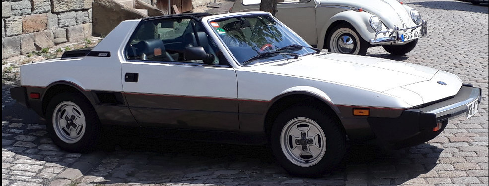
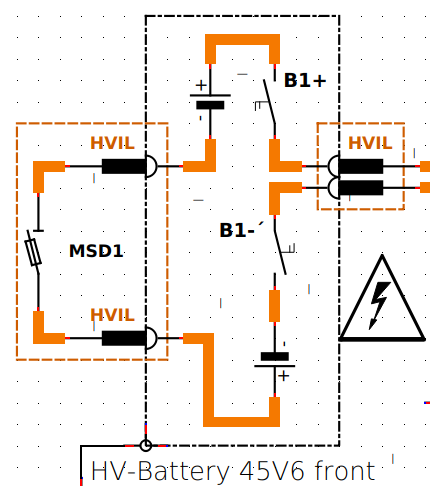
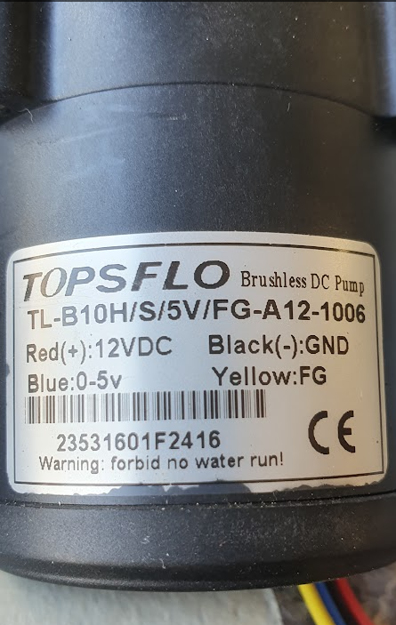
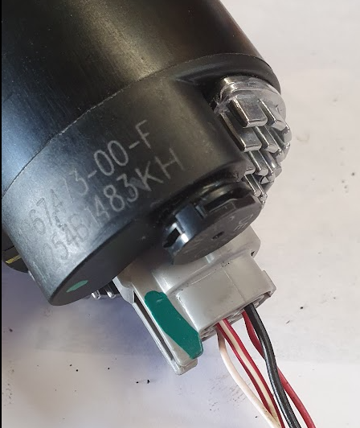
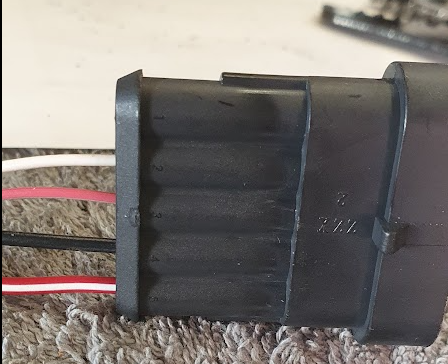
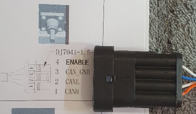
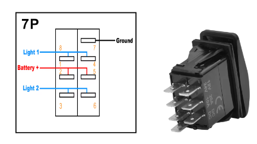
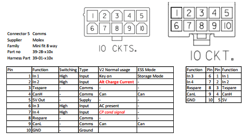
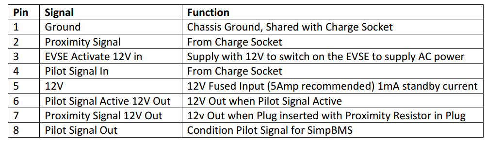
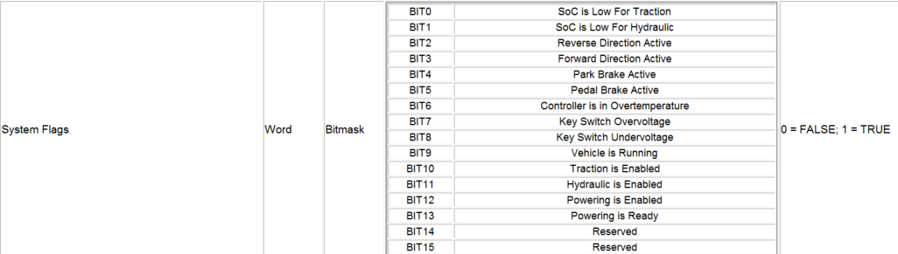

# Projektdokumentation

**BERTONE X1/9*e***

Umrüstung eines BERTONE X1/9 auf Elektro-Antrieb

BERTONE X1/9e

Umbau, Tag der Erstzulassung: 1983

Batterie-Elektrofahrzeug

Umrüstung durch Privatperson

Kraftübertragung durch konventionelles Getriebe

Fahrzeugklasse: M1

Betriebsspannung HV-Batterie: 114V

**Projektdokumentation und Umrüstung**

Frank Hielscher
Dipl.-Wirtschaftsingenieur (FH)
Staatlich geprüfter Techniker, Fachrichtung Elektrotechnik

Kontakt
Frank Hielscher
Zum Muschbach 17
97816 Lohr
Tel. 0172 6811397
E-Mail <FHielscher@web.de>

**Ausgabe**
2026-05-28

# Technische Kurzbeschreibung
## Allgemeines
Angaben zum Fahrzeug:
- **Marke:** BERTONE (I)
- **Typ:** 128AS1
- **Tag der Erstzulassung:** 1983
- **Fahrzeugklasse:** M1
- **Bezeichnung:** Bertone X1/9e, umgerüstet auf Batterieelektrischen Antrieb (BEV) durch Privatperson.
- **Kraftübertragung:** durch konventionelles Getriebe
- **Betriebsspannung HV-Batterie:** 114 V DC

***Zusätzliche Informationen:** Die Bremsanlage (ohne Unterdruckkraftverstärker) und Lenkung (ohne Servo) des Basisfahrzeugs bleiben mechanisch und hydraulisch unangetastet. Die Beheizung der Frontscheibe wurde durch ein elektrisches System ersetzt.*

**Name und Anschrift des Umrüsters:** Frank Hielscher, 97816 Lohr a. Main

## Antriebssystem (Powertrain)

**Systembezeichnung:** NetGain HyPer 9 IS™ (Integrated System)

**Elektromotor (Antriebsmotor):**
- **Hersteller:** NetGain Motors, Inc. (Gefertigt durch: SME S.p.A.,   Italien)
- **Modell / Typ:** HyPer 9™ (SRIPM - Synchronous Reluctance Internal Permanent Magnet)
- **Nennspannung:** 100 V
- **Nennstrom:** 350 A
- **Nenndrehzahl (S1-Dauerbetrieb):** 3.200 U/min
- **Maximaldrehzahl:** 8.000 U/min

**Inverter / Motor Controller:**
- **Hersteller:** SME S.p.A., Italien
- **Modell:** AC-X1 80/100V 750A SWS
- **Type Code:** ACX1S75000000
- **Rating Data:** 80/100V, 750A (Maximalstrom)

**Zusammenfassende Leistungsdaten des Gesamtsystems (Eintragungswerte):**
- **Maximale 30-Minuten-Leistung
  (Dauerleistung):** 38 kW (gemäß Herstellerangabe Systemintegrator NetGain; abgeleitet aus S1-Betrieb)
- **Maximale Nutzleistung (Spitzenleistung):** 95 kW
- **Maximales Drehmoment:** 234 Nm (Begrenzung via Controller-Mapping auf 154 Nm zum Schutz des Original-Getriebes parametriert, siehe Abschnitt 6).

## Energiespeichersystem REESS
### Technische Daten

| Parameter | Spezifikation / Angabe |
| :--- | :--- |
| **Hersteller (Zellen)** | Panasonic |
| **Hersteller (Module)** | TESLA (gebrauchte Module aus TESLA Model S mit je 5,3 kWh) |
| **Typ (Zellen)** | NCR18650B, NCA (Nickel-Cobalt-Aluminium) |
| **Anzahl und Anordnung der Module** | 5 Module, aufgeteilt in einen 2er-Pack und einen 3er-Pack (jeweils in separatem Gehäuse) |
| **Zellkonfiguration pro Modul** | 6S74P |
| **Zellkonfiguration Gesamt** | 30S74P |
| **Zellenanzahl** | 2220 |
| **Nennspannung** | 114 V DC (3,8 V/Zelle x 30 Zellen in Serie) |
| **Ladeschlussspannung** | 126 V DC (4,2 V/Zelle x 30 Zellen in Serie) |
| **Abschaltspannung** | 90 V DC (3,0 V/Zelle x 30 Zellen in Serie) |
| **Kapazität** | 232 Ah (26,5 kWh) |
| **Höchststrom** | 870 A (10 Sek.) |
| **Batteriemanagementsystem (BMS)** | SimpBMS (Master-Slave-System mit TESLA Slave Boards) |
| **Überladeschutz** | Integriert im BMS (automatische Abschaltung) |
| **Überhitzungsschutz** | 2 Temperatursensoren pro Modul und Notabschaltung durch BMS |
| **Thermomanagement** | **Typ:** Aktive Flüssigkeitskühlung **Konstruktion:** Die Kühlung erfolgt über Kühlschleifen, die direkt entlang der Zellen innerhalb jedes Moduls geführt sind. **Verschaltung:** Alle Kühlkreisläufe der einzelnen Module sind parallel geschaltet, um eine gleichmäßige Temperaturverteilung zu gewährleisten. **Medium:** G48 (Glysantin) korrosionsgeschützt und frostsicher |
| **Gehäusematerial** | Aluminium |
| **Gewicht (gesamt)** | 185 kg |
| **Maintenance Service Disconnect (MSD)** | **Typ:** NISTAR NI4-1-S630-2NYA (je Batteriepack). **Funktion:** Trennt bei Entfernung die interne Serienschaltung der Module und senkt, insbesondere beim 3er-Pack, dadurch die Spannung auf Kleinspannungsniveau (< 60V DC). |
| **Sicherung** | EATON BUSSMANN EBSD-630A (je Batteriepack) |

### Schematische Darstellung des Funktionsbereiches:
<figure id="schaltschema">
  
  <figcaption>Abbildung 1: Schaltschema des Batterie-Packs</figcaption>
</figure>

### Beschreibung, Zeichnungen oder Bilder des REESS mit Erläuterungen zu folgenden Punkten:

- **Aufbau Tesla 5,3 kWh Modul** (5 x vorhanden):

{alt="Zeichnung 2: TESLA 5,3 kWh Modul"
"}

- Darstellung Battery Pack Aufbau (2 x vorhanden):

{alt="Zeichnung 3: Pack mit zwei Modulen (Deckel entfernt)"
"}

#### Battery Pack rear (Aufbau, Werkstoffe und physische Abmessungen):
  Eigenbau, basierend auf zwei gebrauchten TESLA Model S 5,3 kWh Modulen   inkl. HV-Buchse mit HVIL Kontakten, MSD und HV-Relais, integrierter   Kühlkreislauf, **Notentlüftungs- & Druckausgleichselement**.
| Parameter | Spezifikation / Angabe |
| :--- | :--- |
| **Konstruktion:**| Seitenwände aus 28 mm x 240 mm Aluminium-Systemprofil verschraubt mit   Front- und Rückseite aus 6 mm Aluminiumplatten.   Deckel- und Boden aus 5 mm Aluminiumplatten.|
  |**Abdichtung:**| Neopren Zellkautschuk CR-150|
  |**Abmessung:**| 340 mm x 240 mm x 788 mm|
  |**Gewicht:**| 80 kg|
  |**Kapazität:**| 10,6 kWh|
  |**Nennspannung:**| 45,6 V|

#### Battery Pack front (Aufbau, Werkstoffe und physische Abmessungen:
  Eigenbau, basierend auf drei gebrauchten TESLA Model S 5,3 kWh Modulen inkl. HV-Buchse mit HVIL Kontakten, MSD und HV-Relais, integrierter   Kühlkreislauf, **Notentlüftungs- & Druckausgleichselement**.
  | Parameter | Spezifikation / Angabe |
| :--- | :--- |
| **Konstruktion:**| Seitenwände aus 28 mm Aluminium-Systemprofil verschraubt mit   Front- und Rückseite aus 6 mm Aluminiumplatten.   Deckel- und Boden aus 5 mm Aluminiumplatten.|
  |**Abdichtung:**| Neopren Zellkautschuk CR-150|
  |**Abmessung:**| 340 mm x 320 mm x 788 mm|
  |**Gewicht:**| 105 kg|
  |**Kapazität:**| 15,9 kWh|
  |**Nennspannung:**| 68,4 V|

### Beschreibung und Zeichnungen des Einbaus des REESS im Fahrzeug:

- **Physische Unterstützung:**
  - Der erste Batterie-Pack (3er) wird im vorderen Kofferraum platziert.   Die Befestigung erfolgt mit vier Stahlwinkeln, die jeweils mit 2 x M8   Schrauben am Pack-Gehäuse und mit 7/16" UNF Schrauben am Fahrzeug-Zwischenboden und an der Spritzwand mit hinterlegten FIA-konformen Gurt-Verstärkungsplatten aus Stahl verschraubt sind.
  - Der zweite Batterie-Pack (2er) wird im Motorraum an der Position des   bisherigen Zylinderkopf/Einspritzanlage montiert. Die Befestigung   erfolgte an den Original-Punkten der oberen Motoraufhängung.
- **Typ der Wärmeregelung: Wasserkreislauf** bestehend aus:
  - Wärmetauscher THERMOTEC D7W073TT,
  - TESLA Wasserpumpe, 
  - Ausgleichsbehälter, 
  - Schläuche (8 x 3,5 mm , Material:   EPDM), 
  - Kühlmittel G48.
- **Elektronische Steuerung des REEES: Batteriemanagementsystem (BMS)** 
  - **Typ:** SimpBMS Master-Slave-System mit original TESLA Slave Boards
  - **Überladeschutz:** Integriert im BMS (automatische Abschaltung),
  - **Überhitzungsschutz:** Temperatursensoren und Notabschaltung durch BMS

## Ladesystem
| Parameter | Spezifikation / Angabe |
| :--- | :--- |
| **Ladeanschluss:**| Typ 2 (\"Mennekes\")|
| **Ladebetriebsart:**| Mode 2 oder Mode 3|
| **Maximale Ladeleistung:**| 3,3 kW|
| **Ladespannung:**| 230 V AC (einphasig)|
| **Ladezeit (geschätzt):**| ca. 8 Stunden für vollständige Ladung|
| **Sicherheitsfunktionen:**| Verriegelung des Ladekabels während des Ladevorgangs|

## **Hochvolt-Leitungen**
| Parameter | Spezifikation / Angabe |
| :--- | :--- |
| **Art:**| Geschirmte, einadrige, flexible Leitungen, halogenfrei, flammwidrig, doppelt isoliert|
| **Material:**| Kupfer|
| **Isolierung:**| Vernetztes Polyethylen (VPE)|

## **Sicherheitskomponenten**
| Parameter | Spezifikation / Angabe |
| :--- | :--- |
|**Isolationsüberwachung (IMD):**| BENDER iso165C-1,  Überwachung des Isolationswiderstands zwischen HV-Kreis und Fahrzeugmasse,  Ansprechwerte: 250 kOhm, Vorwarnung: 400 kOhm|
|**Hochvolt-Relais (Schütze):**| Allpolige (Plus und Minus) Abschaltung des REESS durch HV-Relais (Schütze), die durch BMS, HVIL und LV-Batterie aktiviert werden.|
| **Hochvolt-Interlock-Leitung (HVIL):**| Unterbricht bei Entriegelung  eines Steckers die Spannungsversorgung.|

## **Elektrisches System**
**Ausführung:** Isoliertes Netz (IT-System)
**Zusätzliche Anmerkung:** Es erfolgt keine separate Überwachung des Schutzleiters (PE) im  Fahrzeug. Die Schutzleiterverbindung wird durch die Wallbox über das standardisierte Typ2-Ladekabel hergestellt. Es wird vorausgesetzt, dass die Ladeinfrastruktur (Wallbox) einen funktionierenden Schutzleiter bereitstellt und überwacht.

## Gewichtsbilanz und Achslasten 
Angaben aus dem Fahrzeugschein (vor Umbau):
| Parameter | Spezifikation / Angabe |
| :--- | :--- |
| **Leergewicht:**| 970 kg|
| **Zul. Achslast vorne:**| 510 kg|
| **Zul. Achslast hinten:**| 700 kg|
| **Zul. Gesamtgewicht:**| 1200 kg|

 

Gemessene Ist-Werte (nach EV-Umbau):
| Parameter | Spezifikation / Angabe |
| :--- | :--- |
| **Ist-Gewicht Vorderachse:**| (440) kg|
| **Ist-Gewicht Hinterachse:**| (480) kg|
| **Neues Leergewicht:** | (995) kg|

### Umbaukonzept und Gewichtsverteilung (Zuladung)
Aufgrund der Mittelmotor-Architektur des Basisfahrzeugs und der strengen Limitierung der vorderen Achslast (max. 510 kg) wurde bei der Umrüstung besonderer Wert auf eine gesetzeskonforme Gewichtsverteilung gelegt.

#### Bauliche Maßnahmen zur Einhaltung der Achslasten:
Um eine Überladung der Vorderachse im Passagierbetrieb auszuschließen, steht der vordere Gepäckraum durch die Positionierung des vorderen Batterie-Packs (105 kg) für weiteres Gepäck nicht mehr zur Verfügung. Er dient baulich bedingt nur noch der Aufnahme des Targa-Dachs.
Zum Ausgleich der Transportkapazität wurde der Heckbereich modifiziert. Der durch den Entfall der Abgasanlage freigewordene Raum unterhalb des hinteren Kofferraums wurde genutzt um den Gepäckraum zu erweitern (plus ca. 70 Liter).

# Funktionssicherheit

## Ladevorgang (Technisches Sicherheitskonzept)

### Technische Basisdaten:
| Parameter | Spezifikation / Angabe |
| :--- | :--- |
| ***Ladeanschluss:**| Typ2 (gemäß DIN EN 62196-2),   fahrzeugseitiges Inlet (Berührschutz nach IPXXB)|
| **Ladebetriebsart:**| Mode 2 oder Mode 3 (AC-Laden)|
| **Max. Ladeleistung:**| 3,3 kW (einphasig)|
| ***Onboard** **Ladegerät:**|  Elcon TC charger HK-MF-108-32 (Galvanisch getrennt)|

### Sicherheitslogik bei Ladebeginn (Handshake & Verriegelung):
Die Initiierung des Ladevorgangs erfolgt über einen normgerechten Handshake zwischen dem Ladeanschluss (Fahrzeug) und der Infrastruktur (Wallbox/Ladesäule).
| Parameter | Spezifikation / Angabe |
| :--- | :--- |
| **Signalauswertung durch Ladecontroller:**| Die Auswertung der Steckerkennung (Proximity Pilot - PP) sowie die Erfassung der netzseitigen Leistungsvorgabe (PWM-Signal über Control Pilot - CP) erfolgt nicht direkt im Ladegerät, sondern durch einen dedizierten Ladecontroller (**Modul „SimpCharge"**).|
| **Systemkommunikation:**| Das SimpCharge-Modul ist steuerungstechnisch an das übergeordnete Batteriemanagementsystem (SimpBMS) gekoppelt. Nach erfolgreicher Auswertung der CP/PP-Signale und elektromechanischer Verriegelung des Steckers im Inlet gibt das SimpBMS den Ladebefehl via CAN-Bus an das Onboard-Ladegerät (Elcon TC Charger) weiter.|
|**Wegfahrsperre (Drive Inhibit)   gemäß VdTÜV 764:**| Um ein Anfahren mit gestecktem Ladekabel konstruktiv auszuschließen, ist eine Hardware-Wegfahrsperre integriert. Sobald das SimpCharge-Modul eine physikalische Verbindung am Typ-2-Ladeanschluss erkannt wird (Signal am PP/CP-Kontakt), setzt das gekoppelte Batteriemanagementsystem (BMS) unverzüglich ein "Drive Inhibit"-Signal. Dies bewirkt technisch:   - Der Inverter (Motor Controller) erhält keine Traktionsfreigabe.   - Auf dem BMS-Display im Cockpit wird der Status „CHARGE" dauerhaft visualisiert.   - Der Status „DRIVE" (aktiver Fahrbetrieb) ist software- und hardwareseitig gesperrt.|

### Schutzleiteranbindung (PE) und Isolationsüberwachung:
- Während des AC-Ladevorgangs ist das Chassis des Fahrzeugs über den PE-Leiter des Typ-2-Kabels zwingend mit dem Erdungspotenzial der Ladeinfrastruktur verbunden.
- Das Onboard-Ladegerät (Elcon) verfügt über eine galvanische Trennung zwischen der AC-Netzseite und der DC-Hochvoltseite des Fahrzeugs.
- Das fahrzeugseitige Isolationsüberwachungssystem (IMD) bleibt aktiv bzw. führt vor dem Zuschalten der Hochvoltschütze einen Selbsttest durch.
### Sicherheitslogik bei Beendigung des Ladevorgangs:
Das BMS überwacht fortlaufend die Einzelzellspannungen und den Ladezustand (SoC). Bei Erreichen der Ladeschlussspannung kommandiert das BMS das Ladegerät zur stufenlosen Leistungsabregelung bis auf 0 Ampere.
- **Trennung unter Last ausgeschlossen:** Die elektromechanische Verriegelung des Ladekabels im Fahrzeug-Inlet bleibt nach Ladeende aktiv. Eine Trennung des Kabels unter Last ist somit ausgeschlossen.
- **Manuelle Entriegelung:** Der Stecker kann erst gezogen werden, wenn der Ladevorgang netz- oder fahrzeugseitig (über einen separaten Taster im Innenraum) gestoppt wurde. Dieser Taster unterbricht das CP-Signal, wodurch die Infrastruktur die AC-Spannung lastfrei wegschaltet. Erst danach gibt der Aktuator den Stecker mechanisch frei und das BMS hebt das **"Drive Inhibit"**-Signal auf.

### Fahrbetrieb (Betriebssicherheit)
Um eine Gefährdung des Fahrers oder Dritter auszuschließen, ist das Antriebssystem mit Hardware- und Software-Interlocks(Verriegelungsbedingungen) ausgestattet. Die Einhaltung der funktionalen Sicherheitsanforderungen gemäß VdTÜV-Merkblatt 764 (Kapitel 3.2) wird wie folgt technisch umgesetzt:
**Einleitung des Fahrbetriebs (Start-Sequenz):**
Die Aktivierung der Fahrbereitschaft (Zuschaltung der Hochvolt-Traktionsbatterie zum Inverter) erfordert eine zwingende logische Reihenfolge. Fehlt eine der folgenden Bedingungen, verweigert das System die Traktionsfreigabe:
**1. Lade-Interlock:** Das Typ-2-Ladekabel muss physisch getrennt sein     (siehe Kap. 2.1).
**2. Mechanische Freigabe:** Die Diebstahlsicherung (Lenkradschloss)     muss durch den mechanischen Zündschlüssel (Position 1) entriegelt sein.
**3. Fahrtrichtungs-Interlock:** Der elektrische Fahrtrichtungsschalter muss auf Position „N" (Neutral) stehen.
**4. Brems-Interlock:** Das Bremspedal muss betätigt sein (Signalabgriff über Bremslichtschalter), um ein unkontrolliertes Anrollen beim Schließen der HV-Schütze zu verhindern.

Sind diese Bedingungen erfüllt und wird die „Zündung" (Schlüssel auf Position 2) aktiviert, fahren die Steuergeräte (MCU, BMS, VCU) hoch. Das Isolationsüberwachungssystem (IMD) führt einen Selbsttest durch; der aktuelle Isolationswiderstand (R~iso~) wird im Kombi-Instrument angezeigt.
Nach erfolgreichem System-Check schließen die HV-Schütze. Der Zustand „aktiver Fahrbetrieb möglich" wird dem Fahrer permanent durch die optische Anzeige „**DRIVE**" im BMS-Display signalisiert.

### Fahren, Anhalten und Umsteuerung (Fahrtrichtung):
Maßnahmen gegen unbeabsichtigte Beschleunigung und fehlerhafte Umsteuerung:

- **Zweikanaliges Fahrpedal:** Die Drehmomentanforderung erfolgt über ein redundantes, zweikanaliges Analog-Potentiometer. Die MCU führt fortlaufend eine Plausibilitätsprüfung beider Signale durch. Bei einer Signaldifferenz (Grenzwerte) oder Leitungsbruch wird das System abgeregelt (Limp-Home oder sofortiger Stopp).
- **Neutral-Start-Sicherheit:** Eine direkte Umschaltung von Vorwärts auf Rückwärts (bzw. umgekehrt) unter Last wird durch die MCU unterbunden. Ein Richtungswechsel erfordert stets den bewussten Zwischenschritt über die Position N (Neutral). Die aktuell angewählte Fahrrichtung wird auf dem Display H im Kombi-Instrument angezeigt.
- Die **Drehrichtung und Drehzahl** des Motors werden sicherheitsgerichtet   durch einen integrierten elektronischen Geber überwacht.

#### Warnsysteme beim Verlassen des Fahrzeugs:
Um zu verhindern, dass das Fahrzeug im fahrbereiten oder ungesicherten Zustand verlassen wird, ist eine akustische Warnlogik (Buzzer/Signalton) implementiert, die den Türkontaktschalter auswertet:
- **Warnung Fahrbereitschaft:** Öffnet der Fahrer die Tür, während das System noch aktiv ist (Zündung auf Position 2), ertönt ein Warnsignal.
- **Warnung Wegrollsicherung:** Wird das System ordnungsgemäß deaktiviert (Zündung 0), aber die mechanische Feststellbremse wurde nicht angezogen, ertönt beim Öffnen der Tür ebenfalls ein akustisches Warnsignal.

#### Thermomanagement und Leistungsverminderung (Derating) im Überlastfall:
Das Fahrzeug ist mit einem mehrstufigen Schutzkonzept zur Begrenzung der Leistung bei thermischer Überlastung ausgestattet, welches rechtzeitig vor Erreichen kritischer Zustände warnt:
**1.  Aktive Kühlung:** Die MCU überwacht fortlaufend die Inverter- und Motortemperaturen. Bei ansteigender Temperatur steuert die VCU zunächst automatisch die Kühlmittelpumpen und Zusatzlüfter an, um die Temperatur abzubauen.
**2.  Optische Warnung:** Steigt die Temperatur trotz aktiver Kühlung weiter an, wird im Kombi-Instrument die Warnmeldung **„TEMP"** ausgegeben. Dies fordert den Fahrer auf, die Leistungsentnahme proaktiv zu reduzieren (Vorgabe gem. VdTÜV 764).
**3.  Hard-Derating:** Wird ein vordefinierter kritischer Grenzwert erreicht, greift die MCU aktiv ein und begrenzt die Leistungsabgabe automatisch auf **50 %**. Das Fahrzeug bleibt manövrierfähig (kein plötzlicher Antriebsverlust), ist jedoch in seiner Leistung spürbar beschnitten, um Hardware-Schäden und Brandgefahr zu verhindern.

## Sicherstellung des Antriebs (Dimensionierung)

Dieses Kapitel belegt die Leistungsfähigkeit des elektrischen Antriebsstrangs und die Speicherkapazität der Hochvoltbatterie, um die Anforderungen an Fahrperformance, Reichweite und Steigfähigkeit zu erfüllen und die Betriebssicherheit zu gewährleisten.

### 1. Leistung des Motors und Energieversorgung

**Dauerleistung Antriebsmotor:**
Der eingesetzte Elektromotor (NetGain HyPer 9) ist für eine Dauerleistung von 38 kW ausgelegt.

**Dimensionierung der Hochvoltbatterie:**
Die verbauten Tesla Model S Module (total 5 Module, 26,5 kWh) bilden eine Batterie mit einer Nennspannung von 114 V DC. Die Fähigkeit der Batterie, die Dauerleistung des Motors zu unterstützen, wurde geprüft:
- **Strombedarf des Motors bei Dauerleistung (38 kW):**
  Zur Bereitstellung der Dauerleistung von 38 kW (38.000 W) bei der Nennspannung der Batterie von 114 V DC ergibt sich ein Strombedarf von:
  $${I_{\mathit{Motor}_{\mathit{Dauer}}} = {P/U_{\mathit{Batt}}} = 38.000}{W/114}{V \approx 333,3}A$$
  Der Elektromotor benötigt somit zur Lieferung seiner Dauerleistung (38 kW) einen Strom von ca. 333,3 Ampere, den die Batterie bei 114 V liefern muss.
- **Batteriekapazität in Amperestunden (Ah):***\
  Die Gesamtkapazität der Batterie beträgt 26,5 kWh bei 114 V (Nennspannung). Daraus resultiert eine Kapazität von:\
  $${Q_{\mathit{Batt}} = {{({\mathit{Energie}{{(\mathit{kWh})} \times 1000}})}/\mathit{Nennspannung}}}{{(V)} = {{({26,5{\mathit{kWh} \times 1000}})}/114}}{V \approx 232,5}\mathit{Ah}$$*
- **Maximaler Entladestrom der Batterie (C-Rating):***\
  Basierend auf einem C-Rating von 3 (Herstellerangabe der Zellen) kann
  die Batterie einen maximalen Entladestrom von:\
  $${I_{\mathit{Batt}_{\mathit{\max}}} = {Q_{\mathit{Batt}} \times C_{\mathit{Rating}}} = 232,5}{{\mathit{Ah} \times 3} \approx 697,5}A$$\
  Die Batterie kann somit theoretisch bis zu 697,5 A liefern. Dies
  übersteigt den zur Bereitstellung der Motordauerleistung von 38 kW
  benötigten Strom von 333,3 A deutlich.*
- **Maximale Leistungsabgabe der Batterie:***\
  Die maximale Leistungsabgabe der Batterie (unter Berücksichtigung des
  C-Ratings) beträgt:\
  $${P_{\mathit{Batt}_{\mathit{\max}}} = {U_{\mathit{Batt}} \times I_{\mathit{Batt}_{\mathit{\max}}}} = 114}{V \times 697,5}{A \approx 79.515}{W \approx 79,5}\mathit{kW}$$\
  Die Batterie ist in der Lage, eine maximale Leistung von ca. 79,5 kW
  bereitzustellen, was die 38 kW Dauerleistung des Motors um ein
  Vielfaches übertrifft und auch für die vom Inverter bereitgestellte
  Spitzenleistung (95 kW, S.5) ausreichend Reserven bietet.*
- **Systemabstimmung:***\
  Die Nennspannung der Batterie (114 V) ist mit dem
  Betriebsspannungsbereich des Inverters (SME AC-X1 80/100V) kompatibel.
  Der Inverter ist auf einen Maximalstrom von 750 A ausgelegt, was die
  benötigten Ströme für Dauer- und Spitzenleistung des Motors abdeckt.
  Die Leistungsbegrenzung des Motors auf 154 Nm maximales Drehmoment
  dient dem Schutz des Original-Getriebes und wurde über das
  Controller-Mapping parametriert (siehe Abschnitt 6).*

### 2. Fahrleistungen und Reichweitenabschätzung:
Die folgenden Berechnungen basieren auf den realistischen Annahmen für
das umgerüstete Fahrzeug unter Berücksichtigung des angepassten
Leergewichts von ca. 995 kg (siehe Kap. 1.8).

**Fahrzeug-Eckdaten für die Berechnungen:**

- **Leergewicht:**  ca. 995 kg

- **Bereifung:**  185/60 R13

  - Effektiver Durchmesser: 55,2 cm
  - Abrollumfang: ca. 1,679 m (minimal) bis 1,735 m (maximal)

- **Cw-Wert:** *Schätzung basierend auf Fahrzeugform: 0,36 (Referenzwert für ähnliche Fahrzeuge)*

- **Frontfläche (A***~***F***~***):** *ca. 1,7 m²*

- **Antriebseffizienz:** *NetGain HyPer 9 mit ca. 90 %   Wirkungsgrad*

- **Getriebe (4. Gang):** *Übersetzung 4,252*

**A. Anfahrvermögen an Steigung (nach VdTÜV 764, Kap. 3.3):**\
*Das Fahrzeug muss in der Lage sein, eine Steigung von 12 % (ca. 6,82°) aus dem Stillstand anzufahren und dies fünfmal innerhalb von fünf Minuten zu wiederholen.*

- **Benötigte Kraft für 12 % Steigung:**\
  Die Hangabtriebskraft bei 12 % Steigung berechnet sich aus:\
  $${F_{\text{Steigung}} = {m \times g \times \sin}}{(\text{alpha})}$$
Bei $m = 995\text{ kg (Leergewicht)}$ und $\alpha = \arctan(0,12) \approx 6,82^\circ$:
$$F_{\text{Steigung}} = 995\text{ kg} \times 9,81\text{ m/s}^2 \times \sin(6,82^\circ) \approx 1172,7\text{ N}$$

- **Rollwiderstandskraft (F***~***R***~***):**\
  Mit einem Rollwiderstandsbeiwert (Crr) von 0,01 für gute Reifen:\
  $${F_{R}} = m \times g \times C_{\text{rr}} = 995{\text{ kg} \times 9,81\ m/s^{2} \times 0,01} \approx 97,6\text{ N}$$*
- **Gesamtkraft beim Anfahren (Steigung + Rollwiderstand):**\
  $${F_{\mathit{Total}_{\mathit{Anfahren}}} = {F_{\mathit{Steigung}} + F_{R}} = 1172,7}{N + 97,6}{N \approx 1270,3}N$$*
- **Benötigtes Drehmoment am Rad für Anfahren:**\
  Mit einem typischen Raddurchmesser von 0,552 m (Radius 0,276 m):\
  $${T_{\mathit{Rad}_{\mathit{Anfahren}}} = {F_{\mathit{Total}_{\mathit{Anfahren}}} \times \mathit{Radius}} = 1270,3}{N \times 0,276}{m \approx 350,6}\mathit{Nm}$$*
- **Benötigtes Motordrehmoment für Anfahren:**\
  Bei einer Getriebeübersetzung **(4. Gang)** von 4,252:\
  $${T_{\mathit{Motor}_{\mathit{Anfahren}}} = {T_{\mathit{Rad}_{\mathit{Anfahren}}}/\mathit{Getriebeübersetzung}} = 350,6}{{\mathit{Nm}/4,252} \approx 82,5}\mathit{Nm}$$*

**Fazit zum Anfahrvermögen:**\
Wie die Berechnung zeigt, ist das Fahrzeug bereits im 4. Gang in der
Lage, die gesetzlich geforderten Steigungen von 12 % problemlos zu
bewältigen. Dies ermöglicht ein „Single-Speed"-Betriebskonzept, bei dem
auf mechanische Schaltvorgänge im Regelbetrieb verzichtet werden kann.
Um die mechanischen Reserven des Basisfahrzeugs (Kupplung/Getriebe)
optimal zu nutzen und vor den hohen Drehmomentspitzen des Elektromotors
zu schützen, wird die Leistung softwareseitig präzise limitiert (siehe
3. Parametrierung des elektrischen Antriebs).*

**B. Verbrauchswerte und Reichweitenprognose (bei konstanter
Fahrt):**

- **Luftwiderstandskraft (\$F_L\$) bei 80 km/h (22,2 m/s):**\
  $${F_{L} = {0,5 \times C_{w} \times A_{F} \times \mathit{rho} \times v^{2}}}{({\${\mathit{rho} = 1,225}{\mathit{kg}/m}^{3}\mathit{für}\mathit{Luftdichte}})}$$\
  $${F_{L} = {0,5 \times 0,36 \times 1,7}}{m^{2} \times 1,225}{{{\mathit{kg}/m}^{3} \times {({22,2{m/s}})}^{2}} \approx 194,0}N$$*
- **Gesamtwiderstandskraft (\$F\_{Total}\$) bei 80 km/h:**\
  $${F_{\mathit{Total}} = {F_{R} + F_{L}} = 97,6}{N + 194,0}{N \approx 291,6}N$$*
- **Leistungsbedarf (P***~***{Fahrt}***~***) bei 80 km/h an der
  Radachse:**\
  $${P_{\mathit{Fahrt}} = {F_{\mathit{Total}} \times v} = 291,6}{N \times 22,2}{{m/s} \approx 6472}{W \approx 6,5}\mathit{kW}$$*
- **Elektrischer Leistungsbedarf (Batterie) bei 80 km/h:***\
  Unter Berücksichtigung einer Antriebseffizienz von 90 %:\
  $${P_{\mathit{Elektrisch}} = {P_{\mathit{Fahrt}}/\mathit{Effizienz}} = 6,5}{{\mathit{kW}/0,9} \approx 7,2}\mathit{kW}$$*
- **Verbrauch pro 100 km (Batterie) bei 80 km/h:***\
  Der Verbrauch ergibt sich aus dem elektrischen Leistungsbedarf
  multipliziert mit der Zeit für 100 km (1,25 Stunden bei 80 km/h):\
  $$\mathit{Verbrauch}{{100\mathit{km}} = P}{{\mathit{Elektrisch} \times {({100{\mathit{km}/80}{\mathit{km}/h}})}} = 7,2}{\mathit{kW} \times 1,25}{h = 9,0}{{\mathit{kWh}/100}\mathit{km}}$$*
- **Realistischer Durchschnittsverbrauch:***\
  Unter Berücksichtigung von weiteren Verlusten (z.B. durch Heizung,
  Elektronik) und variablen Fahrbedingungen wird ein realistischer
  Verbrauch von* **ca. 10 -- 12 kWh/100 km** *angesetzt.*
- **Reichweitenprognose:***\
  Mit einer nutzbaren Batteriekapazität von 26,5 kWh und einem
  realistischen Verbrauch von 12 kWh/100 km ergibt sich eine Reichweite
  von:\
  $${\mathit{Reichweite} = {\mathit{Kapazität}/\mathit{Verbrauch}_{100\mathit{km}} \times 100} = 26,5}{\mathit{kWh}/12}{{{{\mathit{kWh}/100}\mathit{km}} \times 100} \approx 220,8}\mathit{km}$$*

**Fazit zur Reichweite:***\
Mit dem umgerüsteten Fahrzeug ist basierend auf dem Cw-Wert von 0,36 und
dem tatsächlichen Leergewicht eine realistische Reichweite von* **200
-- 250 km** *(abhängig von Fahrstil, Umgebungstemperatur und
Topografie) zu erwarten. Die rechnerisch ermittelte Reichweite von ca.
220 km (bei konstant 80 km/h) liegt innerhalb dieses realistischen
Korridors.*

### 3. Parametrierung des elektrischen Antriebs (Softwareseitige Begrenzungen)

Zur praktischen Umsetzung des Betriebskonzepts und zur Sicherstellung der Bauteil-Langlebigkeit wird die Motorsteuerung (SME-Controller) über die SMARTView-Software parametriert. Da der HyPer 9 Motor ein maximales Drehmoment von 234 Nm liefern könnte, die mechanischen Komponenten (Kupplung und Getriebe) jedoch vor Überlastung geschützt werden müssen, fungiert die MCU hier als primäres Schutzorgan.
Die folgende Tabelle zeigt die für die Betriebssicherheit und den Bauteilschutz relevanten Parameter:
| Parameter (SmartView) | Wert | Schutzziel / Begründung |
| :--- | :--- | :--- |
|  Control Mode |                     Torque Mode |     Lineares Ansprechverhalten analog zum Serienzustand.|
|  Max. Motor Speed |                 5.500 rpm    |    Einhaltung der max. Getriebeeingangsdrehzahl|
|  Max. Torque Limit |                154 Nm      |     **Hardware-Schutz:** Begrenzung ist das Nennmoment der Kupplung (160 Nm).|
|  Min. Torque Accel Time  |          1,8 s       |     **Lastschlagdämpfung:** Verhindert schlagartige Belastung der Mechanik.|
|  Brake Priority |                   Aktiviert   |     Sicherheitsabschaltung bei Bremsbetätigung |
|  SRO (Static Return) |              Aktiviert   |     Verhindert Anfahren beim Einschalten |
|  Controlled Roll-Off  |             Aktiviert   |     Verhindert unkontrolliertes Rollen im Stand |
|  Hill Hold |   By Pedal Brake |  Erleichert das Anfahren an Steigungen |
|  Neutral Braking Rate  |            15 %      |       Simulation eines moderaten Motor-Schleppmoments (Segel-Modus) |
| Activation Delay |                150 ms    |       Geschmeidiges Ansprechverhalten |

## Mindestladezustand des Energiespeichers 
Der Mindestladezustand des Energiespeichers (SOC -- State of Charge) ist vom Batteriemanagementsystem (BMS) hardwareseitig auf 5 % der maximalen Kapazität festgelegt. Die eingebauten Anzeigen im Kombi-Instrument visualisieren den aktuellen SOC analog und digital. Bei Erreichen des Mindestladezustands wird eine zusätzliche Warnmeldung im Kombi-Instrument angezeigt, um den Fahrer über die verbleibende Restreichweite zu informieren und sicherzustellen, dass das Fahrzeug auch unter diesen Bedingungen aus dem Verkehrsbereich hinausgefahren werden kann (gemäß VdTÜV 764, Kap. 3.4).

## Heizung/Lüftung sowie Entfrostung, Trocknung
Zur Erfüllung der Anforderungen nach § 35c StVZO bezüglich Beheizung, Belüftung und Entfrostung der Scheiben wurde das bestehende manuelle Lüftungssystem des Basisfahrzeugs beibehalten und mit einem elektrischen PTC-Heizer ergänzt.
- **Belüftung der Fahrgastzelle:** Die aktive Belüftung der
  Fahrgastzelle erfolgt über die vorhandenen Lüftungswege und den
  ursprünglichen Lüfter gemäß der OEM-Spezifikation.
- **Beheizung der Fahrgastzelle und Windschutzscheiben-Entfrostung:** Ein elektrischer PTC-Heizer ist in den Luftstrom des vorhandenen Lüftungssystems integriert. Dieser Heizer wird elektrisch zugeschaltet und gewährleistet die Versorgung der Fahrgastzelle und insbesondere der Windschutzscheibe mit   ausreichend warmer Luft zur Funktion der Beheizung und Entfrostung/Trocknung. Die Luftverteilung für die Windschutzscheibe erfolgt durch manuelle Steuerung der Luftaustrittsklappen (Fußraum/Mittelkonsole) zur Priorisierung des Luftstroms zur Scheibe hin.

## Bremse

Das Fahrzeug ist mit einer zweikreisigen Bremsanlage mit vier Scheiben-bremsen ausgerüstet. Es verfügt weder über einen Unterdruckbrems-verstärker noch über ein Antiblockiersystem (ABS). Die
Feststellbremse wirkt mechanisch auf die Bremsen der Hinterachse. Die vorhandene Bremsanlage des Basisfahrzeugs wurde unverändert beibehalten.

Das elektrische Antriebssystem ermöglicht eine zusätzliche elektrische Bremsunterstützung durch Energierückgewinnung (Rekuperationsprinzip).
Dieses System ist wie folgt nach UN-Regelung Nr. 13/13H als **Kategorie A** realisiert:
**- Rekuperationsaktivierung (Kategorie A):** Die Aktivierung der Rekuperation erfolgt ausschließlich durch das Loslassen des Fahrpedals (Coast-Down-Rekuperation).
**- Deaktivierung der Rekuperation:** Die Rekuperation kann für besondere Fahrbedingungen (z.B. Glatteis) über einen Schalter „RECU OFF" deaktiviert werden.
**- Keine Integration in die Betriebsbremsanlage:** Die  Rekuperationsfunktion ist **nicht** in die Betriebsbremsanlage integriert. Das Bremspedal betätigt ausschließlich die mechanischen Reibbremsen. Ein Blockieren der Räder durch das Rekuperationssystem ist durch die ausschließliche Aktivierung über das Fahrpedal und fehlende Koppelung mit dem Bremspedal ausgeschlossen.

## Lenkung

Die Lenkeinrichtung des Fahrzeugs ist unverändert und entspricht der Originalspezifikation. Das Fahrzeug verfügt über keine Servolenkung und die mechanische Lenkeinheit wurde nicht modifiziert.

## Grundfunktion der elektrischen Systeme

Die grundlegenden elektrischen Funktionen des Fahrzeugs, insbesondere die in § 47 StVZO geforderten Beleuchtungseinrichtungen (z.B. Standlicht, Warnblinkanlage) sowie das akustische Warnsystem, bleiben auch bei einem Ausfall oder der Deaktivierung des Hochvolt-Antriebssystems uneingeschränkt funktionsfähig. Dies wird durch das Vorhandensein eines separaten 12V-Bordnetz-Energiespeichers (12V-Batterie) sichergestellt.

## Batterie und Batteriemanagementsystem (REESS, BMS)

Das Rechargeable Energy Storage System (REESS) ist das zentrale Bauteil für die Speicherung der elektrischen Energie. Um die geforderte elektrische und funktionale Sicherheit zu gewährleisten, ist es mit einem dedizierten Batteriemanagementsystem (BMS) ausgestattet.

### 1. REESS (Energiespeicher)

- **Bestandteile:** Das REESS besteht aus insgesamt fünf gebrauchten Tesla Model S Modulen (5.3 kWh/Modul), die zu einem 2er-Pack und einem 3er-Pack konfiguriert sind. Details zur Kapazität und Nennspannung sind in Kapitel 1.3 dargestellt.
- **Qualitätssicherung der Zellen:** Der Nachweis der Prüfung und Zertifizierung der verwendeten Zellen gemäß den Anforderungen der  UN-Regelung Nr. 38.3 ist im **Anhang X.X** beigefügt. *(*todo:* passende Anhangs-Referenz einfügen)*. Die verbauten Zellen (Panasonic NCR18650B) sind Teil zertifizierter Module.
- **Integration:** Die Module werden durch das BMS überwacht, um einen  sicheren Betrieb auch mit gebrauchten Komponenten zu gewährleisten.

### 2. BMS (Batteriemanagementsystem)

- **Architektur:** Es wird ein **SimpBMS** in einer  Master-Slave-Konfiguration eingesetzt. Dieses System nutzt die originalen Tesla Slave Boards, die direkt an den Modulen verbaut sind, zur Datenakquise.

- **Überwachungsfunktionen:**

  - **Zellspannungen:** Das SimpBMS erfasst und überwacht kontinuierlich    sämtliche Einzelzellspannungen (S-Schaltung) innerhalb der Module, auch die Balancierfunktionen der Slave Boards werden genutzt.
  - **Temperaturen:** Die in den Tesla-Modulen integrierten Temperatursensoren werden vom SimpBMS ausgelesen und überwacht.
  - **C-Rating / Strom:** Der maximale Entlade- und Ladestrom wird limitiert und überwacht.
  - **Gesamtspannung:** Die Gesamtspannung der Batterie wird überwacht.

- **Grenzwertüberwachung:** Das BMS ist mit definierten Ansprech- und  Schwellwerten für alle kritischen Parameter (Spannung, Strom,  Temperatur) parametriert.

### 3. Aktive Systemreaktion bei Grenzwertverletzungen

Bei Über- oder Unterschreitung der definierten Ansprech- und Schwellwerte reagiert das BMS aktiv und sicherheitsgerichtet, um Personen- und Sachschäden zu vermeiden und die Lebensdauer der Batterie zu maximieren:

- **Kommunikation/Regelung:** Das BMS kommuniziert via CAN-Bus mit dem  Onboard-Ladegerät (zur Reduzierung oder Abschaltung des Ladestroms), dem Inverter (zur Reduzierung oder Abschaltung der Leistungsanforderung) und der Vehicle Control Unit (VCU).
- **Direkte Abschaltung (Schütze):** Bei kritischen Fehlern oder  drastischer Grenzwertverletzung aktiviert das BMS unmittelbar die  Notabschaltung durch die direkte Ansteuerung der Hauptschütze (Contactor) im REESS, welche (getrennt für Plus- und Minuspol) den Hochvolt-Stromkreis trennen. Dies gewährleistet die sofortige Spannungsfreischaltung des Antriebssystems.
- **Display:** Das SimpBMS Master-Modul verfügt über ein separates Display, welches dem Servicepersonal den Abruf aller relevanten Parameter und Systemzustände für Diagnosezwecke ermöglicht.

## Mechanische Antriebsintegration

Die betriebsfeste und passgenaue Verbindung des Elektromotors (NetGain Hyper9) mit dem Original-Fünfganggetriebe des Bertone X1/9 wird durch eine professionell gefertigte Adapterlösung sichergestellt. Alle Komponenten zur mechanischen Kraftübertragung wurden vom europäischen Fachbetrieb **evshop.eu** bezogen bzw. in Auftrag gegeben, der auf die Komponenten des Herstellers NetGain Motors spezialisiert ist.

### 1. Motor-Getriebe-Adapterplatte

Eine speziell für diese Fahrzeug-Motor-Kombination angefertigte Adapterplatte aus hochfestem Stahl stellt die exakte koaxiale Ausrichtung zwischen der Motorwelle und der Getriebeeingangswelle sicher. Die präzise Fertigung der Platte durch einen Fachbetrieb gewährleistet die für eine lange Lebensdauer der Wellenlager und der Kupplung notwendige Fluchtungsgenauigkeit. Die Verschraubung der Platte erfolgt mit Schrauben der Festigkeitsklasse 10.9 (todo: prüfen!), die mit dem vom Hersteller empfohlenen Drehmoment angezogen wurden.

### 2. Wellenkupplung

Die Kraftübertragung zwischen Motor- und Getriebewelle erfolgt über eine **Klauenkupplung mit einem Elastomer-Dämpfungselement**. Diese Kupplung wurde als passendes Zubehör für den Hyper9-Antriebsstrang vom genannten Fachhändler bezogen.

***Begründung der Auslegung und Maßnahmen zur Dauerhaltbarkeit:***
Die Verwendung dieser Kupplungsart bietet den Vorteil, minimale Fluchtungsungenauigkeiten sowie hochfrequente Vibrationen des Antriebsstrangs durch das elastische Zwischenelement effektiv zu dämpfen.
Um die für Klauenkupplungen kritischen, harten Lastwechsel zu minimieren und die Dauerhaltbarkeit des Elastomerelements zu maximieren, wurden im Motorcontroller (MCU) folgende Maßnahmen parametriert:
**- Drehmomentenrampen (\"Slew Rate\"):** Die Anstiegs- und Abfallzeit des Drehmoments wurde auf einen weichen Übergang eingestellt (siehe Kap. 6 todo: korrigieren), um schlagartige Belastungen auf die Kupplung zu vermeiden.
**- Begrenzung des Maximaldrehmoments:** Das maximale Motordrehmoment wurde softwareseitig auf 154 Nm begrenzt, was sowohl dem Schutz des Original-Getriebes als auch der Entlastung des Kupplungselements dient.

Durch die Kombination aus professionell gefertigten mechanischen Komponenten und einer darauf abgestimmten, bauteilschonenden Software-Parametrierung wird eine betriebssichere und dauerhaltbare Kraftübertragung gewährleistet.

### 3. Motoraufhängung (Motor Cradle)

Zur Abstützung des Motorgewichts am hinteren Ende (Encoder-Seite) und zur Aufnahme des Reaktionsdrehmoments kommt eine originale Motorhalterung („Motor Cradle") des Herstellers NetGain Motors zum Einsatz:
**- Konstruktion:** Der Halter aus korrosionsbeständigem, verzinktem   Stahl umschließt mit 220 mm Innendurchmesser das Motorgehäuse formschlüssig.
**- Schwingungsentkopplung:** Die Aufhängung erfolgt über integrierte **Gummibuchsen** (Rubber Bushings). Diese sorgen für eine Schwingungstechnische Entkopplung zwischen der Antriebseinheit und der Fahrzeugkarosserie, minimieren die Übertragung von Körperschall und verhindern Spannungsrisse in der Struktur.

# Elektrische Sicherheit

Die elektrische Sicherheit des umgerüsteten Fahrzeugs wurde gemäß den Maßgaben der DGUV 200-005 als HV-eigensicheres Fahrzeug ausgelegt, um einen vollständigen Berührungs- und Lichtbogenschutz des Hochvolt-Systems zu gewährleisten. Die Umsetzung folgt den Anforderungen der UN-Regelung Nr. 100 in ihrer aktuell gültigen Fassung.
Um die geforderte HV-Eigensicherheit zu erreichen, wurden folgende Maßnahmen umgesetzt:

## 1. Sicherheitsgerichtete Abschaltung des HV-Systems

- Die **kontrollierte Spannungsfreischaltung** des HV-Systems erfolgt durch Batterie-Hauptrelais (Contactor) am Plus- und Minuspol **jedes Batteriepacks**. Diese Schütze (SMR -- System Main Relay) werden vom Batteriemanagementsystem (BMS) gesteuert.
- Bei **kritischen Fehlern** oder drastischen Grenzwertverletzungen werden die Hauptschütze unmittelbar geöffnet, was eine Trennung des HV-Stromkreises zur Folge hat.
- Ein **Isolationsfehler** wird durch das Isolationsüber-wachungssystem (IMD) detektiert. 
- Bei einem internen **Kurzschluss** innerhalb des HV-Systems wird die Überstromsicherung (Hauptsicherung) zerstört, wodurch der Kurzschluss unterbrochen      und das Hochvoltsystem passiv abgeschaltet wird. Dies stellt eine **sekundäre Schutzmaßnahme** dar und ergänzt die primäre Sicherheitslogik.

## 2. Lichtbogen- und Berührschutz

- Alle HV-Kabelverbindungen, die aus den REESS-Gehäusen herausführen, sind in **lichtbogensicherer Ausführung** über Steckverbinder realisiert. Schraubverbindungen werden ausschließlich innerhalb der geschützten Gehäuse verwendet.
- Eine **Pilotlinie (HV-Interlock -- HVIL)** wurde installiert. Diese 12-Volt-Ringleitung verbindet alle HV-Steckverbinder und Maintenance Service Disconnect (MSD)-Einrichtungen. Sie gewährleistet, dass das HV-System bei Manipulation oder Trennung von Komponenten spannungsfrei geschaltet wird, bevor ein direkter Kontakt zu spannungsführenden Teilen möglich ist.

## 3. Potentialausgleich und elektromagnetische Verträglichkeit

- Alle Gehäuse des REESS, der HV-Distribution und die Schirmungen der HV-Leitungen sind miteinander und mit der Fahrzeugmasse (Karosserie) **elektrisch leitend verbunden und geerdet**, um einen sicheren Potentialausgleich zu gewährleisten und die elektromagnetische Verträglichkeit sicherzustellen.

## 4. Schutz gegen direktes Berühren (IP-Schutzklassen)

Alle spannungsführenden HV-Komponenten sind gemäß den Anforderungen der UN-Regelung Nr. 100 mit den folgenden Schutzgraden gegen direktes Berühren umgesetzt:

- **IPXXD (drahtsicher):** Im Fahrgast- und Laderaum
- **IPXXB (fingersicher):** Am Rest des Fahrzeugs.

**Sicherstellung durch HVIL und MSD:**

- **HVIL-Steckverbinder:** Bei getrennten HVIL-Steckverbindern (z.B. an   den Batteriepacks) wird durch die sofortige Unterbrechung der Pilotlinie und daraus resultierende Abschaltung der Schütze sichergestellt, dass die verbleibende Spannung **innerhalb einer Sekunde auf unter 60 V DC absinkt**. Dies verhindert eine Gefährdung beim Trennen von Hochvoltkomponenten am Fahrzeug.
- **Maintenance Service Disconnect (MSD):** Jeder Batteriepack ist mit einem MSD ausgestattet. Diese können **ohne Werkzeug** gezogen werden und erfüllen im getrennten Zustand die Berührschutzanforderung nach **IPXXB**, wodurch ein sicheres Arbeiten am Fahrzeug ermöglicht wird.

## Kennzeichnung von Abdeckung und Gehäuse der HV-Komponenten

Auf allen Abdeckungen und Gehäusen, deren Entfernung eine Berührung spannungsführender HV-Komponenten ermöglichen würde, ist ein Warnsymbol gemäß „Warnung vor gefährlicher elektrischer Spannung" angebracht.
{alt="Zeichnung 7: Warnzeichen \"Warnung vor gefährlicher elektrischer Spannung\""}

Alle HV-Leitungen, die nicht in Gehäusen verlegt sind, besitzen eine orangefarbene Außenhülle zur sofortigen Erkennbarkeit.

## Isolationsüberwachungssystem (IMD)

Ein **BENDER iso165C-1** Isolationsüberwachungssystem (IMD) ist verbaut. Dieses System überwacht kontinuierlich den Isolationswiderstand zwischen dem Hochvolt-Kreis und der Fahrzeugmasse (Karosserie). Es erfüllt das Prinzip der Ein-Fehler-Toleranz (ein Isolationsfehler darf nicht direkt zu einer Gefährdung führen). Weitere Informationen zu den Meldungen, die das IMD auf den Anzeigegeräten ausgibt, sind in Kapitel „Anzeigen und
Bedienelementen" erläutert.

- **Schwellenwerte:**
  - **Vorwarnwert: 400 kOhm**
    **→** Fahrer wird mit „ISO WARN" im Kombi-Instrument informiert.*
  - **Warnwert (Interventionsschwelle):** **250 kOhm*** \
    **→** Fahrer wird mit „ISO ERR" im Kombi-Instrument informiert.*

- **Systemintegration und Zuschaltlogik (Precharge):**
  Das Hochvoltsystem ist mit einer zweistufigen Zuschaltlogik ausgestattet, die einen lastfreien Start der Batterieschütze sowie eine normgerechte Vorschaltladung (Precharge) der Inverter-Kondensatoren gewährleistet.
  Ein fehlerfreier Isolationswiderstand (> 250 kOhm) ist Voraussetzung für die Aktivierung des Systems. Die Zuschaltung erfolgt in folgender Sequenz:

**1. Zuschaltung REESS (Lastfrei):** Bei Aktivierung des Systems schließt das Batteriemanagementsystem (BMS) zunächst die allpoligen Schütze innerhalb der beiden Batteriepacks. Da das nachgelagerte Inverter-Hauptschütz in der HV-Distribution zu diesem Zeitpunkt noch geöffnet ist, erfolgt das Schließen der Batterie-Schütze völlig strom- und lastfrei (kein Verschleiß durch Einschaltströme). Das IMD überwacht ab diesem Zeitpunkt die HV-Strecke bis zur HV-Distribution.
**2. Vorschaltladung (Precharge) durch Inverter:** Das System nutzt die integrierte Precharge-Logik des Motorcontrollers. Das eingesetzte Invertermodell (NetGain HyPer-Drive X1, NON-ISOLATED Logic) verfügt gemäß Herstellerangabe (siehe NetGain User Manual Rev.A.1, S. 15) über einen internen Precharge-Widerstand. Mit Anliegen der Steuerspannung lädt der Inverter seine internen Zwischenkreiskondensatoren kontrolliert vor.
**3. Freigabe Hauptschütz (HV-Distribution):** Erst nach erfolgreichem Abschluss der Vorschaltladung steuert der Inverter das Inverter-Hauptschütz in der HV-Distribution an und schließt dieses. Damit ist das Gesamtsystem unterbrechungsfrei und bauteilschonend mit dem Antriebsstrang verbunden und die volle Leistung wird freigegeben. Das IMD überwacht nun das gesamte HV-Netz.

## Hochvoltkreise

Alle Hochvoltkreise des Antriebssystems sind als **isoliertes Netz (IT-System)** ausgeführt. Die Leitungen des Plus- und Minuspols werden vollständig vom Fahrzeugchassis getrennt geführt und sind zu keinem Zeitpunkt mit der Fahrzeugmasse verbunden.

## Ausfallsicherheit elektrisches Netz

Das elektrische Netz des Antriebssystems ist so dimensioniert und ausgelegt, dass unter allen vorhersehbaren Betriebsbedingungen und Lastfällen ein vorzeitiges Versagen ausgeschlossen ist (gemäß VdTÜV-Merkblatt 764, Kap. 4.5) \[1.10\]. Die Absicherung teilt sich auf in einen hardwarebasierten Kurzschlussschutz und einen softwarebasierten Überlastschutz \[1.13\].

### Leitungsquerschnitte und Absicherung (Tabelle 1)

| Systemkomponente | Strombelastbarkeit Leitungen  (mm²) | Sicherung  (A) | Schutzfunktion (Software)|
| :--------- | :---: | :---: | :--- |
|  REESS und Inverter (38.000W) | 70 | 630   Schmelzsicherung  | Begrenzung auf max. 200 A DC (VCU-Algorithmus)|
 | Ladegerät/Charger (3.300W)|     4   |  40    Schmelzsicherung |  Elektronische Überwachung durch BMS und Ladegerät |
 |  Motor / Inverter (38.000W)  |     50    |200  |  Elektronisch über Inverter Begrenzung auf max. 154 Nm Drehmoment (AC-Strom) |
 | DC/DC Converter (1.000W)    |   4  |  12   Schmelzsicherung |   Elektronische Begrenzung im Wandler|
 | Heizung/Heating (500W)      |   0,75 | 5   Schmelzsicherung |Thermische Abschaltung|

***Hinweis zur Absicherung des Motors: Die Absicherung des Motors ist in der Motor Control Unit (MCU) integriert und wird elektronisch überwacht.***

### Spezifikation der Hochvolt-Komponenten (Tabelle 2)
| Komponente  | Hersteller / Typ | Nennstrom (Dauer) | Spitzenstrom (Peak)| Normkonformität / Nachweis |
| :--------- | :---: | :---: | :--- |:--- |
 | **HV-Kabel**|Huber + Suhner  | ca. 350 A   | > 700 A  |  SO 19642 (Automotive Standard) |
 | **HV-Steckverbinder**|  | 200 A |  ca. 400 A  | EC 61984 / UL 1977 |
|  **Hauptschütze** |  Gigavac   | 350 A   |  > 1.000 A  | UL 508 / IEC 60947 |
 | **Hauptsicherung**  |     Eaton Bussmann EBSD   | 630 A |              Abschaltvorgang bei Kurzschluss |   IEC 60269-4 / Träge Charakteristik|

***Hinweis zum Überlastschutz der Steckverbinder: Da die Steckverbinder für einen nominalen Dauerstrom von 200 A ausgelegt sind, wird der maximale DC-Batteriestrom durch die VCU (ESP32) über das BMS-Proxy-CAN-Protokoll (ID 0x246) bei steigender Motordrehzahl dynamisch begrenzt (siehe Software-Berechnung in Kap. X). Ein thermisches Versagen der Steckverbinder wird dadurch zuverlässig verhindert.***

### **Mechanischer Schutz und Verlegung der HV-Kabel**

- **Mechanische Ausfallsicherheit der HV-Kabel:**   Die verwendeten HV-Kabel sind nach den geforderten Standards als   **doppelt isolierte und geschirmte Leitungen** ausgeführt. Dies gewährleistet einen erhöhten elektrischen Schutz.
- **Durchführung und Kantenschutz:**   In Bereichen, wo die Kabel durch Blechwände geführt werden, sind diese   mit passenden **Kabeldurchführungen und Kantenschutz** ausgestattet, um Scheuerstellen zu verhindern.
- **Fixierung und Biegeradien:**   Die Kabel sind im Fahrzeuginnenraum, vorderen Kofferraum und Motorraum   verlegt. Da die Kabel bauartbedingt einen großen Biegeradius aufweisen und somit eine starre Verlegung erfordern, werden sie über die gesamte Verlegestrecke mittels spezieller **Kabelhalterungen** fixiert.
- **Zusätzlicher Mechanischer Schutz:**   An Stellen, die explizit erhöhten mechanischen Belastungen (z.B. Steinschlag, Quetschung, Abrieb) ausgesetzt sein könnten (insb. im Motorraum und unter dem Fahrzeug), wird  zusätzlicher mechanischer Schutz durch robuste *Wellrohre und/oder Kabelkanäle* angebracht, um die doppelt isolierten Kabel vor Beschädigung zu bewahren.

### **Konzept des softwarebasierten Überlastschutzes (VCU-Algorithmus)**

*Um die im System verbauten HV-Steckverbinder (Spezifikation: 200 A
Nennstrom) vor thermischer Überlastung im Dauerbetrieb zu schützen, wird
ein dynamischer Schutzalgorithmus in der Vehicle Control Unit (VCU /
ESP32) implementiert \[4.1, 4.5\]. Da der Inverter (SME AC-X1) im
Torque-Modus betrieben wird, erfolgt die Strombegrenzung indirekt über
eine drehzahlabhängige Reduzierung des Drehmoment-Sollwerts
(Hüllkurve)\[*[***1***](https://www.google.com/url?sa=E&q=https%3A%2F%2Fvertexaisearch.cloud.google.com%2Fgrounding-api-redirect%2FAUZIYQFmgVgpkqyC732zKiWUDsLI0svhKe2h34Pj6jAUJ2rGBhVwHrB4SAnjqTgUWXDp8Ah2OUgC7zqX5l9KQTVvrV3PICb1ZCApbhwptyr5XdBrF26YjWzQneNYN8tCky9EUOOru8UdAd8WUgcuwq2xVu6s0f9sQwy5VA%3D%3D)*\].*

***Mathematischer Nachweis:**\
Die maximal zulässige elektrische Leistung bei einer Nennspannung von\
114 V DC und einem maximalen Dauerstrom von 200 A beträgt:*

$$P_{\mathit{el}},{\mathit{\max} = 114}V\cdot 200{A = 22,8}\mathit{kW}$$

*Unter Berücksichtigung eines konservativen Gesamtwirkungsgrades von\
ŋ = 90 % (Inverter und Motor) ergibt sich die maximal zulässige
mechanische Leistung an der Motorwelle:\
$$P_{\mathit{mech}},\mathit{\max}{\hspace{0pt} = 22,8}\mathit{kW}\cdot{0,90 = 20,52}\mathit{kW}$$\
Aus der mechanischen Leistung lässt sich für jede Motordrehzahl (n in
U/min) das maximal zulässige Drehmoment (T*~*Limit*~ *in Nm) berechnen,
bei dem der DC-Strom exakt 200 A beträgt:\*

$$T_{\mathit{Limit}}\hspace{0pt}{{(n)} = \frac{P_{\mathit{mech}.\mathit{\max}}}{\omega}}\hspace{0pt}{\hspace{0pt} = \frac{20.520W\cdot 60}{2\pi\cdot n}}\hspace{0pt}\approx\frac{127.240}{n}\hspace{0pt}$$

**

**Regelung:**

- ***Bereich** ***n** **≤ 1.272U/min:** Das maximal angeforderte
  Drehmoment von* **154 Nm** *wird vollständig freigegeben. Der
  DC-Strom bleibt anfahrbedingt weit unter 200 A (z. B. ca. 78 A bei 500
  U/min)*
- ***Bereich*
  **`n ``> 1.272 U/min:`` Der VCU-Algorithmus berechnet bei jeder CAN-Botschaft das reduzierte Drehmoment-Limit (``T``Limit`**)
  und sendet dieses als maximal zulässigen Prozentwert
  (***limit_percent***) über das BMS-Proxy-Protokoll an den
  Inverter. Das Drehmoment wird entlang der 20,52-kW-Hyperbel
  gedrosselt. Der DC-Strom verbleibt somit konstant auf maximal 200
  A.**

***

***Herleitung der Regelung:***

**Die 1.272 U/min sind kein zufälliger Wert, sondern der exakte
mathematische Schnittpunkt, an dem dein eingestelltes Drehmomentlimit
(154 Nm) und die maximale Stromgrenze deiner Steckverbinder (200 A)
bei*** ***der Batteriespannung (114 V) aufeinandertreffen.\
\### Schritt 1: Berechnung der maximalen elektrischen Leistung\\nDie
HV-Steckverbinder dürfen dauerhaft mit maximal \$200\\\\text{ A}\$
belastet werden. Bei deiner nominalen Batteriespannung von
\$114\\\\text{ V}\$ ergibt sich daraus die maximal zulässige elektrische
Leistung, die aus der Batterie entnommen werden
darf:\\n\$\$P\_{\\\\text{el, max}} = 114\\\\text{ V} \\\\cdot
200\\\\text{ A} = 22.800\\\\text{ W} \\\\quad (22,8\\\\text{
kW})\$\$\\n\\n### Schritt 2: Berechnung der mechanischen Leistung an der
Motorwelle\\nDa kein System verlustfrei arbeitet, nehmen wir einen
realistischen Gesamtwirkungsgrad von \$90\\\\,\\\\%\$ (Inverter und
Motor zusammen) an. Das bedeutet, dass von den \$22,8\\\\text{ kW}\$
elektrischer Leistung ca. \$90\\\\,\\\\%\$ in mechanische Leistung an
der Motorwelle umgesetzt werden:\\n\$\$P\_{\\\\text{mech, max}} =
P\_{\\\\text{el, max}} \\\\cdot 0,90 = 22.800\\\\text{ W} \\\\cdot 0,90
= 20.520\\\\text{ W} \\\\quad (20,52\\\\text{ kW})\$\$\\n\\n### Schritt
3: Der physikalische Zusammenhang von Leistung, Drehmoment und
Drehzahl\\nDie mechanische Leistung eines rotierenden Motors berechnet
sich aus dem Drehmoment (\$T\$ in Nm) und der Winkelgeschwindigkeit
(Drehzahl \$n\$ in U/min):\\n\$\$P\_{\\\\text{mech}} = T \\\\cdot
2\\\\pi \\\\cdot \\\\frac{n}{60}\$\$\\nWenn wir diese Formel nach der
Drehzahl (\$n\$) umstellen, erhalten wir:\\n\$\$n =
\\\\frac{P\_{\\\\text{mech}} \\\\cdot 60}{T \\\\cdot
2\\\\pi}\$\$\\n\\n### Schritt 4: Einsetzen deiner spezifischen
Grenzwerte\\nJetzt setzen wir deine maximale mechanische Leistung
(\$20.520\\\\text{ W}\$) und dein gewünschtes Drehmomentlimit
(\$154\\\\text{ Nm}\$) ein:\\n\$\$n = \\\\frac{20.520\\\\text{ W}
\\\\cdot 60}{154\\\\text{ Nm} \\\\cdot 2\\\\pi}\$\$\\n\$\$n =
\\\\frac{1.231.200}{967,61}\$\$\\n\$\$n \\\\approx
\\\\mathbf{1.272,4\\\\text{ U/min}}\$\$\\n\\n### Was bedeutet das in der
Praxis?\\n\* \*\*Unterhalb von 1.272 U/min:\*\* Der Motor kann die
vollen \$154\\\\text{ Nm}\$ abgeben, ohne dass der Batteriestrom
\$200\\\\text{ A}\$ erreicht, weil die Drehzahl (und damit die
mechanische Leistung) noch so gering ist.\\n\* \*\*Genau bei 1.272
U/min:\*\* Der Motor leistet genau bei \$154\\\\text{ Nm}\$ die maximal
zulässigen \$20,52\\\\text{ kW}\$ mechanisch -- der Batteriestrom
erreicht exakt \$200\\\\text{ A}\$.\\n\* \*\*Oberhalb von 1.272
U/min:\*\* Würde der Motor hier weiterhin \$154\\\\text{ Nm}\$ liefern,
würde die Leistung (und damit der Strom über 200 A) ansteigen. Genau ab
diesem Punkt muss das Drehmoment also elektronisch gedrosselt werden,
damit die Leistung konstant bei \$20,52\\\\text{ kW}\$ und der Strom
konstant bei \$200\\\\text{ A}\$ gedeckeln bleibt.\"*** **

*Die genaue softwareseitige Implementierung (C++ Quellcode der VCU) ist
im Anhang unter Kapitel 8.13 dokumentiert.*

## Spannungsfreischaltung des HV-Systems bei Wartung und Notfall

Zur Durchführung von Wartungsarbeiten oder in Notfallsituationen kann das HV-System schnell und sicher spannungsfrei geschaltet werden:

- **Maintenance Service Disconnect (MSD):** An jedem Batteriepack ist ein MSD-Stecker vorhanden, der ohne Werkzeug zugänglich ist (nach Öffnen des vorderen Kofferraums bzw. des Motorraums). Das Ziehen des
  MSD-Steckers unterbricht die interne Serienschaltung des Batteriepacks und somit physikalisch den HV-Stromkreis im gesamten Fahrzeug.
- **Pilotlinie (HVIL):** Die 12-Volt-Pilotlinie ist integraler Bestandteil aller HV-Steckverbinder. Die Gestaltung der Steckerkontakte gewährleistet, dass die HVIL-Verbindung bei einem Trennvorgang **immer zuerst unterbrochen** wird. Dies führt zur sofortigen Abschaltung der Hochvolt-Hauptrelais. Erst im Anschluss
  daran, bei weiterer Trennung der Steckverbindung, werden die HV-Kontakte selbst gelöst, wodurch eine **lichtbogensichere Trennung** sichergestellt wird.
- **Allpolige Abschaltung:** Das HV-System wird seitens des REESS immer allpolig (Plus- und Minuspol mit separaten Schützen) innerhalb der Gehäuse abgeschaltet.
- **Notwendigkeit des MSD:** Obwohl die Pilotlinie das HV-System auch beim Abklemmen der 12-Volt-Bordbatterie spannungsfrei schaltet, ist das **Abziehen des MSD-Steckers** für Wartungsarbeiten am Hochvoltsystem **zwingend vorgeschrieben**, um eine physische Trennung und somit höchste Sicherheit zu gewährleisten.

# Sicherheit des Energiespeichers

Dieses Kapitel beschreibt die Maßnahmen, die getroffen wurden, um die Sicherheit des wiederaufladbaren Energiespeichersystems (REESS) gemäß VdTÜV-Merkblatt 764 (Kap. 5) zu gewährleisten.

## Belüftung (Schutz vor Gasansammlung)

Die beiden Batteriepacks des REESS sind außerhalb Fahrgastraums im vorderen Kofferraum sowie im hinteren Motorraum verbaut. Jeder dieser Bereiche ist durch eine Spritzwand vom Fahrgastraum getrennt.
Um die Ansammlung von potenziell entzündlichen Gasen (z.B. im Fehlerfall einer Batteriezelle) zu verhindern, ist jede der beiden Batterieboxen (siehe Beschreibung Kap. 1.3) mit einem **dedizierten Notentlüftungs- und Druckausgleichselement** ausgestattet. Dieses Element gewährleistet eine permanente, passive Be- und Entlüftung direkt an der Entstehungsquelle und stellt gleichzeitig den Schutz gegen das Eindringen von Feuchtigkeit und Staub sicher. Ein unkontrolliertes Eindringen von Gasen in den Fahrgastraum ist somit konstruktiv ausgeschlossen.

## Konstruktions- und Einbaubedingungen (Schutz im Crash- & Betriebszustand)

Die Konstruktion der Batteriegehäuse, deren Befestigung sowie die Wahl des Einbauortes wurden so ausgelegt, dass die Anforderungen des VdTÜV-Merkblatts 764 (Kap. 5.2) erfüllt werden.

**1. Schutz vor Deformationszonen (Knautschzonen):**
    Die Einhaltung der empfohlenen Mindestabstände des VdTÜV-Merkblatts 764 zur äußeren Fahrzeugbegrenzung wurde messtechnisch überprüft:

| Bereich  | Anforderung (Merkblatt) | Gemessener Abstand | Status |
| :--------- | :---: | :---: | :---: |
|  Front           | \> 420 mm            |     **660 mm**                |  **OK** |
|  Heck            | \> 300 mm          |       **740 mm**                |  **OK** |
|  Seite (links)   | \> 200 mm          |       **380 mm**                |  **OK** |  
 | Seite (rechts)  | \> 200 mm           |      **380 mm**                |  **OK** |  
**Ergebnis:** Die Batteriepacks sind innerhalb der stabilen Fahrzeugstruktur positioniert und nicht in den primären Energieabsorptionszonen verbaut.

**2. Schutz vor mechanischer Beschädigung von unten:**
    Beide Batteriepacks sind oberhalb der Fahrzeugbodenwanne montiert. Sie sind durch die tragende Karosseriestruktur und Bodenbleche vollständig vor direktem Fahrbahnkontakt, Aufsetzen oder Steinschlag    geschützt. Der Überfahrwinkel des Fahrzeugs wird nicht negativ beeinflusst.
**3.Schutz des Fahrgastraums:**
    Die robuste Konstruktion der Batteriegehäuse aus Aluminium-Systemprofilen und die stabile Verschraubung mit der Karosseriestruktur (siehe Kap. 1.3) stellen sicher, dass sich das REESS auch bei einem Unfall nicht unkontrolliert in Bewegung setzt oder Teile davon in den Fahrgastraum eindringen.
 **4. Schutz vor Elektrolytaustritt:**
    Die Gehäuse der Batteriepacks sind umlaufend mit einer **Neopren-Zellkautschuk-Dichtung** *(siehe Kap. 1.3)
    abgedichtet (Schutzgrad \> IP67). Dies verhindert im Regel- und Fehlerfall das unkontrollierte Austreten von Elektrolytflüssigkeit in die Fahrzeugumgebung.

# Umweltschutz und Umweltverträglichkeit

Dieses Kapitel dokumentiert die Einhaltung der gesetzlichen Vorschriften bezüglich der Umweltverträglichkeit des umgerüsteten Fahrzeugs.

## Elektromagnetische Verträglichkeit (EMV)

Die elektromagnetische Verträglichkeit des Gesamtfahrzeugs wird gemäß den Anforderungen der UN-Regelung Nr. 10 sichergestellt. Dies wird durch folgende Maßnahmen erreicht:

- Verwendung von EMV-geprüften Hauptkomponenten (Inverter, Ladegerät, DC/DC-Wandler, BMS).
- Durchgehende Schirmung aller Hochvolt-Leitungen.
- Konsequenter Potentialausgleich durch die Verbindung aller metallischen Gehäuse der HV-Komponenten und der Kabelschirmung mit der Fahrzeugmasse (siehe Kap. 3).

Durch diese Maßnahmen wird sichergestellt, dass das Fahrzeug weder durch externe elektromagnetische Felder gestört wird, noch selbst unzulässige Störungen aussendet.

## Geräuschemissionen

Gemäß UN-Regelung Nr. 51 unterliegt das Fahrzeug Grenzwerten für das Fahrgeräusch. Durch den Entfall des Verbrennungsmotors und der Abgasanlage emittiert das Fahrzeug im Fahrbetrieb primär Reifen- und Windgeräusche, die die gesetzlichen Grenzwerte deutlich unterschreiten.
Eine Messung des Standgeräuschs ist für reine Elektrofahrzeuge gemäß VdTÜV-Merkblatt 764 nicht erforderlich und entfällt somit.

## Stromverbrauch und Reichweite

Eine detaillierte Berechnung des zu erwartenden Stromverbrauchs sowie eine Abschätzung der elektrischen Reichweite auf Basis der Fahrzeugparameter und der Batteriekapazität ist in [**Kapitel
2.3**](#2.3.Sicherstellung des Antriebs (Dimensionierung)|outline) dieser Dokumentation dargelegt.

## Kennzeichnung des Energiespeichers (Batteriegesetz -- BattG)

Zur Erfüllung der gesetzlichen Vorgaben des Batteriegesetzes (BattG) werden die beiden Batteriepacks (REESS) mit dem Symbol der durchgestrichenen Mülltonne gekennzeichnet, um auf die Notwendigkeit der fachgerechten Entsorgung hinzuweisen.

# Umfassender Personenschutz -- Schutz für Dritte

Dieses Kapitel beschreibt Maßnahmen, die über die unmittelbare Fahrzeugsicherheit hinausgehen und dem Schutz Dritter im Falle eines Unfalls, einer Bergung oder bei Wartungsarbeiten dienen.

## Schutz im Normalbetrieb (Äußere Sicherheit)

Das Fahrzeug wurde so konstruiert, dass von ihm keine vermeidbaren Gefahren für andere Verkehrsteilnehmer ausgehen (§30 StVZO).

- **Keine scharfen Kanten:** Alle neu angebauten oder modifizierten Teile weisen keine vorstehenden, scharfkantigen Bauteile auf.
- **Schutz vor heißen Oberflächen:** Alle im Betrieb potenziell heißen Komponenten des Antriebsstrangs (Motor, Inverter) sind innerhalb des geschlossenen Motorraums verbaut und nicht von außen berührbar.
- **Schutz vor beweglichen Teilen:** Alle rotierenden Teile des Antriebsstrangs sind sicher gekapselt.

## Schutz für Rettungs- und Bergungskräfte (Notabschaltkonzept und Rettungsdatenblatt)

Zur sicheren und schnellen Deaktivierung des Hochvoltsystems im Falle eines Unfalls oder für Rettungskräfte sind gemäß VdTÜV-Merkblatt 764 (Kap. 5.5 & 9.2) drei redundante Mechanismen implementiert:

**1. Automatische Abschaltung (Inertia Switch):** Ein mechanischer Trägheitsschalter (Crash-Sensor) unterbricht bei einem Aufprall sofort den 12V-Halteschaltkreis der Hauptschütze. Dadurch wird die Hochvoltspannung direkt an den Batteriepacks galvanisch getrennt.
**2. Manuelle Rettungs-Trennschleife (First Responder Cut-Loop):** Im gut zugänglichen Motorraum (Position des rückwärtigen REESS) befindet sich eine deutlich gekennzeichnete 12V-Trennschleife. Durch das Durchtrennen oder Abziehen dieser markierten Verbindung wird die Energieversorgung der HV-Schütze unterbrochen und das System spannungsfrei geschaltet.
**3. Mechanische Trennung (MSD):** Zusätzlich verfügt jedes Batteriepack über einen Maintenance Service Disconnect (MSD), der den HV-Stromkreis physisch unterbricht und für Wartungszwecke oder Langzeitbergung genutzt wird.

**Rettungsdatenblatt (gemäß ISO 17840):** Basierend auf diesen Mechanismen wird ein fahrzeugspezifisches Rettungsdatenblatt erstellt, welches folgende Informationen grafisch aufbereitet:

- Die genaue Position der beiden Hochvolt-Batteriepacks (REESS).
- Die Lage der Hochvoltleitungen (orange Kabel), HV-Komponenten und der 12V-Batterie.
- Die exakte Position der Rettungs-Trennschleife und der MSDs.
- Die empfohlene Vorgehensweise zur schnellen Deaktivierung.
- ***Verfügbarkeit:** Das Rettungsdatenblatt wird im Fahrzeug mitgeführt (z.B. hinter der Sonnenblende) und kann direkt über den Link [*Rettungskarte Bertone X1/9e*](https://fhiel.github.io/x19e-electric-speed/safety/Rettungskarte_Bertone_X19e.pdf) oder diesen QR-Code abgerufen werden.

## **Schutz bei Wartung und Instandsetzung**

Um sicherzustellen, dass Wartungs- und Reparaturarbeiten sicher durchgeführt werden können, wird eine  **Ergänzung zur Original-Bedienungsanleitung** erstellt. Diese enthält alle sicherheitsrelevanten Informationen für den Fahrzeughalter und das Werkstattpersonal, insbesondere:

- Die exakte Prozedur zur Spannungsfreischaltung des HV-Systems durch Entfernung der MSDs.
- Eindeutige Warnhinweise bezüglich der Gefahren beim Arbeiten am Hochvoltsystem und der Notwendigkeit einer Qualifizierung gemäß DGUV 200-005.
- Eine Erläuterung der HV-spezifischen Warnleuchten und Anzeigen im Kombiinstrument.

# Anhang

## Fahrpedalsensor

Hersteller: BMW, Teilenummer: **6770935**

Das Pedalmodul verfügt über zwei unabhängig voneinander arbeitende Sensoren zur Redundanz- und Plausibilitätskontrolle. Sensor 2 gibt genau die Hälfte der Spannung von Sensor 1 aus.

## Wasserpumpe Inverter

TOPSFLO Das Anschlusskabel der bürstenlosen Wasserpumpe ist ein hochtemperaturbeständiger Teflondraht, der von guter Qualität ist. Sein Anschlusskabel ist 4P und seine Antriebsplatte verfügt über einen Verpolungsschutz.Daher sind die Plus- und Minuspole mit der Wasserpumpe verbunden, funktionieren aber nicht und verbrennen die Antriebsplatte nicht.Die Antriebsplatte verfügt außerdem über eine Ausgangssignal-FG-Leitung (gelbe Linie) und eine blaue Geschwindigkeitsregulierungsleitung (5V PWM-Signal). Die Verkabelungsmethode ist wie folgt:
- Rote Leitung: An den Pluspol der Stromversorgung anschließen (12 V)
- Schwarze Leitung: Verbinden Sie den Minuspol der Stromversorgung und den Minuspol des PWM-Signals (GND).
- Gelbe Linie: FG-Leitung des Ausgangssignals (Lassen Sie es einfach in der Luft)
- Blaue Linie: 5V PWM-Signal (oder 5V Spannung)

Wenn nur eine einfache Bedienung erforderlich ist, ist die rote Leitung
mit 12 V verbunden, die blaue Leitung wird über einen 10K-Widerstand mit
der roten Leitung verbunden, die schwarze Leitung ist mit dem Minuspol
verbunden und die Wasserpumpe läuft mit der höchsten Geschwindigkeit,
damit nur 1 Satz Netzteile normal verwendet werden kann, was sehr
praktisch ist.

Wenn eine Geschwindigkeitsregelung des PWM-Signals erforderlich ist,
wird an der blauen Leitung ein 5-V-PWM-Signal eingegeben.Bitte beachten
Sie, dass die Spannung des PWM-Signals etwa 5 V beträgt, denn wenn die
Spannung zu stark 5 V überschreitet, läuft die Wasserpumpe mit höchster
Geschwindigkeit und kann keine Geschwindigkeitsregulierung erfolgen.Wenn
die Spannung zu niedriger als 5 V ist, kann die höchste Leistung der
Wasserpumpe nicht ausgeübt werden.Wenn wir beispielsweise ein
2-V-PWM-Signal verwenden, beträgt der Strom der Wasserpumpe bei höchster
Geschwindigkeit nur etwa 0,98 A, was nur etwa 12 W beträgt.Der Minuspol
des PWM-Signals sollte ebenfalls an den Minuspol der Stromversorgung
angeschlossen werden.

\

### 

## Wasserpumpe Batteriekühlung

Hersteller: TESLA, Teilenummer: **muss ergänzt werden** **

Quelle:
<https://www.evcreate.com/using-tesla-thermal-management-system-parts/>
13.08.2024.

Ja, es gibt konkrete Angaben zur PWM-Steuerung der Tesla-Pumpe mit der
Teilenummer **6007367-00-E**:

- **PWM Signal:**\
  Die Pumpe erwartet ein PWM-Signal, das „gegen Masse geschaltet"
  (low-side) ist, also ein Signal, das zwischen offen (hochohmig) und
  GND wechselt, nicht ein klassisches 0/5V-Pegelsignal.\
  Das PWM-Signal wird an Pin 3 der Pumpe
  angeschlossen[1](https://www.evcreate.com/using-tesla-thermal-management-system-parts/)[3](https://www.ossev.info/projects/tesla_pump/).

- **Signalpegel:**\
  Das PWM-Signal arbeitet mit **5V**-Logikpegeln, wobei der Eingang
  intern mit einem Pull-up-Widerstand auf 5V liegt. Das bedeutet, der
  Eingang ist standardmäßig auf 5V und wird durch das PWM-Signal auf
  Masse gezogen.\
  Ein 3,3V-Logiksignal reicht in der Praxis oft nicht aus, um den
  Eingang zuverlässig als „Low" zu erkennen, da der interne Pull-up auf
  5V liegt. Ein Open-Drain-Ausgang oder ein Transistor/MOSFET, der
  direkt auf Masse schaltet, ist
  ideal[1](https://www.evcreate.com/using-tesla-thermal-management-system-parts/)[3](https://www.ossev.info/projects/tesla_pump/).

- **PWM-Frequenz:**\
  Die Pumpe erwartet eine sehr niedrige PWM-Frequenz von etwa **2
  Hz** (ungewöhnlich langsam für
  PWM)[3](https://www.ossev.info/projects/tesla_pump/).\
  Viele Mikrocontroller erzeugen PWM im kHz-Bereich, das ist
  hier **nicht** kompatibel. Die Frequenz muss explizit auf ca. 2 Hz
  eingestellt werden.

- **Spannungsversorgung:**\
  Die Pumpe selbst läuft mit **12--13V** Versorgungsspannung,
  akzeptiert
  8--16V[1](https://www.evcreate.com/using-tesla-thermal-management-system-parts/)[3](https://www.ossev.info/projects/tesla_pump/).

- **Zusammenfassung für die Ansteuerung:**

  - PWM-Eingang: Pin 3, gegen Masse schalten (Open-Drain/Collector oder
    MOSFET empfohlen)
  - PWM-Frequenz: ca. 2 Hz
  - PWM-Pegel: 5V, aber Signal muss aktiv auf Masse ziehen
  - Versorgung: 12V
  - Ohne gültiges PWM-Signal läuft die Pumpe nach 4--7 Sekunden auf
    Volllast

**Quellen:**

- [EVcreate: Tesla water pump
  control1](https://www.evcreate.com/using-tesla-thermal-management-system-parts/)
- [OSSEV: Tesla Pump Speed Controller
  Project3](https://www.ossev.info/projects/tesla_pump/)

**Praktische Umsetzung:**\
Mit einem ESP32 kannst du das Signal erzeugen, aber du solltest einen
kleinen NPN-Transistor oder MOSFET als Open-Drain-Treiber verwenden, um
den PWM-Eingang der Pumpe sicher auf Masse zu schalten. Außerdem musst
du die PWM-Frequenz auf 2 Hz einstellen, was mit Software-PWM auf dem
ESP32 möglich ist.

**Fazit:**\
Die PWM-Spannung ist durch den internen Pull-up auf 5V definiert. Das
Signal muss auf Masse gezogen werden (Open-Drain). Ein direktes
3,3V-Signal reicht nicht, aber mit einem Transistor als Schalter ist die
Ansteuerung problemlos möglich, auch über 2 Meter Leitungslänge, solange
du Störungen minimierst und die Leitungen sauber
verlegst[1](https://www.evcreate.com/using-tesla-thermal-management-system-parts/)[3](https://www.ossev.info/projects/tesla_pump/).

Für die Ansteuerung des PWM-Eingangs der Tesla-Pumpe (6007367-00-E)
empfehle ich einen **kleinen NPN-Transistor** oder
einen **Logikpegel-N-Kanal-MOSFET**. Beide Varianten sind geeignet, um
das Signal zuverlässig auf Masse zu ziehen (Open-Drain/Open-Collector).

## **Empfohlene Transistoren**

  Typ              Beispiel            Vorteile                                        Hinweise
  ---------------- ------------------- ----------------------------------------------- --------------------------
  NPN-Transistor   BC547, BC337        Einfach, günstig, überall verfügbar             Basisvorwiderstand nötig
  N-Kanal MOSFET   2N7000, IRLML6344   Direkt mit 3,3V ansteuerbar, geringer Rds(on)   Gatewiderstand empfohlen

## **Empfohlene Schaltungsvariante (NPN-Transistor, z. B. BC547):**

- **Kollektor** an den PWM-Eingang der Pumpe (Pin 3)
- **Emitter** an Masse (GND)
- **Basis** über einen **1 kΩ Widerstand** an den ESP32 GPIO
- **Optional:** 10 kΩ Pull-Down von Basis nach Masse für sauberes
  Abschalten

## **MOSFET-Variante (z. B. 2N7000):**

- **Drain** an den PWM-Eingang der Pumpe
- **Source** an Masse (GND)
- **Gate** über 100 Ω an den ESP32 GPIO
- **Optional:** 10 kΩ Pull-Down von Gate nach Masse

**Begründung:**

- Beide Typen schalten zuverlässig auf Masse, auch wenn der PWM-Eingang
  intern auf 5V gezogen wird.
- Sie sind robust gegen Störungen und funktionieren auch bei längeren
  Leitungen.

**Tipp:**\
Wenn du einen MOSFET wählst, achte auf einen **Logikpegel-Typ** (z. B.
IRLML6344, 2N7000), damit er mit 3,3V sauber durchschaltet.

**Fazit:**\
Für deine Anwendung sind **BC547** (NPN) oder **2N7000** (Logik-MOSFET)
bewährte, leicht verfügbare und zuverlässige Bauteile.

Die Beschaltung der Vehicle Control Unit

Anschlussbild Lilygo T 485

  ------ --------------------------------------------------------------- ------ -----------------------
  GND    Unlock key, DRV8871 GND , ULN2803 Pin9(weiss), TYPE2 Feedback   IO25   DRV8871 IN1 (schwarz)
  IO32   Unlock key (violett)                                            IO33   DRV8871 IN2 (grau)
  IO05   Inverter Pump (grün)                                            IO12   Battery Pump (blau)
  IO34   Reserve 1 (orange)                                              IO35   Reserve 2 (gelb)
  IO18   TYPE2 Feedback (braun)                                          VDD    DRV8871 VDD (rot)
  ------ --------------------------------------------------------------- ------ -----------------------

ULN2803

Our [MX-5e](https://www.ossev.info/projects/mx5e/index.php) is a typical
application of this pump speed controller. When the ignition is switched
on, 12V dc is provided to pump and a 5V dc-dc converter, the latter
powering the pump speed controller. Both are powered via a
suitable [fuse](https://www.ossev.info/design/electrics/12V.php#fuses).
With no inputs connected, the pump will run at 25% which is 750rpm.

The [Driver Control Unit
(DCU)](https://www.ossev.info/design/electronics/dcu.php) is interfaced
to the pump speed controller via the three pins: SP1, SP2 and ERR. Based
on observed temperatures in the [MX-5e cooling
system](https://www.ossev.info/projects/mx5e_cooling/index.php), the DCU
will control the speed via the SP1 & SP2 pins: \[00\] = 20% PWM and
750rpm, \[01\] = 40% PWM and 2000rpm, \[10\] = 60% PWM and 3300rpm,
\[11\] = 80% PWM giving the maximum speed of 4700rpm.

If the sensed speed of the Tesla pump (via SEN pin) is out of the
expected range, then the ERR pin is pulled low by the control and
the [Driver Control Unit
(DCU)](https://www.ossev.info/design/electronics/dcu.php) will then flag
the error to the driver.

## Onboard-Ladegerät

## DC-DC Wandler

## R-N-D Schalter

### 

## Kombi-Instrument 

Das Kombi-Instrument verfügt über digitale Anzeigen und nutzt weiterhin
die analogen Instrumente um digitale Informationen darzustellen.

### MicroController

Hersteller: LONGAN, Typ: CanBed RP2040

Aufgabe:\
Der Microcontroller erweitert das Kombi-Instrument um digitale Anzeigen
und reaktiviert die analogen Instrumente. Er stellt Daten vom Inverter
und zusätzliche CanBus Informationen dar.

**Specifications:**

- Microcontroller: Raspberry Pi RP2040

<!-- -->

- Clock speed: 133 MHz

<!-- -->

- Flash memory: 2MB

<!-- -->

- RAM: 264KB

<!-- -->

- Operating voltage: 9-28V

### Display 1 -- Zentrale Meldungsanzeige

Typ: [*0.91 Zoll OLED Display SSD1306 I2C/IIC 128x32 Modul 4 PIN
Weiß*](https://www.ebay.de/itm/174255778938?var=473236321890)

Aufgabe*:\*
Berichtet über Systemmeldungen beim Start und weitere Zustände. Die
Standardanzeige ist „**BERTONE**".

### Display 2 -- Ganganzeige und Fehlerzustände

Typ: [0.49 Zoll OLED Display Module IIC I2C/SSD1306
Weiß](https://www.ebay.de/itm/175071126309)

Aufgabe:\
Wertet die korrespondierenden System Statusmeldungen des Inverters aus.

Anzeigewerte:\
**R** Reverse Rückwärtsfahrt

**N** Neutral Neutral

**D** Drive Vorwärtsfahrt

**P** Park Handbremse

    RND-Display Fehlercodes:
    NDT: Kein Datenempfang
    CRSH: Systemabsturz

  --------- ----------------------------- --------------------------------------------------------------------
  Anzeige   Bedeutung                     Beschreibung
  NODT      Kein Datenempfang (Timeout)   Keine Telemetriedaten vom ESP32 empfangen (länger als 2 Sekunden).
                                          
                                          
  CRSH      Systemabsturz Dispay Unit     System durch Watchdog zurückgesetzt nach einem Softwarefehler.
  --------- ----------------------------- --------------------------------------------------------------------

### Display 3 - Odometer

Bereifung: 185/60 R13\
Reifendurchmesser: 55,2 cm\
Abrollumfang: 167,9 cm -- 173,5 cm

Beispiel: 180 km/h = 50 m/s,**\**
Umdrehungen pro Sekunde = geschwindigkeit/umfang\
50 m/s : 1,71 m = 29,24 umdrehungen/sek

10 km/h = 2,77 m/s,**\**
Umdrehungen pro Sekunde = geschwindigkeit/umfang\
2,77777 m/s : 1,71 m = 1,624 umdrehungen/sek

\
*Auszug aus dem Code zur Ermittelung der Geschwindigkeit:*

from machine import Pin, PWM

import time

\# Konfiguration

WHEEL_CIRCUMFERENCE = 1.71 \# Radumfang in Metern

PULSES_PER_REVOLUTION = 2 \# Anzahl der Pulse pro Radumdrehung

INPUT_PIN = 16 \# GPIO-Pin für den Eingangspuls

\# PWM für Pulszählung einrichten

pwm = PWM(Pin(INPUT_PIN))

pwm.freq(100000) \# Hohe Frequenz für genaue Messung

def calculate_speed():

start_time = time.ticks_us()

start_count = pwm.duty_u16()

time.sleep(0.1) \# Messintervall (anpassbar für verschiedene
Geschwindigkeiten)

end_time = time.ticks_us()

end_count = pwm.duty_u16()

duration = time.ticks_diff(end_time, start_time) / 1000000 \# in
Sekunden

pulse_count = end_count - start_count

if pulse_count \> 0:

revolutions = pulse_count / PULSES_PER_REVOLUTION

distance = revolutions \* WHEEL_CIRCUMFERENCE

speed_mps = distance / duration

speed_kmh = speed_mps \* 3.6

return speed_kmh

else:

return 0

while True:

speed = calculate_speed()

print(f\"Aktuelle Geschwindigkeit: {speed:.2f} km/h\")

time.sleep(0.5) \# Aktualisierungsintervall

Dieser Code nutzt die PWM-Funktionalität des RP2040, um die Pulse
präzise zu zählen\[1\]\[3\]. Hier sind die Hauptpunkte:

1\. Wir verwenden PWM im Eingangsmodus, um die Pulse zu zählen.

2\. Die Funktion \`calculate_speed()\` misst die Anzahl der Pulse in
einem kurzen Zeitintervall.

3\. Die Geschwindigkeit wird aus der Anzahl der Umdrehungen, dem
Radumfang und der verstrichenen Zeit berechnet.

4\. Das Messintervall von 0,1 Sekunden ermöglicht die Erfassung von
Geschwindigkeiten von etwa 5 km/h bis über 200 km/h.

Für genauere Messungen bei sehr niedrigen oder sehr hohen
Geschwindigkeiten können Sie das Messintervall dynamisch anpassen. Bei
niedrigen Geschwindigkeiten verlängern Sie das Intervall, bei hohen
Geschwindigkeiten verkürzen Sie es.

Beachten Sie, dass die tatsächliche Genauigkeit von der Stabilität und
Frequenz der Eingangspulse abhängt. Für sehr präzise Messungen,
insbesondere bei hohen Geschwindigkeiten, sollten Sie möglicherweise
zusätzliche Filtertechniken oder eine Mittelwertbildung über mehrere
Messungen in Betracht ziehen.

Citations:

\[1\]
https://hackaday.com/2023/08/26/accurate-cycle-counting-on-rp2040-micropython/

\[2\] https://docs.micropython.org/en/latest/rp2/quickref.html

\[3\] https://iosoft.blog/2023/08/21/picofreq_python/

\[4\] https://www.youtube.com/watch?v=y2EDhzDiPTE

\[5\] https://forum.micropython.org/viewtopic.php?t=9692

\[6\] https://forums.raspberrypi.com/viewtopic.php?t=310796

\[7\] https://forum.micropython.org/viewtopic.php?t=9695

\[8\] https://media.ccc.de/v/sps22-4239-micropython-on-the-rp2040 **\**

## 

## Impulsgeber

Der Impulszähler liefert 2 Impulse pro Radumdrehung und ist direkt am
Getriebe installiert.

Hersteller: RIDEX, Typ: 833C0073

Abb. Stecker und Belegung Impulsgeber

## BMS

## BMS Charge Control

Sicherheitsmaßnahmen

- Wegfahrschutz bei eingesteckten und verriegelten Stecker zur
  Verhinderung eines versehentlichen Wegfahrens
- Steckerverriegelung als Schutz vor Trennung der Verbindung unter Last
  und auch zur Verhinderung eines nicht-autorisiertes abstecken des
  Ladekabels.
- Nur bei vollständig eingestecktem Stecker wird eine Ladespannung
  angelegt.
- Die Abfrage des Proximity-Kontakts PP meldet den maximal möglichen
  Ladestrom des Fahrzeugs (bzw. des Kabels) an die Ladestation. Hierzu
  wird im Kabel ein Widerstand zwischen PP und PE gesetzt. Die Kodierung
  des zulässigen Stroms zum Widerstandswert ist in [IEC
  61851-1](https://de.wikipedia.org/w/index.php?title=IEC_61851-1&action=edit&redlink=1) geregelt: (https://de.wikipedia.org/wiki/IEC_62196_Typ_2#cite_note-9)

CanBus Meldung zum Ladeanschluss:\
 msg.id  = 0x246; //BMS Message to MCU

  msg.len = 8;

  msg.buf\[0\] = lowByte(SOC);

  msg.buf\[1\] = highByte(SOC);

  msg.buf\[2\] = lowByte(long(currentact / 100));

  msg.buf\[3\] = highByte(long(currentact / 100));

  msg.buf\[4\] = bmsstatus;

  msg.buf\[5\] = (digitalRead(IN1) \| (digitalRead(IN2) \<\< 1) \|
(digitalRead(IN3) \<\< 2) \| (digitalRead(IN4) \<\< 3)); // IN1=KeyOn ,
IN2=Alt_Charge_Cur_Signal ,IN3=Type2_PP, IN4=Type2_CP

  msg.buf\[6\] = 0x00;

  msg.buf\[7\] = 0x00;

Type 2 Stecker Lilygo Verriegelung:\
IO25 verriegelt den Stecker, IO33 entriegelt ihn, jeweils durch
Ansteuerung des Motortreibers DRV8871.\
Eine manuelle Entriegelung kann im Fehlerfall bei Erfüllung der
Voraussetzungen (kein Stromfluss aus dem Onboard-Ladegerät) durch
Drücken des Tasters verbunden mit IO32 erfolgen.\
Eine mechanische Entriegelung kann durch Ziehen der Not-Entriegelung
unterhalb der Typ2 Buchse erfolgen. Dazu muss vorher die Motorhaube
geöffnet werden.\

## Ladeanschluss LED

- **Grün:**

<!-- -->

- - Ladevorgang läuft.

<!-- -->

- **Blau:**

<!-- -->

- - Verbindung zum Ladegerät wird hergestellt.

<!-- -->

- **Gelb:**

<!-- -->

- - Fehler beim Laden.

<!-- -->

- **Rot:**

<!-- -->

- - Fehler Batteriemangementsystem.
  - Blitzend: Fehler Isolationswiderstand

## IMD Isolation Monitoring Device

Typ: iso165C1 Hersteller: Bender GmbH & Co. KG, Grünberg

iso165C-1 DC 0\...600 V CAN Schnittstelle

ISOMETER ©

Isometer Gehäuseversion incl. Bracket

Us = DC 12 V Ri = 1200 kOhm

Messwertausgang: CAN Schnittstelle, 500 kBaud

Ce max.: 1 μF

Ansprechwert: 200 kOhm, Ansprechzeit: \<20 sec.

Vorwarnung: 400 kOhm

Freigabe nach Power On, schliessen der Relais und

Start der Messung: = 3 s Messverfahren: DCP, Faktor: 3

excl. Anschlusskit

Umsetzung in der VCU

Selbsttest-Trigger bei BMS-Zustandsübergängen:

- Prüfung der VIFC-Status-Bits 12 und 13 (vifcStatus) zur Bestimmung, ob
  ein Selbsttest erforderlich ist (1 = nicht ausgeführt).
- Normkonformität:
- IEC 61557-8: Selbsttest zur Überprüfung der Funktionalität des IMD.
- ISO 6469-3: Sicherstellung der elektrischen Sicherheit im Fahrbetrieb.
- IEC 61851-1: Selbsttest vor dem Ladevorgang.

Review des VCU Controller Codes Selftest Trigger:

if (bmsValid) {

// 1. Check if the vehicle is in an operational state (Ready, Drive, or
Charging)

bool isOperational = (currentBmsStatus == BMS_STATUS_READY \|\|

currentBmsStatus == BMS_STATUS_DRIVE \|\|

currentBmsStatus == BMS_STATUS_CHARGE);

// 2. Read Bender VIFC-Status Bits 12 and 13 (1 = Test missing/not
executed)

// Bit 12: IMC-Selbttest (OverAll-Szenario) missing

// Bit 13: VIFC-Selbttest missing

bool imdSelfTestMissing = (vifcStatus & (1 \<\< 12)) \|\| (vifcStatus &
(1 \<\< 13));

// 3. Automated Edge Trigger according to documentation rules:

// If the car is active and the hardware explicitly flags that the test
is missing,

// and we aren\'t already running a test, request it immediately!

if (isOperational && imdSelfTestMissing &&
!telemetryData.selfTestRunning) {

WITH_DATA_MUTEX({ telemetryData.selfTestRequested = true; });

safe_printf(\"\[SYSTEM\] Compliance Trigger: IMD flags test missing
(Bits 12/13). Initiating self-test.\\n\");

}

lastBmsStatus = currentBmsStatus;

}

#### 1. **IEC 61557-8 (Isolationsüberwachungsgeräte in IT-Systemen)**

- **Anforderung:** Die Funktionalität des IMD (inklusive der Messketten
  und der internen HV-Ankoppelrelais) muss zyklisch oder ereignisbasiert
  überprüft werden können.
- **Erfüllung:** Durch den Aufruf von `send_imd_self_test_start(false)`
  (Befehl `0x00D0` auf CAN-ID `0x22`) stößt die VCU exakt diesen
  genormten geräteinternen Hardware-Selbsttest des Benders an und
  evaluiert im Zustand `EVALUATING` das Ergebnis.

#### 2. **ISO 6469-3 (Elektrische Sicherheit von Elektrofahrzeugen)**

- **Anforderung:** Schutz von Personen vor elektrischem Schlag im
  regulären Fahrbetrieb. Ein sicherer Zustand (Fahrverbot / Interlock)
  muss erzwungen werden, solange der Isolationszustand des HV-Busses
  nicht zweifelsfrei verifiziert ist.
- **Erfüllung:** Deine State Machine in `self_test.cpp` hält
  `send_bms_relay_release(false)` (ID `0x309` auf `0x00`) so lange
  aktiv, bis der Selbsttest den Zustand `CLEANUP_SUCCESS` erreicht. Das
  bedeutet: **Die echten HV-Schütze der Tesla-Batterie schließen
  niemals, solange das Isometer nicht grünes Licht gibt.** Das Fahrzeug
  ist im Fehlerfall physisch blockiert (`Drive Inhibit` über den
  Hyper9-BMS-Proxy).

#### 3. **IEC 61851-1 (Elektrische Ausrüstung von Elektro-Straßenfahrzeugen -- Konduktive Ladesysteme)**

- **Anforderung:** Bevor Energie aus der Ladesäule (EVSE) in das
  Fahrzeug fließen darf, muss die elektrische Sicherheit der
  fahrzeugseitigen HV-Infrastruktur überprüft werden.
- **Erfüllung:** Sobald das SimpBMS in den Status `3`
  (`BMS_STATUS_CHARGE`) wechselt, erkennt die VCU das, blockiert den
  Ladevorgang über die `CAN_Transmit_Task()`, führt zuerst den
  Isometer-Selbsttest durch, schließt danach die internen Messrelais und
  gibt erst dann den Elcon-Charger frei.

## Iso-R Prüfbox

Tester für Insulation Monitoring Device aufgebaut aus 8 in reihe
geschalteten 82kOhm Widerständen. Vier Ausgänge ermöglichen es den
Widerstand auf 496, 372, 248 und 124kOhm zu senken.

Testablauf:

- Anschluß GND (schwarz) über Krokodilklemme mit der Fahrzeugmasse
  verbinden
- Sicherheitsprüfkabel mit HV+ oder HV- verbinden
- Das andere Ende des Sicherheitsprüfkabels zuerst mit dem höchsten
  Widerstands-Ausgang 496kOhm (grün) verbinden.

+-----------------+-------------------------+-----------------------------+-------------------+
| **Ausgang** | **Widerstände in      | **Gesamt-**             | **Prüfzweck** |
|                 | Reihe**               |                             |                   |
|                 |                         | **widerstand              |                   |
|                 |                         | R**~**Pr**~~**ü**~~**f​**~** |                   |
+=================+=========================+=============================+===================+
| D               | R1+R2+R3+R4+R5+R6+R7+R8 | 496kΩ                       | **Prüfung         |
|                 |                         |                             | Hysterese** (ca.  |
|                 |                         |                             | 500**kΩ**).       |
+-----------------+-------------------------+-----------------------------+-------------------+
| C               | R1+R2+R3+R4+R5+R6       | 372kΩ                       | **Auslösung       |
|                 |                         |                             | WARNUNG**         |
|                 |                         |                             | (400**kΩ**).      |
+-----------------+-------------------------+-----------------------------+-------------------+
| B               | R1+R2+R3+R4             | 248kΩ                       | **Auslösung       |
|                 |                         |                             | FEHLER**          |
|                 |                         |                             | (250**kΩ** .      |
+-----------------+-------------------------+-----------------------------+-------------------+
| A               | R1+R2                   | 124kΩ                       | Minimaler         |
|                 |                         |                             | Fehlerwert (klar  |
|                 |                         |                             | **ROT**)          |
+-----------------+-------------------------+-----------------------------+-------------------+
| GND             |                         |                             | Masse (Referenz). |
+-----------------+-------------------------+-----------------------------+-------------------+

Prüfreihenfolge

  ------------------------------------------------------------------------------------------------------------------------------------------------
  **Nr.**   **Ausgang**   **Farbe**   **Prüf-widerstand\   **Erwarteter Zustand**   **Prüfzweck**
                                                  (kOhm)**                                          
  ------------- ----------------- --------------- ---------------------- ---------------------------- --------------------------------------------
  1             D                 Grün            496                    OK                           Startwert

  2             C                 Gelb            372                    WARNUNG                      Löst die 400**kΩ** \
                                                                                                      Warnung-schwelle aus.

  3             B                 Rot             248                    FEHLER                       Löst die 250**kΩ** \
                                                                                                      Error-Schwelle aus.

  4             A                 Rot             124                    FEHLER                       Fehler bleibt aktiv (sehr niedriger Wert).
  ------------------------------------------------------------------------------------------------------------------------------------------------

## CAN Open Network

Baudrate: 500k

CO Node: CAN Open Node. In this case you create a network composed by
some nodes. There are two type of CO Nodes:

- **Node One:** You must specify Node One, the Net Manager. You must
  complete the Net Composition with the Node One ID and listing all
  active Generic Nodes in the network with their ID. This node can cause
  the falling down of the network in case of fault.
- **Generic Node:** one of the secondary nodes in your network.

### Inverter CanBus Meldungen

\
NEU! TODO\
TPDO 1 (`0x239`) -- Intervall: Fast (100ms / 10Hz)

Hier landen alle Variablen, die du für flüssige Dashboard-Anzeigen
(Drehzahlmesser, Powermeter) und sofortige Leistungsberechnungen
brauchst.

- **Byte 0--1 (Word):** Motor Speed (rpm)
- **Byte 2--3 (Word):** Motor 1 - Torque Word % (signed: `-100%` bis
  `+100%` -- zeigt dir auch Rekuperation perfekt als Minuswert an!)
- **Byte 4 (Byte):** Motor Temperature (°C)
- **Byte 5 (Byte):** Inverter Temperature (°C)
- **Byte 6 (Byte):** Fault Level
- Frei: Byte 7 (z.B. für ein Status-Byte)

#### TPDO 2 (`0x240`) -- Intervall: Medium (250ms / 4Hz)

Hier landen die mächtigen Bitmasken und Betriebsstundenzähler. Sie
ändern sich nicht im Millisekundentakt, sind aber für die Diagnose
unersetzlich.

- **Byte 0--1 (Word):** System Flags
- **Byte 2--3 (Word):** Motor Flags
- **Byte 4-5 (WORD):** System Key Ontime (Betriebsstunden seit Zündung
  ein)

MCU Konfiguration zum Auslesen der BMS Daten über Proxy BMS.

*Todo: Stop Flag bit0 bei IMD fault ergänzt!\
\*

### **Code-Implementierung des Software-Überlastschutzes (VCU)**

Die VCU (ESP32 / Lilygo T485) liest kontinuierlich die Motordrehzahl
(telemetryData.motorRPM) über die CAN-Bus-TPDOs (Real ID 239) des
Inverters aus. In der zyklischen Funktion zur Übertragung der
BMS-Proxy-Daten (send_proxy_bms_data(), CAN-ID 0x246) wird der
Skalierungsfaktor für das Drehmoment (limit_percent) in Echtzeit
berechnet und an den Inverter gesendet.

**Quellcode-Auszug (C++):**

void send_proxy_bms_data() {

uint16_t soc_hyper9 = 0;

int16_t current_da = 0;

uint8_t status = 0;

uint8_t limit_percent = 100;

if (xSemaphoreTake(dataMutex, pdMS_TO_TICKS(20)) == pdTRUE) {

soc_hyper9 = (uint16_t)((telemetryData.bmsSoC / 100.0f) \* 32768.0f);

current_da = (int16_t)(telemetryData.bmsCurrent \* 10.0f);

// \-\-- DYNAMIC CURRENT LIMITING (200A PROTECT) \-\--

if (telemetryData.motorRPM \> 1272) {

uint32_t calculated_limit = 127240 / telemetryData.motorRPM;

limit_percent = (uint8_t)calculated_limit;

if (limit_percent \> 100) limit_percent = 100;

if (limit_percent \< 10) limit_percent = 10; // Lowest value, to ensure
propulsion

} else {limit_percent = 100; // Maximum Torque at Start with less than
1272 U/min}

// BMS-Warning have always highest priority

if (telemetryData.bmsHighTempWarn && limit_percent \> 50) {

limit_percent = 50;

} else if (telemetryData.bmsLowVoltageWarn && limit_percent \> 40)
{limit_percent = 40;}

*// \-\-- DRIVE INHIBIT (INTERLOCK) LOGIC \-\--*

bool cableConnected = (telemetryData.bmsStatus == 0x04 \|\|
telemetryData.isCharging);

bool systemFault = (telemetryData.selfTestResult != 0 \|\|
telemetryData.bmsHardwareFault);

if (cableConnected \|\| telemetryData.isLocked \|\| systemFault) {

status \|= (1 \<\< 5); // DRIVE INHIBIT ACTIVATED

} else if (limit_percent \< 100) {

status \|= (1 \<\< 1); // LIMIT MODE

} else {status \|= (1 \<\< 2); // NORMAL MODE}

if (telemetryData.isCharging) status \|= (1 \<\< 3);

xSemaphoreGive(dataMutex);

}

twai_message_t msg = {0};

msg.identifier = HYPER9_PROXY_ID;

msg.data_length_code = 8;

msg.data\[0\] = (uint8_t)(soc_hyper9 \>\> 8);

msg.data\[1\] = (uint8_t)(soc_hyper9 & 0xFF);

msg.data\[2\] = (uint8_t)(current_da \>\> 8);

msg.data\[3\] = (uint8_t)(current_da & 0xFF);

msg.data\[4\] = status;

msg.data\[5\] = limit_percent; // dynamic calculated limit send to
Inverter

twai_transmit(&msg, pdMS_TO_TICKS(5));

}

### DC/DC Wandler:

Haben Sie bereits versucht, die ID `0x18FF51E5` zu senden, und erhalten
Sie eine **Antwort auf** `0x18FF50E5`** zurück?

### CanBus CrossCom

### Inverter Digital-Ausgänge 

### **K1-30 -- Zusatzlüfter Inverter-Kühlkreis ON/OFF** 

Einschalttemperatur: 78°C, Ausschalttemperatur: 68°C

### K1-31 -- tbd

### Inverter Digital-Eingänge 

K1 - 4 Interlock

K1 - 5 Vorwärtsfahrt

Akteur: RND Schalter Ort: Mittelkonsole

K1 - 6 Rückwärtsfahrt

Akteur: RND Schalter Ort: Mittelkonsole

K1- 7 Rekuperation 0%

Akteur: Recu Schalter Ort: Mittelkonsole

K1-18 Pedal Bremse

Akteur: Bremslicht über Relais **Ort: Pedale (Relaiseinheit)

K1-19 tbd
