# Anhang

## Fahrpedalsensor

Hersteller: BMW, Teilenummer: **6770935**

Das Pedalmodul verfügt über zwei unabhängig voneinander arbeitende Sensoren zur Redundanz- und Plausibilitätskontrolle. Sensor 2 gibt genau die Hälfte der Spannung von Sensor 1 aus.

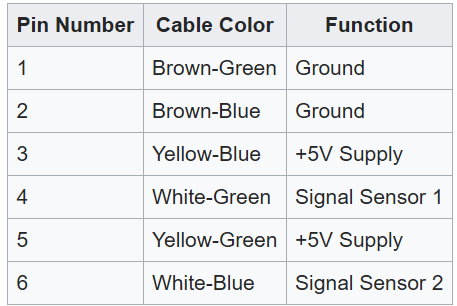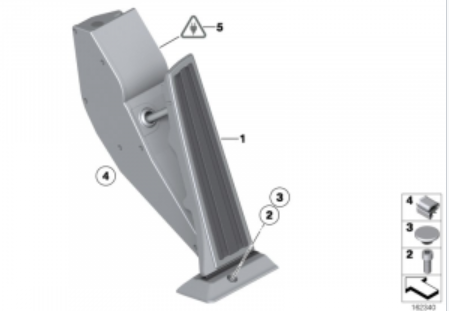

## Wasserpumpe Inverter

TOPSFLO Das Anschlusskabel der bürstenlosen Wasserpumpe ist ein hochtemperaturbeständiger Teflondraht, der von guter Qualität ist. Sein Anschlusskabel ist 4P und seine Antriebsplatte verfügt über einen Verpolungsschutz.Daher sind die Plus- und Minuspole mit der Wasserpumpe verbunden, funktionieren aber nicht und verbrennen die Antriebsplatte nicht.Die Antriebsplatte verfügt außerdem über eine Ausgangssignal-FG-Leitung (gelbe Linie) und eine blaue Geschwindigkeitsregulierungsleitung (5V PWM-Signal). Die Verkabelungsmethode ist wie folgt:

- Rote Leitung: An den Pluspol der Stromversorgung anschließen (12 V)
- Schwarze Leitung: Verbinden Sie den Minuspol der Stromversorgung und den Minuspol des PWM-Signals (GND).
- Gelbe Linie: FG-Leitung des Ausgangssignals (Lassen Sie es einfach in der Luft)
- Blaue Linie: 5V PWM-Signal (oder 5V Spannung)

Wenn nur eine einfache Bedienung erforderlich ist, ist die rote Leitung
mit 12 V verbunden, die blaue Leitung wird über einen 10K-Widerstand mit
der roten Leitung verbunden, die schwarze Leitung ist mit dem Minuspol
verbunden und die Wasserpumpe läuft mit der höchsten Geschwindigkeit,
damit nur 1 Satz Netzteile normal verwendet werden kann, was sehr
praktisch ist.

Wenn eine Geschwindigkeitsregelung des PWM-Signals erforderlich ist,
wird an der blauen Leitung ein 5-V-PWM-Signal eingegeben.Bitte beachten
Sie, dass die Spannung des PWM-Signals etwa 5 V beträgt, denn wenn die
Spannung zu stark 5 V überschreitet, läuft die Wasserpumpe mit höchster
Geschwindigkeit und kann keine Geschwindigkeitsregulierung erfolgen.Wenn
die Spannung zu niedriger als 5 V ist, kann die höchste Leistung der
Wasserpumpe nicht ausgeübt werden.Wenn wir beispielsweise ein
2-V-PWM-Signal verwenden, beträgt der Strom der Wasserpumpe bei höchster
Geschwindigkeit nur etwa 0,98 A, was nur etwa 12 W beträgt.Der Minuspol
des PWM-Signals sollte ebenfalls an den Minuspol der Stromversorgung
angeschlossen werden.

## Wasserpumpe Batteriekühlung

Hersteller: TESLA, Teilenummer: **muss ergänzt werden** **

Quelle:
<https://www.evcreate.com/using-tesla-thermal-management-system-parts/> 13.08.2024.

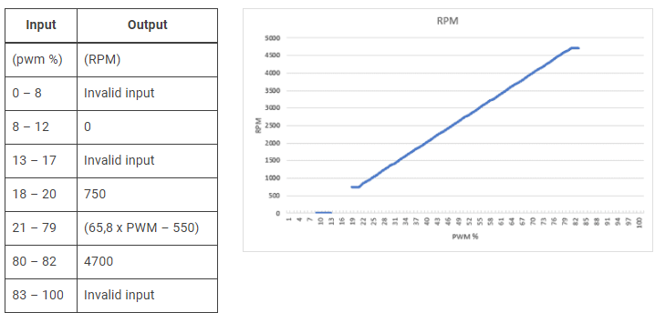

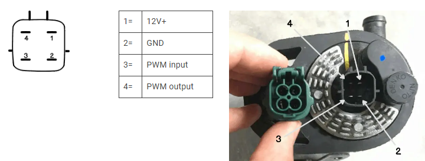

Ja, es gibt konkrete Angaben zur PWM-Steuerung der Tesla-Pumpe mit der
Teilenummer **6007367-00-E**:

- **PWM Signal:**\
  Die Pumpe erwartet ein PWM-Signal, das „gegen Masse geschaltet"
  (low-side) ist, also ein Signal, das zwischen offen (hochohmig) und
  GND wechselt, nicht ein klassisches 0/5V-Pegelsignal.\
  Das PWM-Signal wird an Pin 3 der Pumpe
  angeschlossen[1](https://www.evcreate.com/using-tesla-thermal-management-system-parts/)[3](https://www.ossev.info/projects/tesla_pump/).

- **Signalpegel:**\
  Das PWM-Signal arbeitet mit **5V**-Logikpegeln, wobei der Eingang
  intern mit einem Pull-up-Widerstand auf 5V liegt. Das bedeutet, der
  Eingang ist standardmäßig auf 5V und wird durch das PWM-Signal auf
  Masse gezogen.\
  Ein 3,3V-Logiksignal reicht in der Praxis oft nicht aus, um den
  Eingang zuverlässig als „Low" zu erkennen, da der interne Pull-up auf
  5V liegt. Ein Open-Drain-Ausgang oder ein Transistor/MOSFET, der
  direkt auf Masse schaltet, ist
  ideal[1](https://www.evcreate.com/using-tesla-thermal-management-system-parts/)[3](https://www.ossev.info/projects/tesla_pump/).

- **PWM-Frequenz:**\
  Die Pumpe erwartet eine sehr niedrige PWM-Frequenz von etwa **2
  Hz** (ungewöhnlich langsam für
  PWM)[3](https://www.ossev.info/projects/tesla_pump/).\
  Viele Mikrocontroller erzeugen PWM im kHz-Bereich, das ist
  hier **nicht** kompatibel. Die Frequenz muss explizit auf ca. 2 Hz
  eingestellt werden.

- **Spannungsversorgung:**\
  Die Pumpe selbst läuft mit **12--13V** Versorgungsspannung,
  akzeptiert
  8--16V[1](https://www.evcreate.com/using-tesla-thermal-management-system-parts/)[3](https://www.ossev.info/projects/tesla_pump/).

- **Zusammenfassung für die Ansteuerung:**

  - PWM-Eingang: Pin 3, gegen Masse schalten (Open-Drain/Collector oder
    MOSFET empfohlen)
  - PWM-Frequenz: ca. 2 Hz
  - PWM-Pegel: 5V, aber Signal muss aktiv auf Masse ziehen
  - Versorgung: 12V
  - Ohne gültiges PWM-Signal läuft die Pumpe nach 4--7 Sekunden auf
    Volllast

**Quellen:**

- [EVcreate: Tesla water pump
  control1](https://www.evcreate.com/using-tesla-thermal-management-system-parts/)
- [OSSEV: Tesla Pump Speed Controller
  Project3](https://www.ossev.info/projects/tesla_pump/)

**Praktische Umsetzung:**\
Mit einem ESP32 kannst du das Signal erzeugen, aber du solltest einen
kleinen NPN-Transistor oder MOSFET als Open-Drain-Treiber verwenden, um
den PWM-Eingang der Pumpe sicher auf Masse zu schalten. Außerdem musst
du die PWM-Frequenz auf 2 Hz einstellen, was mit Software-PWM auf dem
ESP32 möglich ist.

**Fazit:**\
Die PWM-Spannung ist durch den internen Pull-up auf 5V definiert. Das
Signal muss auf Masse gezogen werden (Open-Drain). Ein direktes
3,3V-Signal reicht nicht, aber mit einem Transistor als Schalter ist die
Ansteuerung problemlos möglich, auch über 2 Meter Leitungslänge, solange
du Störungen minimierst und die Leitungen sauber
verlegst[1](https://www.evcreate.com/using-tesla-thermal-management-system-parts/)[3](https://www.ossev.info/projects/tesla_pump/).

Für die Ansteuerung des PWM-Eingangs der Tesla-Pumpe (6007367-00-E)
empfehle ich einen **kleinen NPN-Transistor** oder
einen **Logikpegel-N-Kanal-MOSFET**. Beide Varianten sind geeignet, um
das Signal zuverlässig auf Masse zu ziehen (Open-Drain/Open-Collector).

## **Empfohlene Transistoren**

  Typ              Beispiel            Vorteile                                        Hinweise
  ---------------- ------------------- ----------------------------------------------- --------------------------
  NPN-Transistor   BC547, BC337        Einfach, günstig, überall verfügbar             Basisvorwiderstand nötig
  N-Kanal MOSFET   2N7000, IRLML6344   Direkt mit 3,3V ansteuerbar, geringer Rds(on)   Gatewiderstand empfohlen

## **Empfohlene Schaltungsvariante (NPN-Transistor, z. B. BC547):**

- **Kollektor** an den PWM-Eingang der Pumpe (Pin 3)
- **Emitter** an Masse (GND)
- **Basis** über einen **1 kΩ Widerstand** an den ESP32 GPIO
- **Optional:** 10 kΩ Pull-Down von Basis nach Masse für sauberes
  Abschalten

## **MOSFET-Variante (z. B. 2N7000):**

- **Drain** an den PWM-Eingang der Pumpe
- **Source** an Masse (GND)
- **Gate** über 100 Ω an den ESP32 GPIO
- **Optional:** 10 kΩ Pull-Down von Gate nach Masse

**Begründung:**

- Beide Typen schalten zuverlässig auf Masse, auch wenn der PWM-Eingang
  intern auf 5V gezogen wird.
- Sie sind robust gegen Störungen und funktionieren auch bei längeren
  Leitungen.

**Tipp:**\
Wenn du einen MOSFET wählst, achte auf einen **Logikpegel-Typ** (z. B.
IRLML6344, 2N7000), damit er mit 3,3V sauber durchschaltet.

**Fazit:**\
Für deine Anwendung sind **BC547** (NPN) oder **2N7000** (Logik-MOSFET)
bewährte, leicht verfügbare und zuverlässige Bauteile.

Die Beschaltung der Vehicle Control Unit

Anschlussbild Lilygo T 485

  GND    Unlock key, DRV8871 GND , ULN2803 Pin9(weiss), TYPE2 Feedback   IO25   DRV8871 IN1 (schwarz)
  IO32   Unlock key (violett)                                            IO33   DRV8871 IN2 (grau)
  IO05   Inverter Pump (grün)                                            IO12   Battery Pump (blau)
  IO34   Reserve 1 (orange)                                              IO35   Reserve 2 (gelb)
  IO18   TYPE2 Feedback (braun)                                          VDD    DRV8871 VDD (rot)

ULN2803

Our [MX-5e](https://www.ossev.info/projects/mx5e/index.php) is a typical
application of this pump speed controller. When the ignition is switched
on, 12V dc is provided to pump and a 5V dc-dc converter, the latter
powering the pump speed controller. Both are powered via a
suitable [fuse](https://www.ossev.info/design/electrics/12V.php#fuses).
With no inputs connected, the pump will run at 25% which is 750rpm.

The [Driver Control Unit
(DCU)](https://www.ossev.info/design/electronics/dcu.php) is interfaced
to the pump speed controller via the three pins: SP1, SP2 and ERR. Based
on observed temperatures in the [MX-5e cooling
system](https://www.ossev.info/projects/mx5e_cooling/index.php), the DCU
will control the speed via the SP1 & SP2 pins: \[00\] = 20% PWM and
750rpm, \[01\] = 40% PWM and 2000rpm, \[10\] = 60% PWM and 3300rpm,
\[11\] = 80% PWM giving the maximum speed of 4700rpm.

If the sensed speed of the Tesla pump (via SEN pin) is out of the
expected range, then the ERR pin is pulled low by the control and
the [Driver Control Unit
(DCU)](https://www.ossev.info/design/electronics/dcu.php) will then flag
the error to the driver.

## Onboard-Ladegerät

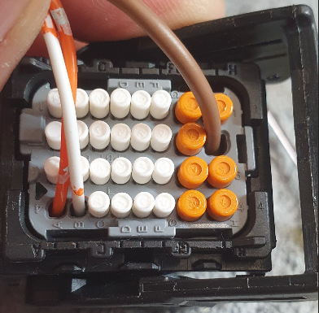

## DC-DC Wandler

## R-N-D Schalter

## Kombi-Instrument

Das Kombi-Instrument verfügt über digitale Anzeigen und nutzt weiterhin die analogen Instrumente um digitale Informationen darzustellen.

## MicroController

Hersteller: LONGAN, Typ: CanBed RP2040

Aufgabe:
Der Microcontroller erweitert das Kombi-Instrument um digitale Anzeigen und reaktiviert die analogen Instrumente. Er stellt Daten vom Inverter und zusätzliche CanBus Informationen dar.

**Specifications:**

- Microcontroller: Raspberry Pi RP2040
- Clock speed: 133 MHz
- Flash memory: 2MB
- RAM: 264KB
- Operating voltage: 9-28V

### Display 1 -- Zentrale Meldungsanzeige

Typ: [*0.91 Zoll OLED Display SSD1306 I2C/IIC 128x32 Modul 4 PIN
Weiß*](https://www.ebay.de/itm/174255778938?var=473236321890)

Aufgabe:
Berichtet über Systemmeldungen beim Start und weitere Zustände. Die
Standardanzeige ist „**BERTONE**".

### Display 2 -- Ganganzeige und Fehlerzustände

Typ: [0.49 Zoll OLED Display Module IIC I2C/SSD1306
Weiß](https://www.ebay.de/itm/175071126309)

Aufgabe:\
Wertet die korrespondierenden System Statusmeldungen des Inverters aus.

Anzeigewerte:\
**R** Reverse Rückwärtsfahrt

**N** Neutral Neutral

**D** Drive Vorwärtsfahrt

**P** Park Handbremse

    RND-Display Fehlercodes:
    NDT: Kein Datenempfang
    CRSH: Systemabsturz

  Anzeige   Bedeutung                     Beschreibung
  NODT      Kein Datenempfang (Timeout)   Keine Telemetriedaten vom ESP32 empfangen (länger als 2 Sekunden).

  CRSH      Systemabsturz Dispay Unit     System durch Watchdog zurückgesetzt nach einem Softwarefehler.

### Display 3 - Odometer

Bereifung: 185/60 R13\
Reifendurchmesser: 55,2 cm\
Abrollumfang: 167,9 cm -- 173,5 cm

Beispiel: 180 km/h = 50 m/s,**\**
Umdrehungen pro Sekunde = geschwindigkeit/umfang\
50 m/s : 1,71 m = 29,24 umdrehungen/sek

10 km/h = 2,77 m/s,**\**
Umdrehungen pro Sekunde = geschwindigkeit/umfang\
2,77777 m/s : 1,71 m = 1,624 umdrehungen/sek

*Auszug aus dem Code zur Ermittelung der Geschwindigkeit:*
from machine import Pin, PWM
import time

# Konfiguration

WHEEL_CIRCUMFERENCE = 1.71 \# Radumfang in Metern
PULSES_PER_REVOLUTION = 2 \# Anzahl der Pulse pro Radumdrehung
INPUT_PIN = 16 \# GPIO-Pin für den Eingangspuls

\# PWM für Pulszählung einrichten
pwm = PWM(Pin(INPUT_PIN))
pwm.freq(100000) \# Hohe Frequenz für genaue Messung
def calculate_speed():
start_time = time.ticks_us()
start_count = pwm.duty_u16()
time.sleep(0.1) \# Messintervall (anpassbar für verschiedene Geschwindigkeiten)
end_time = time.ticks_us()
end_count = pwm.duty_u16()
duration = time.ticks_diff(end_time, start_time) / 1000000 \# inSekunden
pulse_count = end_count - start_count
if pulse_count \> 0:
revolutions = pulse_count / PULSES_PER_REVOLUTION
distance = revolutions \* WHEEL_CIRCUMFERENCE
speed_mps = distance / duration
speed_kmh = speed_mps \* 3.6
return speed_kmh
else:
return 0
while rue:
speed = calculate_speed()
print(f\"Aktuelle Geschwindigkeit: {speed:.2f} km/h\")
time.sleep(0.5) \# Aktualisierungsintervall Dieser Code nutzt die PWM-Funktionalität des RP2040, um die Pulse präzise zu zählen\[1\]\[3\]. Hier sind die Hauptpunkte:
1\. Wir verwenden PWM im Eingangsmodus, um die Pulse zu zählen.
2\. Die Funktion \`calculate_speed()\` misst die Anzahl der Pulse in einem kurzen Zeitintervall.
3\. Die Geschwindigkeit wird aus der Anzahl der Umdrehungen, dem Radumfang und der verstrichenen Zeit berechnet.
4\. Das Messintervall von 0,1 Sekunden ermöglicht die Erfassung von Geschwindigkeiten von etwa 5 km/h bis über 200 km/h.

Für genauere Messungen bei sehr niedrigen oder sehr hohen Geschwindigkeiten können Sie das Messintervall dynamisch anpassen. Bei niedrigen Geschwindigkeiten verlängern Sie das Intervall, bei hohen Geschwindigkeiten verkürzen Sie es.

Beachten Sie, dass die tatsächliche Genauigkeit von der Stabilität und Frequenz der Eingangspulse abhängt. Für sehr präzise Messungen, insbesondere bei hohen Geschwindigkeiten, sollten Sie möglicherweise zusätzliche Filtertechniken oder eine Mittelwertbildung über mehrere Messungen in Betracht ziehen.

Citations:

\[1\] https://hackaday.com/2023/08/26/accurate-cycle-counting-on-rp2040-micropython/
\[2\] https://docs.micropython.org/en/latest/rp2/quickref.html
\[3\] https://iosoft.blog/2023/08/21/picofreq_python/
\[4\] https://www.youtube.com/watch?v=y2EDhzDiPTE
\[5\] https://forum.micropython.org/viewtopic.php?t=9692
\[6\] https://forums.raspberrypi.com/viewtopic.php?t=310796
\[7\] https://forum.micropython.org/viewtopic.php?t=9695
\[8\] https://media.ccc.de/v/sps22-4239-micropython-on-the-rp2040 **\**

## Impulsgeber

Der Impulszähler liefert 2 Impulse pro Radumdrehung und ist direkt am Getriebe installiert.

Hersteller: RIDEX, Typ: 833C0073

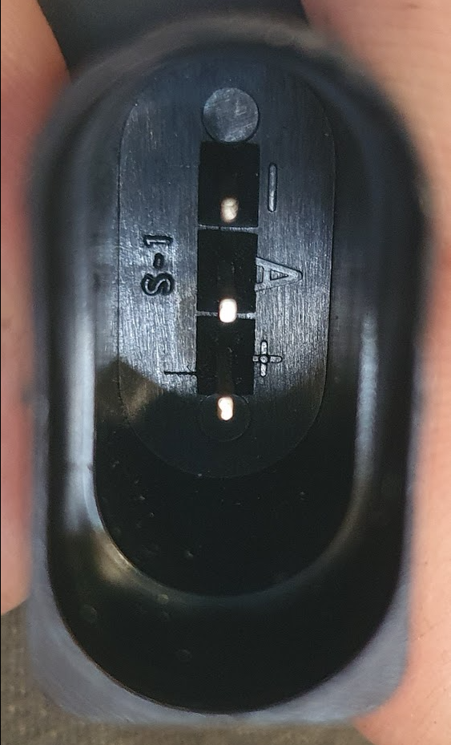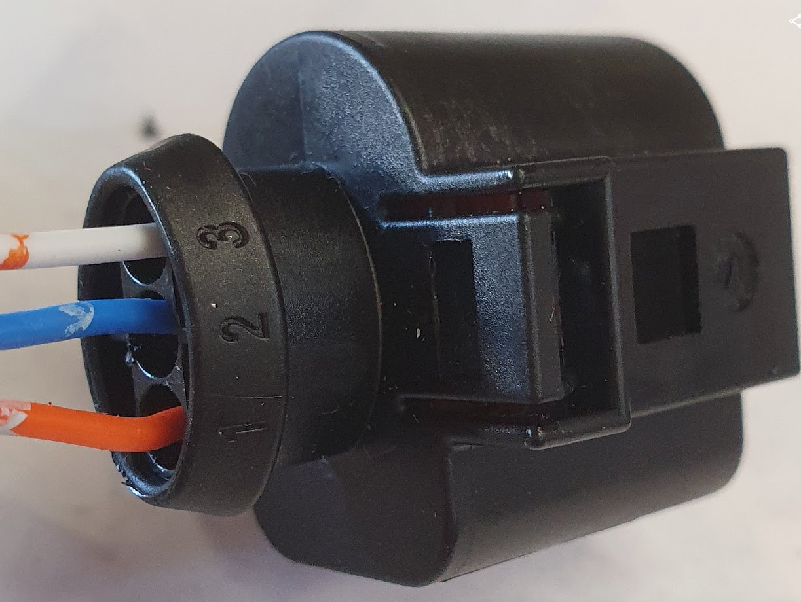Abb. Stecker und Belegung Impulsgeber

## BMS

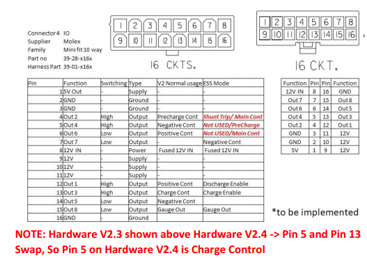

## BMS Charge Control

Sicherheitsmaßnahmen

- Wegfahrschutz bei eingesteckten und verriegelten Stecker zur Verhinderung eines versehentlichen Wegfahrens
- Steckerverriegelung als Schutz vor Trennung der Verbindung unter Last und auch zur Verhinderung eines nicht-autorisiertes abstecken des Ladekabels.
- Nur bei vollständig eingestecktem Stecker wird eine Ladespannung angelegt.
- Die Abfrage des Proximity-Kontakts PP meldet den maximal möglichen Ladestrom des Fahrzeugs (bzw. des Kabels) an die Ladestation. Hierzu wird im Kabel ein Widerstand zwischen PP und PE gesetzt. Die Kodierung des zulässigen Stroms zum Widerstandswert ist in [IEC 61851-1](https://de.wikipedia.org/w/index.php?title=IEC_61851-1&action=edit&redlink=1) geregelt: (https://de.wikipedia.org/wiki/IEC_62196_Typ_2#cite_note-9)

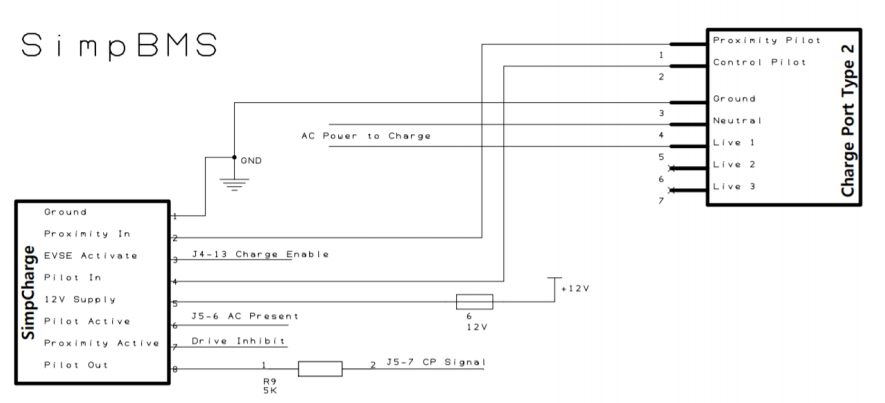

CanBus Meldung zum Ladeanschluss:\
 msg.id  = 0x246; //BMS Message to MCU
  msg.len = 8;
  msg.buf\[0\] = lowByte(SOC);
  msg.buf\[1\] = highByte(SOC);
  msg.buf\[2\] = lowByte(long(currentact / 100));
  msg.buf\[3\] = highByte(long(currentact / 100));
  msg.buf\[4\] = bmsstatus;
  msg.buf\[5\] = (digitalRead(IN1) \| (digitalRead(IN2) \<\< 1) \| (digitalRead(IN3) \<\< 2) \| (digitalRead(IN4) \<\< 3)); // IN1=KeyOn , IN2=Alt_Charge_Cur_Signal ,IN3=Type2_PP, IN4=Type2_CP
  msg.buf\[6\] = 0x00;
  msg.buf\[7\] = 0x00;

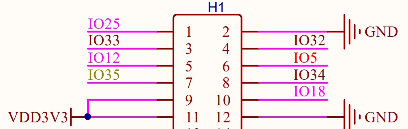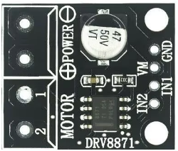Type 2 Stecker Verriegelung:\ IO25 verriegelt den Stecker, IO33 entriegelt ihn, jeweils durch Ansteuerung des Motortreibers DRV8871.\
Eine manuelle Entriegelung kann im Fehlerfall bei Erfüllung der Voraussetzungen (kein Stromfluss aus dem Onboard-Ladegerät) durch Drücken des Tasters verbunden mit IO32 erfolgen.\
Eine mechanische Entriegelung kann durch Ziehen der Not-Entriegelung unterhalb der Typ2 Buchse erfolgen. Dazu muss vorher die Motorhaube geöffnet werden.\

## Ladeanschluss LED

- **Grün:**
  - Ladevorgang läuft.
- **Blau:**
  - Verbindung zum Ladegerät wird hergestellt.
- **Gelb:**
  - Fehler beim Laden.
- **Rot:**
  - Fehler Batteriemangementsystem.
  - Blitzend: Fehler Isolationswiderstand

## IMD Isolation Monitoring Device

Typ: iso165C1 Hersteller: Bender GmbH & Co. KG, Grünberg
iso165C-1 DC 0\...600 V CAN Schnittstelle
ISOMETER ©
Isometer Gehäuseversion incl. Bracket
Us = DC 12 V Ri = 1200 kOhm
Messwertausgang: CAN Schnittstelle, 500 kBaud
Ce max.: 1 μF
Ansprechwert: 250 kOhm, Ansprechzeit: \<20 sec.
Vorwarnung: 400 kOhm
Freigabe nach Power On, schliessen der Relais und Start der Messung: = 3 s Messverfahren: DCP, Faktor: 3

**Umsetzung in der VCU:**
Selbsttest-Trigger bei BMS-Zustandsübergängen:

- Prüfung der VIFC-Status-Bits 12 und 13 (vifcStatus) zur Bestimmung, ob ein Selbsttest erforderlich ist (1 = nicht ausgeführt).
- Normkonformität:
  - IEC 61557-8: Selbsttest zur Überprüfung der Funktionalität des IMD.
  - ISO 6469-3: Sicherstellung der elektrischen Sicherheit im Fahrbetrieb.
  - IEC 61851-1: Selbsttest vor dem Ladevorgang.

Review des VCU Controller Codes Selftest Trigger:

if (bmsValid) {
// 1. Check if the vehicle is in an operational state (Ready, Drive, or
Charging)
bool isOperational = (currentBmsStatus == BMS_STATUS_READY \|\|
currentBmsStatus == BMS_STATUS_DRIVE \|\|
currentBmsStatus == BMS_STATUS_CHARGE);

// 2. Read Bender VIFC-Status Bits 12 and 13 (1 = Test missing/not
executed)
// Bit 12: IMC-Selbttest (OverAll-Szenario) missing
// Bit 13: VIFC-Selbttest missing

bool imdSelfTestMissing = (vifcStatus & (1 \<\< 12)) \|\| (vifcStatus & (1 \<\< 13));

// 3. Automated Edge Trigger according to documentation rules:
// If the car is active and the hardware explicitly flags that the test is missing,
// and we aren\'t already running a test, request it immediately!

if (isOperational && imdSelfTestMissing && !telemetryData.selfTestRunning) {

WITH_DATA_MUTEX({ telemetryData.selfTestRequested = true; });
safe_printf(\"\[SYSTEM\] Compliance Trigger: IMD flags test missing  (Bits 12/13). Initiating self-test.\\n\");

}

lastBmsStatus = currentBmsStatus;

}

#### 1. IEC 61557-8 (Isolationsüberwachungsgeräte in IT-Systemen)

- **Anforderung:** Die Funktionalität des IMD (inklusive der Messketten und der internen HV-Ankoppelrelais) muss zyklisch oder ereignisbasiert überprüft werden können.
- **Erfüllung:** Durch den Aufruf von `send_imd_self_test_start(false)`
  (Befehl `0x00D0` auf CAN-ID `0x22`) stößt die VCU exakt diesen genormten geräteinternen Hardware-Selbsttest des Benders an und evaluiert im Zustand `EVALUATING` das Ergebnis.

#### 2. ISO 6469-3 (Elektrische Sicherheit von Elektrofahrzeugen)

- **Anforderung:** Schutz von Personen vor elektrischem Schlag im regulären Fahrbetrieb. Ein sicherer Zustand (Fahrverbot / Interlock) muss erzwungen werden, solange der Isolationszustand des HV-Busses nicht zweifelsfrei verifiziert ist.
- **Erfüllung:** Deine State Machine in `self_test.cpp` hält `send_bms_relay_release(false)` (ID `0x309` auf `0x00`) so lange aktiv, bis der Selbsttest den Zustand `CLEANUP_SUCCESS` erreicht. Das bedeutet: **Die echten HV-Schütze der Tesla-Batterie schließen niemals, solange das Isometer nicht grünes Licht gibt.** Das Fahrzeug ist im Fehlerfall physisch blockiert (`Drive Inhibit` über den Hyper9-BMS-Proxy).

#### 3. IEC 61851-1 (Elektrische Ausrüstung von Elektro-Straßenfahrzeugen -- Konduktive Ladesysteme)

- **Anforderung:** Bevor Energie aus der Ladesäule (EVSE) in das Fahrzeug fließen darf, muss die elektrische Sicherheit der fahrzeugseitigen HV-Infrastruktur überprüft werden.
- **Erfüllung:** Sobald das SimpBMS in den Status `3` (`BMS_STATUS_CHARGE`) wechselt, erkennt die VCU das, blockiert den Ladevorgang über die `CAN_Transmit_Task()`, führt zuerst den  Isometer-Selbsttest durch, schließt danach die internen Messrelais und gibt erst dann den Elcon-Charger frei.

## Iso-R Prüfbox

Tester für Insulation Monitoring Device aufgebaut aus 8 in reihe geschalteten 82kOhm Widerständen. Vier Ausgänge ermöglichen es den Widerstand auf 496, 372, 248 und 124kOhm zu senken.

Testablauf:

- Anschluß GND (schwarz) über Krokodilklemme mit der Fahrzeugmasse verbinden
- Sicherheitsprüfkabel mit HV+ oder HV- verbinden
- Das andere Ende des Sicherheitsprüfkabels zuerst mit dem höchsten Widerstands-Ausgang 496kOhm (grün) verbinden.

+-----------------+-------------------------+-----------------------------+-------------------+
| **Ausgang** | **Widerstände in      | **Gesamt-**             | **Prüfzweck** |
|                 | Reihe**               |                             |                   |
|                 |                         | **widerstand              |                   |
|                 |                         | R**~**Pr**~~**ü**~~**f​**~** |                   |
+=================+=========================+=============================+===================+
| D               | R1+R2+R3+R4+R5+R6+R7+R8 | 496kΩ                       | **Prüfung         |
|                 |                         |                             | Hysterese** (ca.  |
|                 |                         |                             | 500**kΩ**).       |
+-----------------+-------------------------+-----------------------------+-------------------+
| C               | R1+R2+R3+R4+R5+R6       | 372kΩ                       | **Auslösung       |
|                 |                         |                             | WARNUNG**         |
|                 |                         |                             | (400**kΩ**).      |
+-----------------+-------------------------+-----------------------------+-------------------+
| B               | R1+R2+R3+R4             | 248kΩ                       | **Auslösung       |
|                 |                         |                             | FEHLER**          |
|                 |                         |                             | (250**kΩ** .      |
+-----------------+-------------------------+-----------------------------+-------------------+
| A               | R1+R2                   | 124kΩ                       | Minimaler         |
|                 |                         |                             | Fehlerwert (klar  |
|                 |                         |                             | **ROT**)          |
+-----------------+-------------------------+-----------------------------+-------------------+
| GND             |                         |                             | Masse (Referenz). |
+-----------------+-------------------------+-----------------------------+-------------------+

Prüfreihenfolge

  ------------------------------------------------------------------------------------------------------------------------------------------------
  **Nr.**   **Ausgang**   **Farbe**   **Prüf-widerstand\   **Erwarteter Zustand**   **Prüfzweck**
                                                  (kOhm)**                                          
  ------------- ----------------- --------------- ---------------------- ---------------------------- --------------------------------------------
  1             D                 Grün            496                    OK                           Startwert

  2             C                 Gelb            372                    WARNUNG                      Löst die 400**kΩ** \
                                                                                                      Warnung-schwelle aus.

  3             B                 Rot             248                    FEHLER                       Löst die 250**kΩ** \
                                                                                                      Error-Schwelle aus.

  4             A                 Rot             124                    FEHLER                       Fehler bleibt aktiv (sehr niedriger Wert).
  ------------------------------------------------------------------------------------------------------------------------------------------------

## CAN Open Network

Baudrate: 500k

CO Node: CAN Open Node. In this case you create a network composed by some nodes. There are two type of CO Nodes:

- **Node One:** You must specify Node One, the Net Manager. You must complete the Net Composition with the Node One ID and listing all active Generic Nodes in the network with their ID. This node can cause the falling down of the network in case of fault.
- **Generic Node:** one of the secondary nodes in your network.

### Inverter CanBus Meldungen

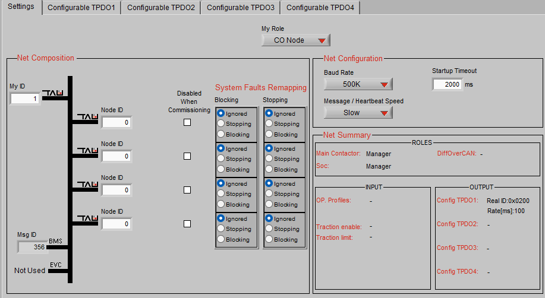

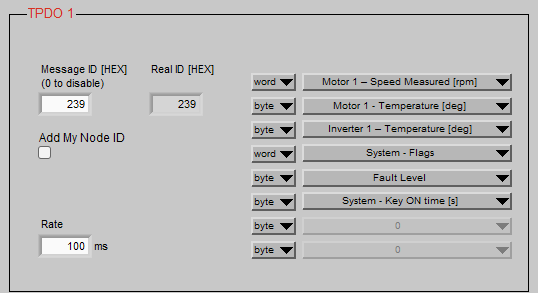
\
NEU! TODO\
TPDO 1 (`0x239`) -- Intervall: Fast (100ms / 10Hz)

Hier landen alle Variablen, die du für flüssige Dashboard-Anzeigen (Drehzahlmesser, Powermeter) und sofortige Leistungsberechnungen brauchst.

- **Byte 0--1 (Word):** Motor Speed (rpm)
- **Byte 2--3 (Word):** Motor 1 - Torque Word % (signed: `-100%` bis  `+100%` -- zeigt dir auch Rekuperation perfekt als Minuswert an!)
- **Byte 4 (Byte):** Motor Temperature (°C)
- **Byte 5 (Byte):** Inverter Temperature (°C)
- **Byte 6 (Byte):** Fault Level
- Frei: Byte 7 (z.B. für ein Status-Byte)

#### TPDO 2 (`0x240`) -- Intervall: Medium (250ms / 4Hz)

Hier landen die mächtigen Bitmasken und Betriebsstundenzähler. Sie ändern sich nicht im Millisekundentakt, sind aber für die Diagnose unersetzlich.

- **Byte 0--1 (Word):** System Flags
- **Byte 2--3 (Word):** Motor Flags
- **Byte 4-5 (WORD):** System Key Ontime (Betriebsstunden seit Zündung
  ein)

MCU Konfiguration zum Auslesen der BMS Daten über Proxy BMS.

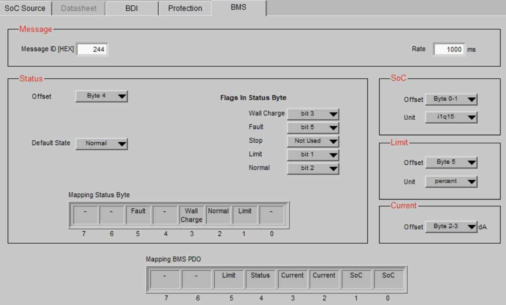*Todo: Stop Flag bit0 bei IMD fault ergänzt!\
\*

### **Code-Implementierung des Software-Überlastschutzes (VCU)**

Die VCU (ESP32 / Lilygo T485) liest kontinuierlich die Motordrehzahl (telemetryData.motorRPM) über die CAN-Bus-TPDOs (Real ID 239) des Inverters aus. In der zyklischen Funktion zur Übertragung der BMS-Proxy-Daten (send_proxy_bms_data(), CAN-ID 0x246) wird der
Skalierungsfaktor für das Drehmoment (limit_percent) in Echtzeit berechnet und an den Inverter gesendet.

**Quellcode-Auszug (C++):**

void send_proxy_bms_data() {
uint16_t soc_hyper9 = 0;
int16_t current_da = 0;
uint8_t status = 0;
uint8_t limit_percent = 100;

if (xSemaphoreTake(dataMutex, pdMS_TO_TICKS(20)) == pdTRUE) {
soc_hyper9 = (uint16_t)((telemetryData.bmsSoC / 100.0f) \* 32768.0f);
current_da = (int16_t)(telemetryData.bmsCurrent \* 10.0f);

// \-\-- DYNAMIC CURRENT LIMITING (200A PROTECT) \-\--
if (telemetryData.motorRPM \> 1272) {
uint32_t calculated_limit = 127240 / telemetryData.motorRPM;
limit_percent = (uint8_t)calculated_limit;
if (limit_percent \> 100) limit_percent = 100;
if (limit_percent \< 10) limit_percent = 10; // Lowest value, to ensure
propulsion
} else {limit_percent = 100; // Maximum Torque at Start with less than
1272 U/min}

// BMS-Warning have always highest priority
if (telemetryData.bmsHighTempWarn && limit_percent \> 50) {limit_percent = 50;

} else if (telemetryData.bmsLowVoltageWarn && limit_percent \> 40) {limit_percent = 40;}

*// \-\-- DRIVE INHIBIT (INTERLOCK) LOGIC \-\--*

bool cableConnected = (telemetryData.bmsStatus == 0x04 \|\| telemetryData.isCharging);

bool systemFault = (telemetryData.selfTestResult != 0 \|\| telemetryData.bmsHardwareFault);

if (cableConnected \|\| telemetryData.isLocked \|\| systemFault) {status \|= (1 \<\< 5); // DRIVE INHIBIT ACTIVATED
} else if (limit_percent \< 100) {status \|= (1 \<\< 1); // LIMIT MODE
} else {status \|= (1 \<\< 2); // NORMAL MODE}

if (telemetryData.isCharging) status \|= (1 \<\< 3);
xSemaphoreGive(dataMutex);
}

twai_message_t msg = {0};
msg.identifier = HYPER9_PROXY_ID;
msg.data_length_code = 8;
msg.data\[0\] = (uint8_t)(soc_hyper9 \>\> 8);
msg.data\[1\] = (uint8_t)(soc_hyper9 & 0xFF);
msg.data\[2\] = (uint8_t)(current_da \>\> 8);
msg.data\[3\] = (uint8_t)(current_da & 0xFF);
msg.data\[4\] = status;
msg.data\[5\] = limit_percent; // dynamic calculated limit send to Inverter

twai_transmit(&msg, pdMS_TO_TICKS(5));

}

### DC/DC Wandler

Haben Sie bereits versucht, die ID `0x18FF51E5` zu senden, und erhalten Sie eine **Antwort auf** `0x18FF50E5`** zurück?

### CanBus CrossCom

### Inverter Digital-Ausgänge

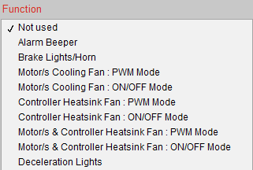

### K1-30 -- Zusatzlüfter Inverter-Kühlkreis ON/OFF

Einschalttemperatur: 78°C, Ausschalttemperatur: 68°C

### K1-31 -- tbd

### Inverter Digital-Eingänge

K1 - 4 Interlock
K1 - 5 Vorwärtsfahrt
Akteur: RND Schalter Ort: Mittelkonsole

K1 - 6 Rückwärtsfahrt
Akteur: RND Schalter Ort: Mittelkonsole

K1- 7 Rekuperation 0%
Akteur: Recu Schalter Ort: Mittelkonsole

K1-18 Pedal Bremse
Akteur: Bremslicht über Relais **Ort: Pedale (Relaiseinheit)

K1-19 tbd
