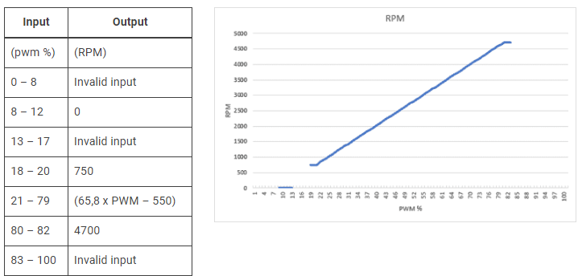
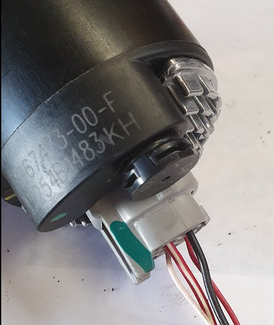
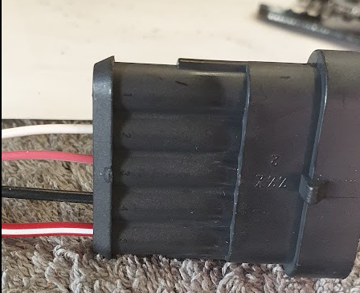
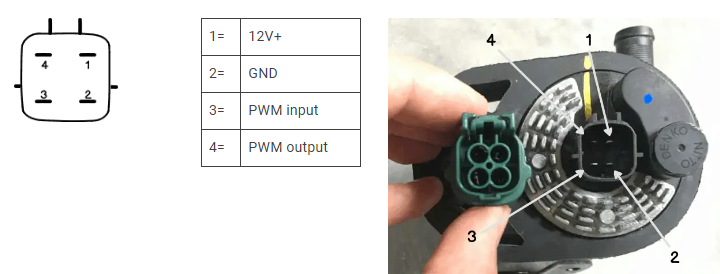

# Wasserpumpe Batteriekühlung

Hersteller: TESLA, Teilenummer: **muss ergänzt werden** **

Quelle:
<https://www.evcreate.com/using-tesla-thermal-management-system-parts/> 13.08.2024.

Ja, es gibt konkrete Angaben zur PWM-Steuerung der Tesla-Pumpe mit der
Teilenummer **6007367-00-E**:

- **PWM Signal:**\
  Die Pumpe erwartet ein PWM-Signal, das „gegen Masse geschaltet"
  (low-side) ist, also ein Signal, das zwischen offen (hochohmig) und
  GND wechselt, nicht ein klassisches 0/5V-Pegelsignal.\
  Das PWM-Signal wird an Pin 3 der Pumpe
  angeschlossen[1](https://www.evcreate.com/using-tesla-thermal-management-system-parts/)[3](https://www.ossev.info/projects/tesla_pump/).

- **Signalpegel:**\
  Das PWM-Signal arbeitet mit **5V**-Logikpegeln, wobei der Eingang
  intern mit einem Pull-up-Widerstand auf 5V liegt. Das bedeutet, der
  Eingang ist standardmäßig auf 5V und wird durch das PWM-Signal auf
  Masse gezogen.\
  Ein 3,3V-Logiksignal reicht in der Praxis oft nicht aus, um den
  Eingang zuverlässig als „Low" zu erkennen, da der interne Pull-up auf
  5V liegt. Ein Open-Drain-Ausgang oder ein Transistor/MOSFET, der
  direkt auf Masse schaltet, ist
  ideal[1](https://www.evcreate.com/using-tesla-thermal-management-system-parts/)[3](https://www.ossev.info/projects/tesla_pump/).

- **PWM-Frequenz:**\
  Die Pumpe erwartet eine sehr niedrige PWM-Frequenz von etwa **2
  Hz** (ungewöhnlich langsam für
  PWM)[3](https://www.ossev.info/projects/tesla_pump/).\
  Viele Mikrocontroller erzeugen PWM im kHz-Bereich, das ist
  hier **nicht** kompatibel. Die Frequenz muss explizit auf ca. 2 Hz
  eingestellt werden.

- **Spannungsversorgung:**\
  Die Pumpe selbst läuft mit **12--13V** Versorgungsspannung,
  akzeptiert
  8--16V[1](https://www.evcreate.com/using-tesla-thermal-management-system-parts/)[3](https://www.ossev.info/projects/tesla_pump/).

- **Zusammenfassung für die Ansteuerung:**

  - PWM-Eingang: Pin 3, gegen Masse schalten (Open-Drain/Collector oder
    MOSFET empfohlen)
  - PWM-Frequenz: ca. 2 Hz
  - PWM-Pegel: 5V, aber Signal muss aktiv auf Masse ziehen
  - Versorgung: 12V
  - Ohne gültiges PWM-Signal läuft die Pumpe nach 4--7 Sekunden auf
    Volllast

**Quellen:**

- [EVcreate: Tesla water pump
  control1](https://www.evcreate.com/using-tesla-thermal-management-system-parts/)
- [OSSEV: Tesla Pump Speed Controller
  Project3](https://www.ossev.info/projects/tesla_pump/)

**Praktische Umsetzung:**\
Mit einem ESP32 kannst du das Signal erzeugen, aber du solltest einen
kleinen NPN-Transistor oder MOSFET als Open-Drain-Treiber verwenden, um
den PWM-Eingang der Pumpe sicher auf Masse zu schalten. Außerdem musst
du die PWM-Frequenz auf 2 Hz einstellen, was mit Software-PWM auf dem
ESP32 möglich ist.

**Fazit:**\
Die PWM-Spannung ist durch den internen Pull-up auf 5V definiert. Das
Signal muss auf Masse gezogen werden (Open-Drain). Ein direktes
3,3V-Signal reicht nicht, aber mit einem Transistor als Schalter ist die
Ansteuerung problemlos möglich, auch über 2 Meter Leitungslänge, solange
du Störungen minimierst und die Leitungen sauber
verlegst[1](https://www.evcreate.com/using-tesla-thermal-management-system-parts/)[3](https://www.ossev.info/projects/tesla_pump/).

Für die Ansteuerung des PWM-Eingangs der Tesla-Pumpe (6007367-00-E)
empfehle ich einen **kleinen NPN-Transistor** oder
einen **Logikpegel-N-Kanal-MOSFET**. Beide Varianten sind geeignet, um
das Signal zuverlässig auf Masse zu ziehen (Open-Drain/Open-Collector).

## **Empfohlene Transistoren**

  Typ              Beispiel            Vorteile                                        Hinweise
  ---------------- ------------------- ----------------------------------------------- --------------------------
  NPN-Transistor   BC547, BC337        Einfach, günstig, überall verfügbar             Basisvorwiderstand nötig
  N-Kanal MOSFET   2N7000, IRLML6344   Direkt mit 3,3V ansteuerbar, geringer Rds(on)   Gatewiderstand empfohlen

## **Empfohlene Schaltungsvariante (NPN-Transistor, z. B. BC547):**

- **Kollektor** an den PWM-Eingang der Pumpe (Pin 3)
- **Emitter** an Masse (GND)
- **Basis** über einen **1 kΩ Widerstand** an den ESP32 GPIO
- **Optional:** 10 kΩ Pull-Down von Basis nach Masse für sauberes
  Abschalten

## **MOSFET-Variante (z. B. 2N7000):**

- **Drain** an den PWM-Eingang der Pumpe
- **Source** an Masse (GND)
- **Gate** über 100 Ω an den ESP32 GPIO
- **Optional:** 10 kΩ Pull-Down von Gate nach Masse

**Begründung:**

- Beide Typen schalten zuverlässig auf Masse, auch wenn der PWM-Eingang
  intern auf 5V gezogen wird.
- Sie sind robust gegen Störungen und funktionieren auch bei längeren
  Leitungen.

**Tipp:**\
Wenn du einen MOSFET wählst, achte auf einen **Logikpegel-Typ** (z. B.
IRLML6344, 2N7000), damit er mit 3,3V sauber durchschaltet.

**Fazit:**\
Für deine Anwendung sind **BC547** (NPN) oder **2N7000** (Logik-MOSFET)
bewährte, leicht verfügbare und zuverlässige Bauteile.

Die Beschaltung der Vehicle Control Unit

Anschlussbild Lilygo T 485

  GND    Unlock key, DRV8871 GND , ULN2803 Pin9(weiss), TYPE2 Feedback   IO25   DRV8871 IN1 (schwarz)
  IO32   Unlock key (violett)                                            IO33   DRV8871 IN2 (grau)
  IO05   Inverter Pump (grün)                                            IO12   Battery Pump (blau)
  IO34   Reserve 1 (orange)                                              IO35   Reserve 2 (gelb)
  IO18   TYPE2 Feedback (braun)                                          VDD    DRV8871 VDD (rot)

ULN2803

Our [MX-5e](https://www.ossev.info/projects/mx5e/index.php) is a typical
application of this pump speed controller. When the ignition is switched
on, 12V dc is provided to pump and a 5V dc-dc converter, the latter
powering the pump speed controller. Both are powered via a
suitable [fuse](https://www.ossev.info/design/electrics/12V.php#fuses).
With no inputs connected, the pump will run at 25% which is 750rpm.

The [Driver Control Unit
(DCU)](https://www.ossev.info/design/electronics/dcu.php) is interfaced
to the pump speed controller via the three pins: SP1, SP2 and ERR. Based
on observed temperatures in the [MX-5e cooling
system](https://www.ossev.info/projects/mx5e_cooling/index.php), the DCU
will control the speed via the SP1 & SP2 pins: \[00\] = 20% PWM and
750rpm, \[01\] = 40% PWM and 2000rpm, \[10\] = 60% PWM and 3300rpm,
\[11\] = 80% PWM giving the maximum speed of 4700rpm.

If the sensed speed of the Tesla pump (via SEN pin) is out of the
expected range, then the ERR pin is pulled low by the control and
the [Driver Control Unit
(DCU)](https://www.ossev.info/design/electronics/dcu.php) will then flag
the error to the driver.