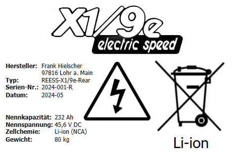

# Batteriepacks

Aus Platzgründen und zur Optimierung der Gewichtsverteilung wurden die 5 Module auf zwei Einbauorte im Fahrzeug verteilt. Beide Batteriepacks sind als Eigenbau umgesetzt. Alle Module stammen aus einem 2017er TESLA Model S mit ca. 60.000 km Fahrleistung (lt. Angabe des Händlers).

## Bewertung der Module

Beim Erwerb der Module wurde mit einem Batterie-Tester Modul-Spannung und Innenwiderstand ermittelt. Auf Basis der Datenbank des Forums **akkudoktor.net** die eine <a href="https://lili.akkudoktor.net/de-prediction.html" target="_blank">Zell-Vorhersage</a> durchführt, wurden die Werte für eine einzelne Zelle ermittelt. Anschliessend wurden diese Werte auf den Gesamtwiderstand der vorhandenen Konstellation der 6S74P 5.3 kWh Module als Erwartungswerte übertragen:

* best = 2.43 mOhm
* used = 3.24 mOhm
* old = 4.46 mOhm

Die tatsächlichen Werte der fünf angebotenen Module:

* 3.41, 
* 3.36, 
* 3.36, 
* 3.33 und 
* 3.36 mOhm Innenwiderstand bei
* 23.6 V Modulspannung aller Module.

Sie sind damit als "Gebraucht" eingestuft und als "für das Projekt geeignet" bewertet worden.

## Mechanischer Aufbau

Für den Aufbau der Module wurden robuste 26 mm Aluminium-Nutenprofile als Seitenwände gewählt. Die Batteriemodule verfügen seitllich um ca. 3 mm starke Führungslaschen mit denen sie im Original-Batteriegehäuse eines Teslas mit Schrauben nebeneinander fixiert werden. Diese Anordnung lies sich hier nicht umsetzen, daher wurden die Laschen zusätzlich mit Kantenschutz verstärkt, in die Nuten der Seitenwände eingeführt und somit vertikal eingespannt. Zur Stabilsierung der Längsrichtung wurden die Führungslaschen der Module mit auf Maß gekürzten Nutensteinen mit 8 mm starken Front- und Rückwande horizontal eingespannt. 5 mm starke Aluminiumbleche bilden den Boden und Deckel.

## Technische Daten Typenschilder

<figure><figcaption>Typenschild Front Battery</figcaption></figure>

<figure><figcaption>Typenschild Rear Battery</figcaption></figure>

## Stückliste

* **Schütze:** 4 x Tyco EV200AAANA <a href="https://www.te.com/commerce/DocumentDelivery/DDEController?Action=srchrtrv&DocNm=EV200_R_TBD_KILOVAC_EV200_Ser_C" target="_blank">Datenblatt (externer Link)</a>