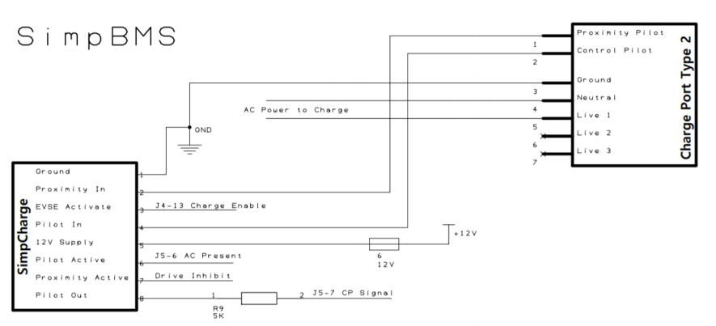

# Anhang D: BMS, Ladesteuerung (VCU) und Ladeanschluss

Während das primäre Batterie-Management-System (SimpBMS) im Master-Betrieb die Tesla-Module ausliest und die Hauptschütze steuert, dient die Erweiterung *SimpCharge* ausschließlich der PWM-Kommunikation mit der Wallbox (EVSE) sowie der reinen Informationsweitergabe an das BMS. 

Sicherheitskritische Hardware-Funktionen wie die mechanische Steckerverriegelung und die optische Statusrückmeldung (LED) werden fahrzeugseitig durch die eigenentwickelte Vehicle Control Unit (VCU) ergänzt und überwacht.

## 1. Systemkomponenten und Dokumentation

* **SimpBMS (Battery Management System):** Verantwortlich für die kontinuierliche Überwachung der Einzelzellspannungen, Zelltemperaturen, die Berechnung des State of Charge (SoC) sowie die direkte Ansteuerung der Hochvoltschütze im Batteriegehäuse.
* **SimpCharge (Charge Controller):** Übernimmt die normgerechte Pilot-Signal-Auswertung (CP-Kontakt) zur Erfassung des maximal zulässigen Ladestroms der Ladesäule.
* **Vehicle Control Unit (VCU):** Die zentrale Steuereinheit (basierend auf der ESP32-Plattform) übernimmt die übergeordnete State-Machine für die mechanische Steckerverriegelung, den fahrzeugseitigen Wegfahrschutz und die optische Statusanzeige über den LED-Leuchtring.

<figure id="simpBMS">
  
  <figcaption style="text-align: center;">Abbildung: SimpBMS Hauptplatine zur Erfassung der Batteriemodule</figcaption>
</figure>

## 2. Sicherheitsmaßnahmen am Ladeanschluss

Um elektrische und mechanische Gefährdungen während des Ladevorgangs auszuschließen, sind folgende Schutzmaßnahmen in der VCU-Firmware implementiert:

* **Wegfahrschutz (Drive Inhibit):** Bei physisch detektiertem und verriegeltem Ladestecker wird jegliche Traktionsfreigabe für den Inverter hardware- und softwareseitig blockiert. Ein versehentliches Anfahren während des Ladevorgangs ist ausgeschlossen.
* **Ladefreigabe (Interlock):** Der Ladebefehl an das Onboard-Ladegerät (OBC) wird erst erteilt, wenn der Verriegelungsbolzen über den internen Feedback-Kontakt der Buchse als "sicher verriegelt" gemeldet wird.
* **Proximity-Pilot (PP-Überwachung):** Die Abfrage des PP-Kontakts meldet den maximal zulässigen Ladestrom des verwendeten Kabels. Hierzu ist fahrzeugseitig ein Widerstand gegen PE verschaltet, dessen Kodierung nach IEC 61851-1 erfolgt.

<figure id="SimpCharge_connector">
  
  <figcaption style="text-align: center;">Abbildung: Anschlussbelegung des fahrzeugseitigen Typ-2-Inlets</figcaption>
</figure>

<figure id="ChargeControlwithBMS">
  
  <figcaption style="text-align: center;">Abbildung: Schaltplan und Integration von SimpCharge und VCU-Steuerung</figcaption>
</figure>

## 3. Mechanische Typ 2 Stecker-Verriegelung

Die physische Sperrung des Steckers erfolgt über einen integrierten Stellmotor in der Typ-2-Buchse. Die Ansteuerung übernimmt ein integrierter H-Brücken-Motortreiber (DRV8871), welcher direkt von der VCU kontrolliert wird:

* **Verriegelung aktivieren:** VCU-Pin `IO25` (HIGH) / `IO33` (LOW).
* **Entriegelung aktivieren:** VCU-Pin `IO25` (LOW) / `IO33` (HIGH).
* **Manuelle Entriegelungs-Anforderung:** Über den physischen Taster im Fahrzeug (verbunden mit `IO32`) kann eine Entriegelung initiiert werden. Die VCU führt diese jedoch erst aus, wenn der CAN-Bus die Reduzierung des Ladestroms auf Null (Ramp-Down des Elcon-Ladegeräts) bestätigt hat, um ein Trennen unter Last zu verhindern.
* **Mechanische Not-Entriegelung:** Bei vollständigem Spannungsausfall ist ein mechanischer Bowdenzug unterhalb der Typ-2-Buchse zugänglich. Dieser ist manipulationsgeschützt im Motorraum platziert.

## 4. Optische Statusrückmeldung (Ladeanschluss-LED)

Zur Benutzerführung und Diagnose ist ein WS2812-LED-Array direkt am Ladeanschluss verbaut. Die Farbsignalisierung orientiert sich am Tesla-Standard und spiegelt den Zustand des Gesamtsystems wider:

* **Grün (pulsierend):** Ladevorgang läuft aktiv (Regulärer Betrieb).
* **Blau (konstant):** Tägliches Ladelimit (80 % SoC) erreicht. Ladegerät befindet sich im Standby-Modus.
* **Gelb (konstant):** Isolationsmessung (IMD-Selbsttest) läuft oder BMS befindet sich im Standby.
* **Rot (konstant):** Ladestecker entriegelt oder unsicherer Zustand während der Präsenzleitung.
* **Rot (schnell blitzend):** Kritischer Systemfehler (Isolationsfehler über BENDER IMD detektiert oder BMS-Fehler).

## 5. Quellcode-Auszug: Ladesteuerung und LED-Matrix

Der folgende Auszug aus der VCU-Firmware dokumentiert die threadsichere Zustandskontrolle (`dataMutex`) sowie die Priorisierung der Sicherheits- und Diagnose-LEDs:

```cpp
/**
 * @file lock_control.cpp & led_control.cpp (Auszug)
 * @brief Automotive-grade locking logic for Type 2 charging connector with safe stop sequencing.
 * @author Frank Hielscher (X1/9e Project)
 */

// ... Hier fügst du einfach exakt deinen bereitgestellten C++ Code ein ...