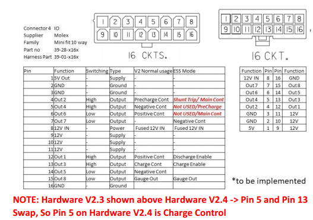
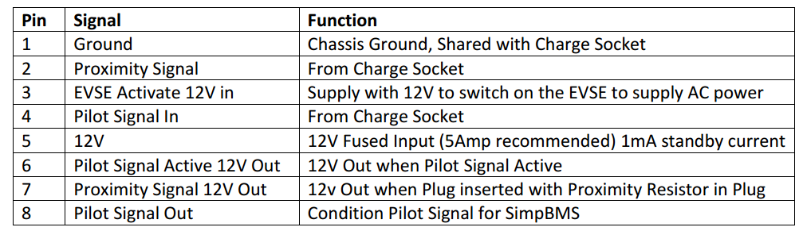

# Batterie Management System

## Dokumentation BMS

## BMS

<figure id="simpBMS">
  
  <figcaption style="text-align: center;">Abbildung: SimpBMS Battery Management System
  </figcaption>
</figure>

## BMS Charge Control

Sicherheitsmaßnahmen

- Wegfahrschutz bei eingesteckten und verriegelten Stecker zur Verhinderung eines versehentlichen Wegfahrens
- Steckerverriegelung als Schutz vor Trennung der Verbindung unter Last und auch zur Verhinderung eines nicht-autorisiertes abstecken des Ladekabels.
- Nur bei vollständig eingestecktem Stecker wird eine Ladespannung angelegt.
- Die Abfrage des Proximity-Kontakts PP meldet den maximal möglichen Ladestrom des Fahrzeugs (bzw. des Kabels) an die Ladestation. Hierzu wird im Kabel ein Widerstand zwischen PP und PE gesetzt. Die Kodierung des zulässigen Stroms zum Widerstandswert ist in IEC 61851-1 geregelt. Auszug siehe <a href="https://de.wikipedia.org/wiki/IEC_62196_Typ_2" target="_blank"><em>Wikipedia IEC 62196 Typ 2 (08.06.2026)</em></a>

<figure id="SimpCharge_connector">
  
  <figcaption style="text-align: center;">Abbildung: Anschlussbelegung</figcaption>
</figure>

<figure id="ChargeControlwithBMS">
  
  <figcaption style="text-align: center;">Abbildung: SimpCharge</figcaption>
</figure>

**Type 2 Stecker Verriegelung:**
IO25 verriegelt den Stecker, IO33 entriegelt ihn, jeweils durch Ansteuerung des Motortreibers DRV8871.
Eine manuelle Entriegelung erfolgt bei Erfüllung der Voraussetzungen (kein Stromfluss aus dem Onboard-Ladegerät) durch Drücken des Tasters verbunden mit IO32.
Eine mechanische Not-Entriegelung kann durch Ziehen der Not-Entriegelung unterhalb der Typ2 Buchse erfolgen. Dazu muss vorher die Motorhaube geöffnet werden.

## Ladeanschluss LED

- **Grün:**
  - Ladevorgang läuft.
- **Blau:**
  - Verbindung zum Ladegerät wird hergestellt.
- **Gelb:**
  - Fehler beim Laden.
- **Rot:**
  - Fehler Batteriemangementsystem.
  - Blitzend: Fehler Isolationswiderstand
  
---