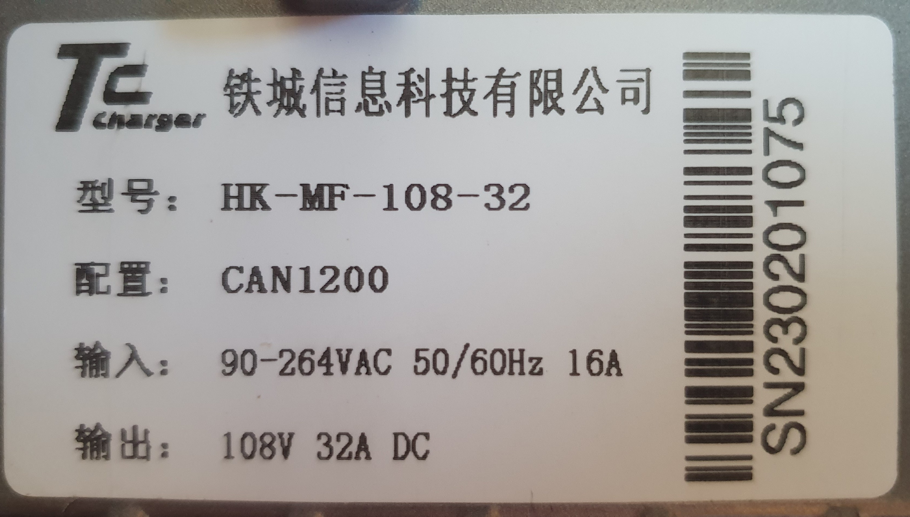
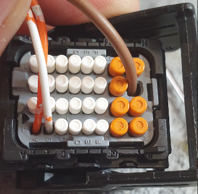

# Anhang F: Onboard Ladegerät

Das TCCHarger Onboard Ladegerät der 4. Generation 3.3 kW HK-M wurde in der Konfiguration "CAN" geordert. Alle Steuersignale werden dabei über CANbus initiiert und ausgewertet. Die Kontrolle des Ladevorgangs wird über die VCU durchgeführt. Zur Schonung der HV-Batterie wird der Ladevorgang bei einem SoC von 80 % automatisch abgeschaltet, der sogenannte "DAILY" Mode. Beim "TRIP" Mode kann die HV-Batterie auf bis zu 100 % geladen werden.  

## Modell

* **Hersteller:** Tiecheng Information Technology Co.,Ltd., China "TC Charger"
* **Typ:** HK-MF-108-32
* **Eingang:** 90 - 264 VAC, 50 - 60 Hz, 16 A
* **Ausgang:** 80 – 161 V 32 A DC
* **Schutzart:** IP67
* **Betriebstemperatur:** - 40°C - 85 °C
* **Lagertemperatur:** - 40°C - 105 °C
* **Abmessungen:** 198 x 244 x 95
* **Kühlung:** Aktive Luftkühlung mit Ventilator
* **Schutzfunktionen:** Ausgang Überspannungsschutz, Überstromschutz, Kurzschluss, Verpolung, Eingang Unterspannung, Eingang Überspannung, Übertemperatur

## Typenschild

<figure><figcaption>Typenschild</figcaption></figure>

## Signalanschluss

<figure><figcaption>Signalstecker</figcaption></figure>

## Dokumentation

<a href="https://shop.fellten.com/shop/hk-mf-108-32-hk-mf-108-32-charger-3-3kw-145v-32a-18701/document/609" target="_blank">HK-MF-108-32</a>
