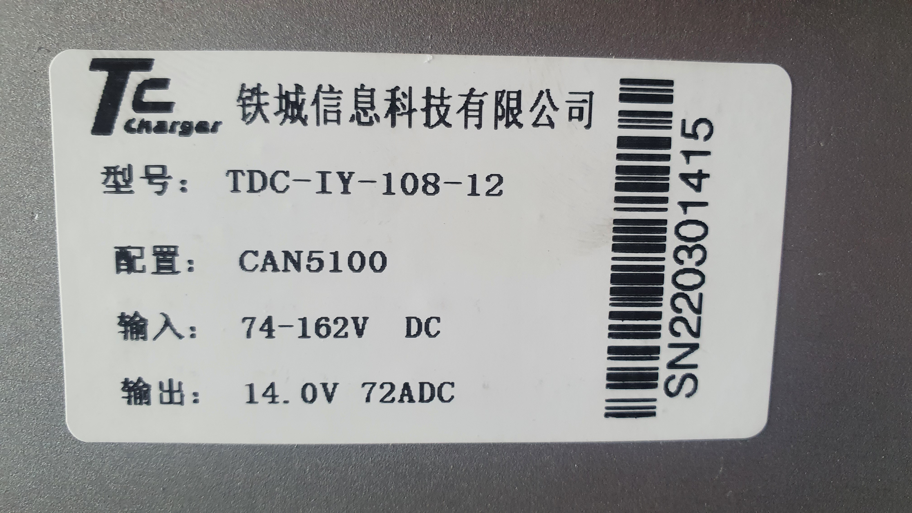
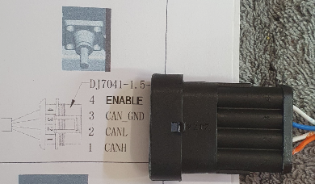

# Anhang G: DC/DC Wandler

## Modell

* **Hersteller:** Tiecheng Information Technology Co.,Ltd., China "TC Charger"
* **Typ:** TDC-IY-108-12
* **Eingang:** 74 - 162 V DC
* **Ausgang:** 14.0 V 72 A DC
* **Schutzart:** IP67  
* **Betriebstemperatur:** - 40°C - 60 °C
* **Lagertemperatur:** - 40°C - 105 °C
* **Abmessungen:** 278 x 116 x 74
* **Kühlung:** Passive Lüftkühlung
* **Schutzfunktionen:** Ausgang Überspannung, Ausgang Unterspannung, Kurzschluss, Eingang Verpolung, Übertemperatur, Kommunikationsfehler

## Typenschild

<figure><figcaption>Typenschild</figcaption></figure>

## Signalanschluss

<figure><figcaption>Signalstecker</figcaption></figure>

## Dokumentation

<a href="https://www.eveurope.eu/wp-content/uploads/2021/12/TDC-IY-1KW-DC-DC-User-Manual.pdf" target="_blank">TDC-IY-108-12</a>

NOTIZ: 
Haben Sie bereits versucht, die ID `0x18FF51E5` zu senden, und erhalten Sie eine **Antwort auf** `0x18FF50E5` zurück?
**!!! Die Angabe CAN5100 deutet auf 250kbps hin! Siehe CAN Protokoll !!!**
Evtl. Komponente an den 2. Canbus verlagern.