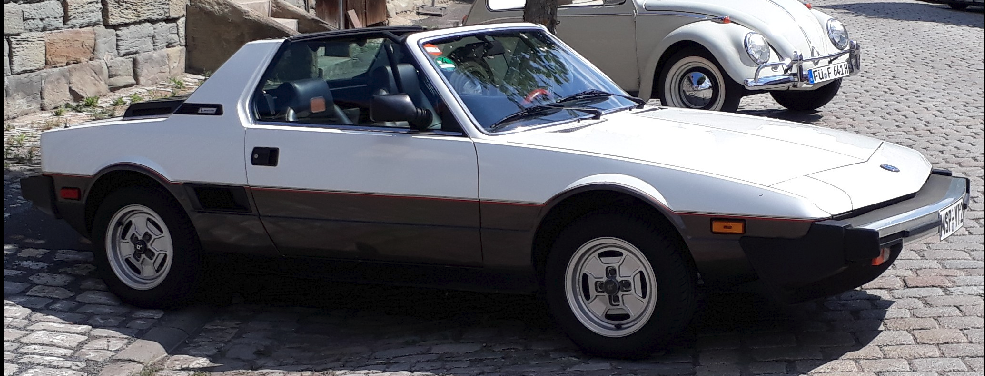

# X1/9e - Technische Dokumentation

**BERTONE X1/9e**

Umrüstung eines BERTONE X1/9 auf Elektro-Antrieb

<figure id="title-image">
  
</figure>

**Fahrzeug-Eckdaten:**

* Umbau, Tag der Erstzulassung: 1983
* Batterie-Elektrofahrzeug
* Umrüstung durch Privatperson
* Kraftübertragung durch konventionelles Getriebe
* Fahrzeugklasse: M1
* Betriebsspannung HV-Batterie: 114 V DC

**Projektdokumentation und Umrüstung:**

Frank Hielscher  
Dipl.-Wirtschaftsingenieur (FH)  
Staatlich geprüfter Techniker, Fachrichtung Elektrotechnik  

**Kontakt:**

Frank Hielscher  
97816 Lohr a. Main  
E-Mail <x19e@web.de>  

<a href="print_page/index.html" class="md-button md-button--primary">
  
    <svg xmlns="http://www.w3.org/2000/svg" viewBox="0 0 24 24"><path d="M12 10.5h1V13h-1v-2.5m4-.5v5h-1v-1.5h-1V15h-1v-5h3m-1 1h-1v1.5h1V11m-9-.5h2a2 2 0 0 1 2 2v1a2 2 0 0 1-2 2H6v-5m2 1v3h1a1 1 0 0 0 1-1v-1a1 1 0 0 0-1-1H8M19 3H5a2 2 0 0 0-2 2v14a2 2 0 0 0 2 2h14c1.11 0 2-.89 2-2V5a2 2 0 0 0-2-2m0 16H5V5h14v14Z"/></svg>
  
  Technische Dokumentation als PDF drucken
</a>
