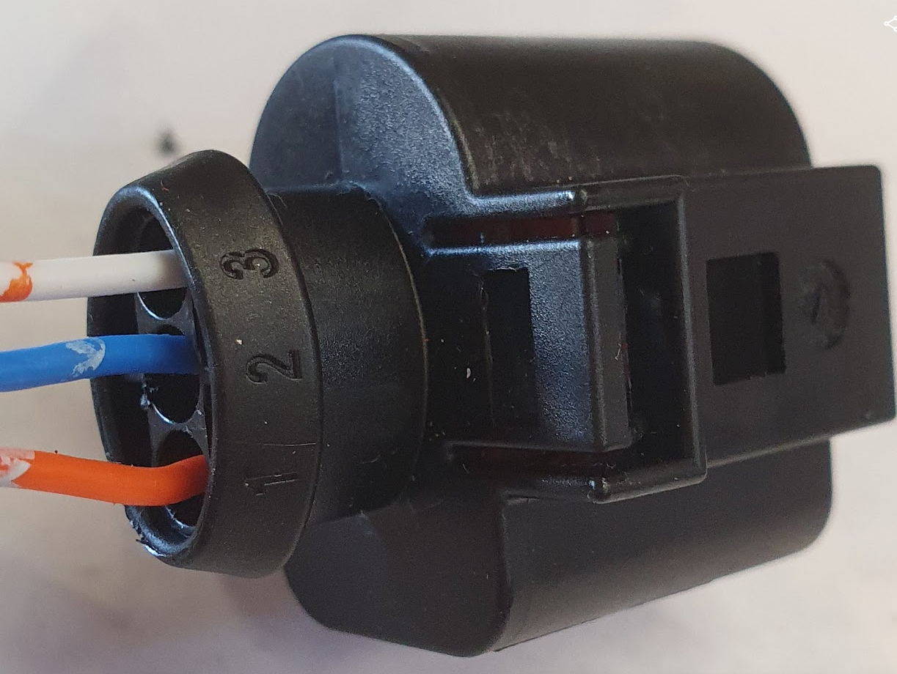

# Instrumente 

## R-N-D Schalter


## Kombi-Instrument

Das Kombi-Instrument verfügt über digitale Anzeigen und nutzt weiterhin die analogen Instrumente um digitale Informationen darzustellen.

### MicroController

Hersteller: LONGAN, Typ: CanBed RP2040

Aufgabe:
Der Microcontroller erweitert das Kombi-Instrument um digitale Anzeigen und reaktiviert die analogen Instrumente. Er stellt Daten vom Inverter und zusätzliche CanBus Informationen dar.

**Specifications:**

- Microcontroller: Raspberry Pi RP2040
- Clock speed: 133 MHz
- Flash memory: 2MB
- RAM: 264KB
- Operating voltage: 9-28V

### Display 1 -- Zentrale Meldungsanzeige

Typ: [*0.91 Zoll OLED Display SSD1306 I2C/IIC 128x32 Modul 4 PIN
Weiß*](https://www.ebay.de/itm/174255778938?var=473236321890)

Aufgabe:
Berichtet über Systemmeldungen beim Start und weitere Zustände. Die
Standardanzeige ist „**BERTONE**".

### Display 2 -- Ganganzeige und Fehlerzustände

Typ: [0.49 Zoll OLED Display Module IIC I2C/SSD1306
Weiß](https://www.ebay.de/itm/175071126309)

Aufgabe:\
Wertet die korrespondierenden System Statusmeldungen des Inverters aus.

Anzeigewerte:\
**R** Reverse Rückwärtsfahrt

**N** Neutral Neutral

**D** Drive Vorwärtsfahrt

**P** Park Handbremse

    RND-Display Fehlercodes:
    NDT: Kein Datenempfang
    CRSH: Systemabsturz

  Anzeige   Bedeutung                     Beschreibung
  NODT      Kein Datenempfang (Timeout)   Keine Telemetriedaten vom ESP32 empfangen (länger als 2 Sekunden).

  CRSH      Systemabsturz Dispay Unit     System durch Watchdog zurückgesetzt nach einem Softwarefehler.

### Display 3 - Odometer

Bereifung: 185/60 R13\
Reifendurchmesser: 55,2 cm\
Abrollumfang: 167,9 cm -- 173,5 cm

Beispiel: 180 km/h = 50 m/s,**\**
Umdrehungen pro Sekunde = geschwindigkeit/umfang\
50 m/s : 1,71 m = 29,24 umdrehungen/sek

10 km/h = 2,77 m/s,**\**
Umdrehungen pro Sekunde = geschwindigkeit/umfang\
2,77777 m/s : 1,71 m = 1,624 umdrehungen/sek

*Auszug aus dem Code zur Ermittelung der Geschwindigkeit:*
from machine import Pin, PWM
import time

```cpp 
WHEEL_CIRCUMFERENCE = 1.71 \# Radumfang in Metern
PULSES_PER_REVOLUTION = 2 \# Anzahl der Pulse pro Radumdrehung
INPUT_PIN = 16 \# GPIO-Pin für den Eingangspuls

\# PWM für Pulszählung einrichten
pwm = PWM(Pin(INPUT_PIN))
pwm.freq(100000) \# Hohe Frequenz für genaue Messung
def calculate_speed():
start_time = time.ticks_us()
start_count = pwm.duty_u16()
time.sleep(0.1) \# Messintervall (anpassbar für verschiedene Geschwindigkeiten)
end_time = time.ticks_us()
end_count = pwm.duty_u16()
duration = time.ticks_diff(end_time, start_time) / 1000000 \# inSekunden
pulse_count = end_count - start_count
if pulse_count \> 0:
revolutions = pulse_count / PULSES_PER_REVOLUTION
distance = revolutions \* WHEEL_CIRCUMFERENCE
speed_mps = distance / duration
speed_kmh = speed_mps \* 3.6
return speed_kmh
else:
return 0
while rue:
speed = calculate_speed()
print(f\"Aktuelle Geschwindigkeit: {speed:.2f} km/h\")
time.sleep(0.5) \# Aktualisierungsintervall Dieser Code nutzt die PWM-Funktionalität des RP2040, um die Pulse präzise zu zählen\[1\]\[3\]. Hier sind die Hauptpunkte:
1\. Wir verwenden PWM im Eingangsmodus, um die Pulse zu zählen.
2\. Die Funktion \`calculate_speed()\` misst die Anzahl der Pulse in einem kurzen Zeitintervall.
3\. Die Geschwindigkeit wird aus der Anzahl der Umdrehungen, dem Radumfang und der verstrichenen Zeit berechnet.
4\. Das Messintervall von 0,1 Sekunden ermöglicht die Erfassung von Geschwindigkeiten von etwa 5 km/h bis über 200 km/h.

Für genauere Messungen bei sehr niedrigen oder sehr hohen Geschwindigkeiten können Sie das Messintervall dynamisch anpassen. Bei niedrigen Geschwindigkeiten verlängern Sie das Intervall, bei hohen Geschwindigkeiten verkürzen Sie es.

Beachten Sie, dass die tatsächliche Genauigkeit von der Stabilität und Frequenz der Eingangspulse abhängt. Für sehr präzise Messungen, insbesondere bei hohen Geschwindigkeiten, sollten Sie möglicherweise zusätzliche Filtertechniken oder eine Mittelwertbildung über mehrere Messungen in Betracht ziehen.

Citations:

\[1\] https://hackaday.com/2023/08/26/accurate-cycle-counting-on-rp2040-micropython/
\[2\] https://docs.micropython.org/en/latest/rp2/quickref.html
\[3\] https://iosoft.blog/2023/08/21/picofreq_python/
\[4\] https://www.youtube.com/watch?v=y2EDhzDiPTE
\[5\] https://forum.micropython.org/viewtopic.php?t=9692
\[6\] https://forums.raspberrypi.com/viewtopic.php?t=310796
\[7\] https://forum.micropython.org/viewtopic.php?t=9695
\[8\] https://media.ccc.de/v/sps22-4239-micropython-on-the-rp2040 **\**

```
## Impulsgeber

Der Impulszähler liefert 2 Impulse pro Radumdrehung und ist direkt am Getriebe installiert.

Hersteller: RIDEX, Typ: 833C0073

Abb. Stecker und Belegung Impulsgeber
