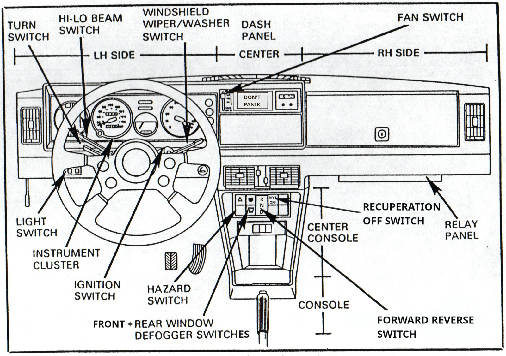
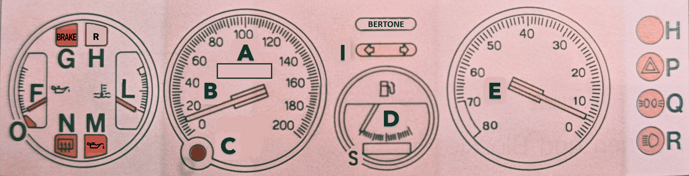
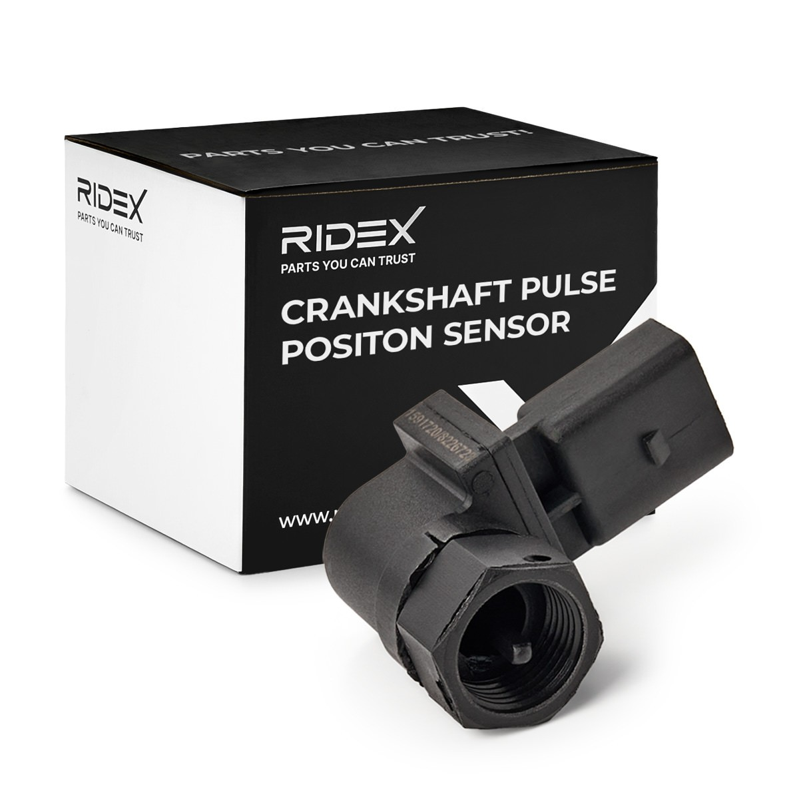
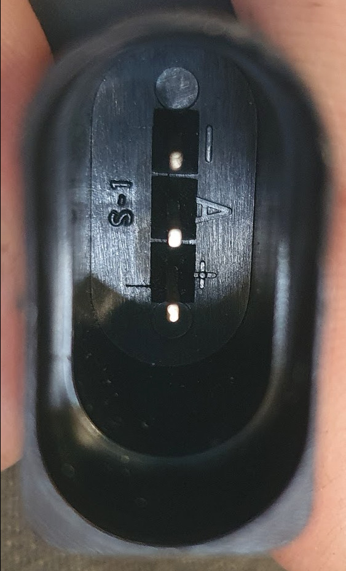
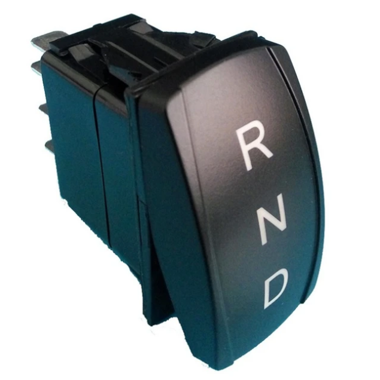
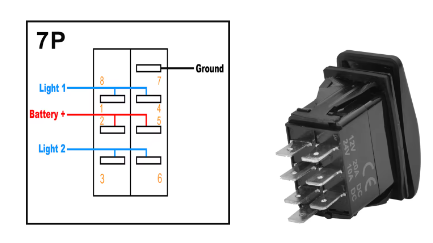
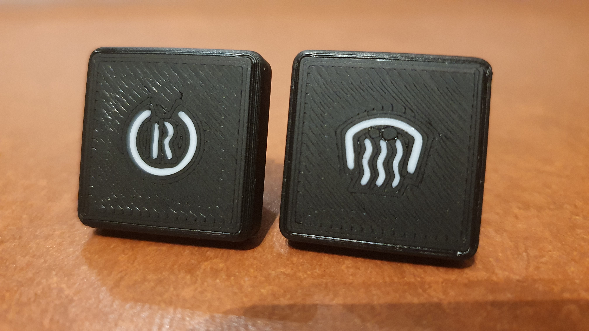

# Cockpit

Im Cockpit wurden einige Modifikation und Ergänzungen durchgeführt. Dies betrifft insbesondere den Instrumententräger, die Mittelkonsole und die zentrale Bedieneinheit in der sich normalerweise das Radio befindet. 

<figure><figcaption>Cockpit Übersicht</figcaption></figure>

## Instrumententräger (INSTRUMENT CLUSTER)

Der Instrumententräger verfügt über digitale Anzeigen, nutzt aber weiterhin die analogen Instrumente um digitale Informationen darzustellen. Die Ansteuerung der Zeigerinstrumente und digitalen Anzeigen erfolgt durch einen MicroController.

<figure><figcaption>Anzeigeeinheit</figcaption></figure>

| | Wert | Darstellung | Einheit | Quelle | Bemerkung |
| | :--- | :---- | :----| :----|  :----|
| A | **ODOMETER** | 128 x 32 OLED | 99999 km <br> 999.9 <br> 229 km/h  | CAN | Ein Druck auf **C** ändert den Modus TOTAL, TRIP und SPEED.|
| B | Geschwindigkeit | analog | 229 km/h | CAN | |
| D | SoC | analog | 100 % | BMS | |
| E | Drehzahlmesser | analog | 8000 U/min | CAN | |
| H | **RND** | 64 x 32 OLED | **R <br> N <br> D** | CAN | Gangwahl |
| L | Temperatur Inverter | analog | F | CAN | |
| M | MCU Fehler | digital | 1 | CAN | |
| S | **CENTRAL** | 128 x 24 OLED  | Statusmeldungen | CAN | Von IMD und MCU  |

### MicroController

Hersteller: LONGAN, Typ: CanBed RP2040

Aufgabe:
Der Microcontroller steuert die digitale Anzeigen an und reaktiviert die analogen Instrumente. Über einen Impulsgeber wird die Geschwindigkeit ermittelt und die Geschwindigkeitsanzeige versorgt. Mit weiteren Informationen aus dem CanBus werden zusätzliche Analoginstrumente und digitale Anzeigen gefüllt.

**Spezifikation:**

- Microcontroller: Raspberry Pi RP2040
- Clock speed: 133 MHz
- Flash memory: 2MB
- RAM: 264KB
- Operating voltage: 9-28V

### CENTRAL-- Zentrale Meldungsanzeige

Aufgabe:
Berichtet über Systemmeldungen beim Start und weitere Zustände. Die
Standardanzeige ist „**BERTONE**".

### RND -- Ganganzeige

Aufgabe:
Wertet die korrespondierenden Systemflags des Inverters aus.

Anzeigewerte:

* **R** Reverse (Rückwärtsfahrt)
* **N** Neutral (Neutral)
* **D** Drive (Vorwärtsfahrt)
* (**P** Park (Handbremse))

### Odometer

Die Ermittlung der tatsächlichen Geschwindigkeit erfolgt durch eine Softwarefunktion mit den folgenden Parametern als Basis: 

- Bereifung: 185/60 R13
- Reifendurchmesser: 55,2 cm
- Abrollumfang: 167,9 cm - 173,5 cm, Mittelwert: 1,71 m
- Formel: Umdrehungen pro Sekunde = Geschwindigkeit / Abrollumfang

**Beispiel 1:**

180 km/h = 50 m/s <br>
50 m/s : 1,71 m = 29,24 Umdrehungen/Sekunde

**Beispiel 2:**

10 km/h = 2,77 m/s <br>
2,77777 m/s : 1,71 m = 1,624 Umdrehungen/Sekunde

**Auszug aus dem Code zur Ermittelung der Geschwindigkeit:**
```cpp 
from machine import Pin, PWM
import time

WHEEL_CIRCUMFERENCE = 1.71 # Radumfang in Metern
PULSES_PER_REVOLUTION = 2 # Anzahl der Pulse pro Radumdrehung
INPUT_PIN = 16 # GPIO-Pin für den Eingangspuls

# PWM für Pulszählung einrichten
pwm = PWM(Pin(INPUT_PIN))
pwm.freq(100000) # Hohe Frequenz für genaue Messung

def calculate_speed():
  start_time = time.ticks_us()
  start_count = pwm.duty_u16()
  time.sleep(0.1) # Messintervall (anpassbar für verschiedene Geschwindigkeiten)
  end_time = time.ticks_us()
  end_count = pwm.duty_u16()
  duration = time.ticks_diff(end_time, start_time) / 1000000 # in Sekunden
  pulse_count = end_count - start_count

  if pulse_count > 0:
    revolutions = pulse_count / PULSES_PER_REVOLUTION
    distance = revolutions * WHEEL_CIRCUMFERENCE
    speed_mps = distance / duration
    speed_kmh = speed_mps * 3.6
    return speed_kmh
  else:
    return 0

  while true:
  speed = calculate_speed()
  print(f"Aktuelle Geschwindigkeit: {speed:.2f} km/h\")
  time.sleep(0.5) # Aktualisierungsintervall 

/*Dieser Code nutzt die PWM-Funktionalität des RP2040 um die Pulse präzise zu zählen. Hier sind die Hauptpunkte:
1. Wir verwenden PWM im Eingangsmodus, um die Pulse zu zählen.
2. Die Funktion `calculate_speed()` misst die Anzahl der Pulse in einem kurzen Zeitintervall.
3. Die Geschwindigkeit wird aus der Anzahl der Umdrehungen, dem Radumfang und der verstrichenen Zeit berechnet.
4. Das Messintervall von 0,1 Sekunden ermöglicht die Erfassung von Geschwindigkeiten von etwa 5 km/h bis über 200 km/h.

Für genauere Messungen bei sehr niedrigen oder sehr hohen Geschwindigkeiten können Sie das Messintervall dynamisch anpassen. Bei niedrigen Geschwindigkeiten verlängern Sie das Intervall, bei hohen Geschwindigkeiten verkürzen Sie es.

Beachten Sie, dass die tatsächliche Genauigkeit von der Stabilität und Frequenz der Eingangspulse abhängt. Für sehr präzise Messungen, insbesondere bei hohen Geschwindigkeiten, sollten Sie möglicherweise zusätzliche Filtertechniken oder eine Mittelwertbildung über mehrere Messungen in Betracht ziehen.

Citations:

\[1\] https://hackaday.com/2023/08/26/accurate-cycle-counting-on-rp2040-micropython/
\[2\] https://docs.micropython.org/en/latest/rp2/quickref.html
\[3\] https://iosoft.blog/2023/08/21/picofreq_python/
\[4\] https://www.youtube.com/watch?v=y2EDhzDiPTE
\[5\] https://forum.micropython.org/viewtopic.php?t=9692
\[6\] https://forums.raspberrypi.com/viewtopic.php?t=310796
\[7\] https://forum.micropython.org/viewtopic.php?t=9695
\[8\] https://media.ccc.de/v/sps22-4239-micropython-on-the-rp2040 
*\

```

### Impulsgeber

Der Impulsgeber liefert 2 Impulse pro Radumdrehung und ist direkt am Getriebe installiert. Er ist in Fahrzeugen der VAG verbaut und wird als Impulsgeber und Kurbelwellensensor eingesetzt. Er kann ohne Änderungen auf den Anschluß für die Tachowelle am Getriebe des X1/9 eingesetzt werden.
<figure><figcaption>Impulsgeber</figcaption></figure>
Hersteller: RIDEX, Typ: 833C0073
<figure><Belegung>Belegung</figcaption></figure>
<figure><Stecker>Anschlussstecker</figcaption></figure>

## Mittelkonsole (CENTER CONSOLE)

Die Mittelkonsole wurde um den R-N-D Schalter zur Gangwahl ergänzt. An dessen Stelle befand sich ein Potentiometer zur Regelung der Beleuchtung des Instrumententrägers. Dies ist entfallen. Eine weitere Ergänzung ist der Schalter zur Frontscheiben-Heizung und der Schalter zur Deaktivierung der Rekuperation. Hierfür wurden freie Plätze in der Mittelkonsole genutzt.

### R-N-D Schalter

<figure><figcaption>R-N-D Schalter</figcaption></figure>
<figure><figcaption>Anschlussbelegung</figcaption></figure>

### Schalter Mittelkonsole

<figure><figcaption>Schalter Rekuperation AUS und Heizung</figcaption></figure>

## Zentrale Bedieneinheit

Um Platz für eine Anzeige für das Batterie-Management-System BMS zu schaffen, wurde die zentrale Bedieneinheit verändert. Die bisherigen Schalter für die Klimaanlage (ausgebaut) wurden entfernt und durch ein Display mit Touchfunktion ersetzt. 
