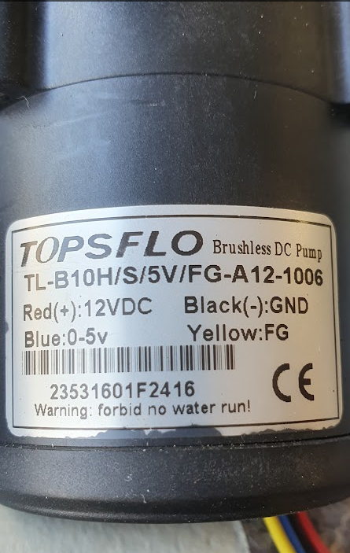

# Wasserpumpe Inverter

- Rote Leitung: An den Pluspol der Stromversorgung anschließen (12 V)
- Schwarze Leitung: Verbinden Sie den Minuspol der Stromversorgung und den Minuspol des PWM-Signals (GND).
- Gelbe Linie: FG-Leitung des Ausgangssignals 
- Blaue Linie: 5V PWM-Signal 

