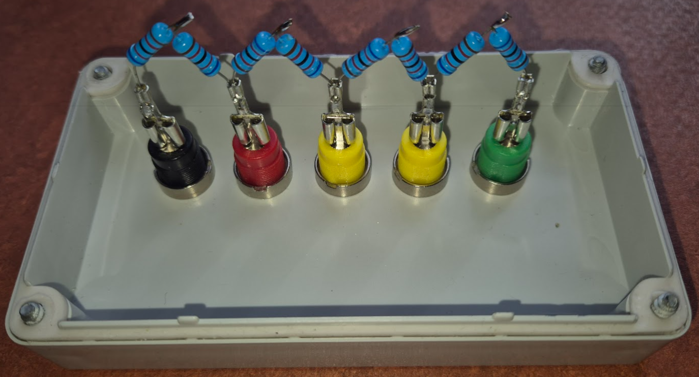

# Anhang M: Iso-R Test

Das eingebaute IMD überwacht im Betriebsmode CHARGE und DRIVE ständig den Isolationswiderstand zwischen dem Hochspannungsteil HV und der Bordspannung 12V. Zum Test der Ansprechschwellen wurde eine Prüfbox entworfen mit der die Ansprechschwellen für WARNUNG und FEHLER geprüft werden können. Diese Prüfung sollte in regelmäßigen Abständen, mindestens 1 Mal jährlich, durchgeführt werden.

##  Iso-R Prüfbox

Der Tester für das *Insulation Monitoring Device* (Isolationswächter) ist aus 8 in Reihe geschalteten 82 k&Omega;-Präzisionswiderständen aufgebaut. Vier separate Ausgänge ermöglichen es, den simulierten Isolationswiderstand gezielt auf 496, 372, 248 und 124 k&Omega; zu senken.

### Geräteaufbau

<figure id="iso_pruefbox">
  
  <figcaption style="text-align: center;">Abbildung 9: Technischer Aufbau der Iso-R Prüfbox für den Isolationswächter-Test
  </figcaption>
</figure>

**Spezifikation der Ausgänge:**

| Ausgang | Widerstände in Reihe | Gesamtwiderstand | Prüfzweck |
| :---: | :--- | :---: | :--- |
| **D** | R1 + R2 + R3 + R4 + R5 + R6 + R7 + R8 | 496 k&Omega; | **Prüfung Hysterese** (Ansprechgrenze liegt bei ca. 500 k&Omega;) |
| **C** | R1 + R2 + R3 + R4 + R5 + R6 | 372 k&Omega; | **Auslösung WARNUNG** (Schwelle: 400 k&Omega;) |
| **B** | R1 + R2 + R3 + R4 | 248 k&Omega; | **Auslösung FEHLER / Abschaltung** (Schwelle: 250 k&Omega;) |
| **A** | R1 + R2 | 124 k&Omega; | Minimaler Fehlerwert (harter Defekt, klare Abschaltung) |
| **GND** | *Keine Widerstände* | 0 &Omega; | Fahrzeugmasse (Referenzpotenzial) |

---

## Testvorbereitung

* **Masseverbindung:** Anschluss GND (schwarz) über eine Krokodilklemme fest mit der Fahrzeugmasse (Karosserie) verbinden.
* **HV-Verbindung:** Sicherheitsprüfkabel mit dem zu prüfenden Pfad (HV+ oder HV-) verbinden.
* **Messreihenfolge:** Das andere Ende des Sicherheitsprüfkabels beginnend beim höchsten Widerstands-Ausgang (496 k&Omega;, grün) sukzessive nach unten durchstecken.

---

## Durchführung der Prüfung und erwartete Systemreaktion

Die mathematische Bestimmung des jeweiligen Prüfwiderstandes berechnet sich im freistehenden Block wie folgt:

$$R_{\mathrm{Pr\ddot{u}f}} = \sum R_{\mathrm{n}}$$

| Nr. | Ausgang | Kabelfarbe | Prüfwiderstand | Erwarteter Zustand | Prüfzweck / Beschreibung |
| :---: | :---: | :---: | :---: | :---: | :--- |
| **1** | D | Grün | 496 k&Omega; | **OK** | Startwert im sicheren Bereich (keine Systemreaktion). |
| **2** | C | Gelb | 372 k&Omega; | **WARNUNG** | Löst die 400 k&Omega;-Warnschwelle im VCU-Display aus. |
| **3** | B | Rot | 248 k&Omega; | **FEHLER** | Unterschreitet die 250 k&Omega;-Abschaltschwelle. AIRs müssen trennen. |
| **4** | A | Rot | 124 k&Omega; | **FEHLER** | Kritischer Isolationsfehler bleibt aktiv bestehen. |

---
