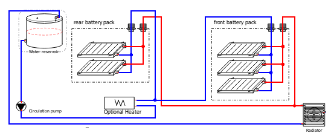

# Sicherheit des Energiespeichers

Dieses Kapitel beschreibt die Maßnahmen, die getroffen wurden, um die Sicherheit des wiederaufladbaren Energiespeichersystems (REESS) gemäß VdTÜV-Merkblatt 764 (Kap. 5) zu gewährleisten.

## Belüftung (Schutz vor Gasansammlung)

Die beiden Batteriepacks des REESS sind außerhalb des Fahrgastraums im vorderen Kofferraum sowie im hinteren Motorraum verbaut. Jeder dieser Bereiche ist durch eine stabile Spritzwand vom Fahrgastraum getrennt.

Um die Ansammlung von potenziell entzündlichen Gasen (z. B. im Fehlerfall einer Batteriezelle) zu verhindern, ist jede der beiden Batterieboxen mit einem **dedizierten Notentlüftungs- und Druckausgleichselement** ausgestattet. Dieses Element gewährleistet eine permanente, passive Be- und Entlüftung direkt an der Entstehungsquelle und stellt gleichzeitig den Schutz gegen das Eindringen von Feuchtigkeit und Staub sicher. Ein unkontrolliertes Eindringen von Gasen in den Fahrgastraum ist somit konstruktiv ausgeschlossen.

---

## Konstruktions- und Einbaubedingungen (Schutz im Crash- & Betriebszustand)

Die Konstruktion der Batteriegehäuse, deren Befestigung sowie die Wahl des Einbauortes wurden so ausgelegt, dass die Anforderungen des VdTÜV-Merkblatts 764 (Kap. 5.2) vollumfänglich erfüllt werden.

### Schutz vor Deformationszonen (Knautschzonen)

Die Einhaltung der empfohlenen Mindestabstände des VdTÜV-Merkblatts 764 zur äußeren Fahrzeugbegrenzung wurde messtechnisch überprüft:

| Bereich | Anforderung (Merkblatt) | Gemessener Abstand | Status |
| :--- | :---: | :---: | :---: |
| **Front** | > 420 mm | **660 mm** | **OK** |
| **Heck** | > 300 mm | **740 mm** | **OK** |
| **Seite (links)** | > 200 mm | **380 mm** | **OK** |
| **Seite (rechts)** | > 200 mm | **380 mm** | **OK** |

**Ergebnis:** Die Batteriepacks sind tief innerhalb der stabilen Fahrzeugstruktur positioniert und nicht in den primären Energieabsorptionszonen (Knautschzonen) verbaut.

### Mechanischer Schutz und Insassensicherheit

* **Schutz vor mechanischer Beschädigung von unten:** Beide Batteriepacks sind oberhalb der Fahrzeugbodenwanne montiert. Sie sind durch die tragende Karosseriestruktur und geschlossene Bodenbleche vollständig vor direktem Fahrbahnkontakt, Aufsetzen oder Steinschlag geschützt. Der Überfahrwinkel des Fahrzeugs wird nicht negativ beeinflusst.
* **Schutz des Fahrgastraums:** Die robuste Konstruktion der Batteriegehäuse aus Aluminium-Systemprofilen und die stabile Verschraubung mit der Karosseriestruktur stellen sicher, dass sich das REESS auch bei schweren Verzögerungen (Unfall) nicht unkontrolliert in Bewegung setzt oder Komponenten davon in den Fahrgastraum eindringen.
* **Schutz vor Elektrolytaustritt:** Die Gehäuse der Batteriepacks sind umlaufend mit einer **Neopren-Zellkautschuk-Dichtung** flüssigkeitsdicht abgedichtet (Schutzgrad > IP67). Dies verhindert im Regel- und Fehlerfall das unkontrollierte Austreten von Elektrolytflüssigkeit in die Fahrzeugumgebung.

---

## Thermisches Management und Kühlkreisläufe

Um die optimalen Betriebstemperaturen der Leistungselektronik sowie des wiederaufladbaren Energiespeichersystems (REESS) sicherzustellen, verfügt das Fahrzeug über zwei voneinander unabhängige Kühlkreisläufe. Beide Systeme arbeiten mit einem standardisierten Wasser-Glykol-Gemisch (Korrosions- und Frostschutzmittel).
  
### Kreislauf 1: Inverter (Leistungskreis)

Dieser primäre Kreislauf ist ausschließlich für die Entwärmung des Inverters zuständig.
<figure><figcaption>Inverter Kühlkreislauf</figcaption></figure>

* **Räumliche Anordnung:** Bedingt durch das Mittelmotorkonzept des Fahrzeugs ist die Leistungselektronik an der Rückwand des hinteren Kofferraums positioniert. Die Kühlung erfolgt über den modellspezifischen Wasserkühlkörper des Inverter-Herstellers. Die Rückkühlung an die Umgebungsluft übernimmt ein kompakter Wärmetauscher samt elektrischem Zusatzlüfter, der am fahrerseitigen Lufteinlass platziert ist. Zur Umwälzung ist eine TOPSFLO-Wasserpumpe (Spezifikation siehe Anhang [Nummer einfügen]) horizontal unterhalb des Inverters verbaut.

* **Ausgleichsbehälter:** Der zugehörige Ausgleichsbehälter ist an der Kofferraumrückwand am physisch höchsten Punkt des Kreislaufs montiert. Dies gewährleistet eine selbstständige und dauerhafte Systementlüftung während des Betriebs.

### Kreislauf 2: REESS-Klimatisierung (Batteriekreis)

Dieser sekundäre Kreislauf dient der thermischen Konditionierung der insgesamt fünf Tesla-Batteriemodule, die auf das vordere und hintere Batteriepack aufgeteilt sind. Da das Fahrzeug konstruktiv für den Sommerbetrieb ausgelegt ist, wird auf die Integration eines aktiven Heizelements verzichtet. Bei Über- oder Unterschreiten der thermischen Betriebsgrenzen greift das Batterie-Management-System (BMS) ein und limitiert die Leistungsabgabe des REESS (Derating).
<figure><figcaption>Batterie Kühlkreislauf</figcaption></figure>

* **Leitungsführung und Anordnung:** Die Durchströmung der Batteriemodule erfolgt strömungstechnisch parallel. Das Kühlmittel wird von der Umwälzpumpe (Tesla, Teilenummer 6007367-00-E, Spezifikation siehe Anhang [Nummer einfügen]) im Motorraum gefördert und teilt sich auf das hintere Pack sowie – über Vor- und Rücklaufleitungen im Mitteltunnel – auf das vordere Pack auf. Die Rückkühlung erfolgt über den an der originalen Position in der Fahrzeugfront verbauten Hauptkühler.

* **Ausgleichsbehälter:** Ein separater Ausgleichsbehälter befindet sich im hinteren Motorraum und ist ebenfalls am höchsten Punkt oberhalb der Batteriepacks installiert.

### Luftkühlung: Elektrischer Antriebsmotor

Im Gegensatz zur fluidgekühlten Leistungselektronik und dem REESS erfolgt die Entwärmung des elektrischen Traktionsmotors rein luftgekühlt.

* **Kühlprinzip und Anordnung:** Bedingt durch die Einbaulage im hinteren Motorraum erfolgt die primäre Wärmeabfuhr an die Umgebungsluft über die gerippte Gehäuseoberfläche des Traktionsmotors. Die fahrzeugspezifische Mittelmotorkonstruktion ermöglicht dabei eine hocheffiziente Durchströmung des Motorraums. Diese wird maßgeblich durch den originalen, beifahrerseitigen Lufteinlass unterstützt, welcher im Fahrbetrieb eine gezielte und kontinuierliche Frischluftzufuhr (dynamische Anströmung) direkt auf den Antriebsstrang sicherstellt.

* **Thermische Überwachung:** Um thermische Überlastungen im Betrieb auszuschließen, ist der Motor mit einem internen Temperaturfühler in der Statorwicklung ausgestattet. Die Sensordaten werden kontinuierlich durch den Inverter eingelesen und überwacht. Nähert sich die Wicklungstemperatur dem zulässigen Grenzwert, wird der Phasenstrom durch die Motorsteuerung automatisch und stufenlos limitiert (Derating), um Bauteilschäden zuverlässig zu verhindern.

### Sicherheitstechnische Schutzmaßnahmen

* **Leckageschutz:** Sämtliche Schlauchverbindungen, insbesondere im Nahbereich der Batteriegehäuse, sind formschlüssig mit geschraubten Spann- oder Federschellen gesichert.
  
* **Isolationsüberwachung:** Da das eingesetzte Kühlmittel elektrisch leitfähig ist, wird eine potenziell auftretende interne Leckage in die HV-Komponenten unverzüglich durch das Isolationsüberwachungssystem (BENDER iso165C-1, siehe Kap. 3) detektiert. Dies führt zu einer sofortigen, allpoligen Abschaltung des HV-Systems.
  
* **Crash-Sicherheit:** Die Verbindungsleitungen zwischen Front- und Heckbereich verlaufen geschützt innerhalb der steifen Fahrgastzelle. Sie sind durch die originale Tunnelabdeckung gegen mechanische Beschädigungen von außen abgeschirmt.
