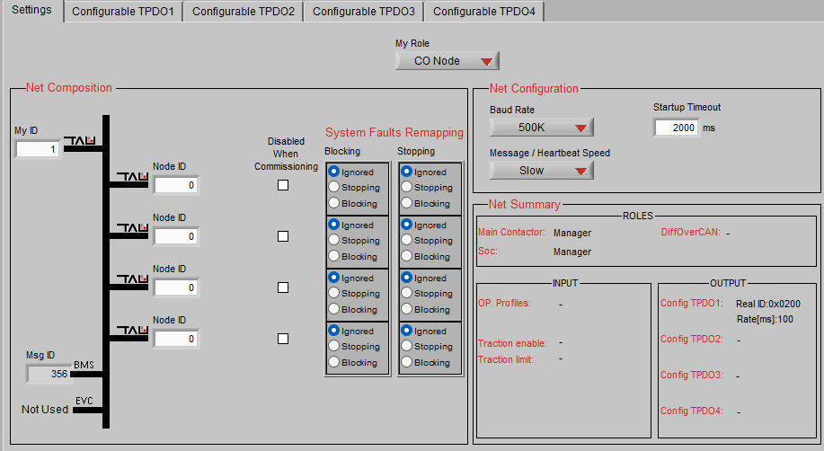
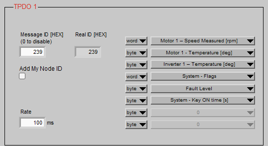
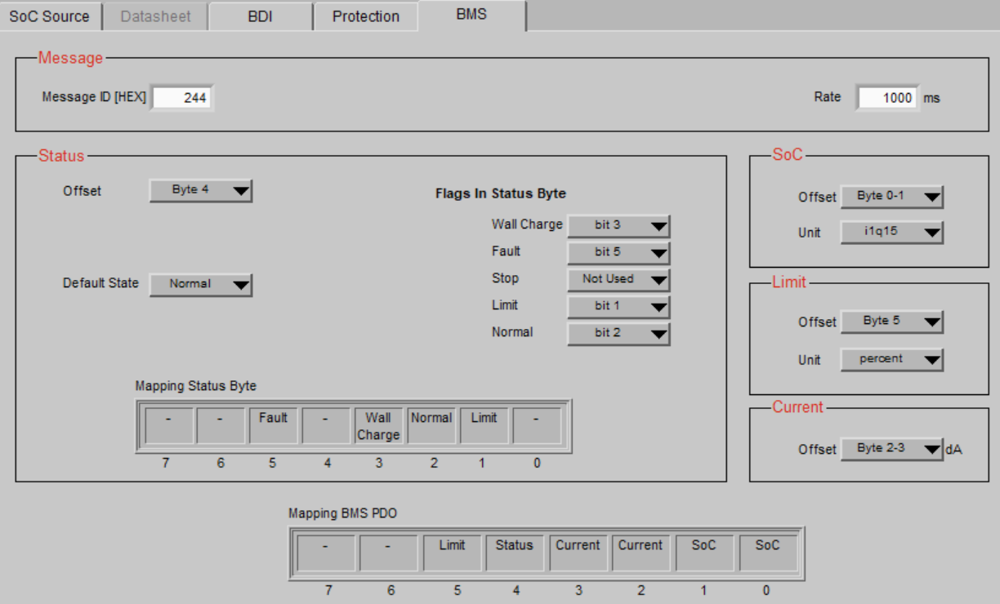
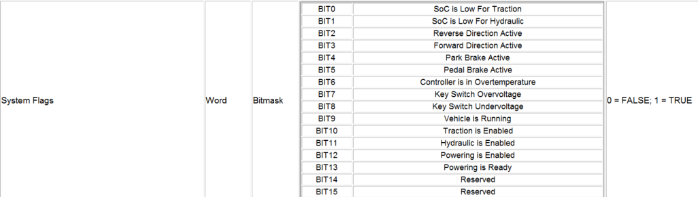

# VCU - Vehicle Control Unit

## CAN Open Network

Baudrate: 500k

### Inverter CanBus Meldungen




\
NEU! TODO\
TPDO 1 (`0x239`) -- Intervall: Fast (100ms / 10Hz)

Hier landen alle Variablen, die du für flüssige Dashboard-Anzeigen (Drehzahlmesser, Powermeter) und sofortige Leistungsberechnungen brauchst.

- **Byte 0--1 (Word):** Motor Speed (rpm)
- **Byte 2--3 (Word):** Motor 1 - Torque Word % (signed: `-100%` bis  `+100%` -- zeigt dir auch Rekuperation perfekt als Minuswert an!)
- **Byte 4 (Byte):** Motor Temperature (°C)
- **Byte 5 (Byte):** Inverter Temperature (°C)
- **Byte 6 (Byte):** Fault Level
- Frei: Byte 7 (z.B. für ein Status-Byte)

#### TPDO 2 (`0x240`) -- Intervall: Medium (250ms / 4Hz)

Hier landen die mächtigen Bitmasken und Betriebsstundenzähler. Sie ändern sich nicht im Millisekundentakt, sind aber für die Diagnose unersetzlich.

- **Byte 0--1 (Word):** System Flags
- **Byte 2--3 (Word):** Motor Flags
- **Byte 4-5 (WORD):** System Key Ontime (Betriebsstunden seit Zündung
  ein)

MCU Konfiguration zum Auslesen der BMS Daten über Proxy BMS.

*Todo: Stop Flag bit0 bei IMD fault ergänzt!\
\*

### **Code-Implementierung des Software-Überlastschutzes (VCU)**

Die VCU (ESP32 / Lilygo T485) liest kontinuierlich die Motordrehzahl (telemetryData.motorRPM) über die CAN-Bus-TPDOs (Real ID 239) des Inverters aus. In der zyklischen Funktion zur Übertragung der BMS-Proxy-Daten (send_proxy_bms_data(), CAN-ID 0x246) wird der
Skalierungsfaktor für das Drehmoment (limit_percent) in Echtzeit berechnet und an den Inverter gesendet.

**Quellcode-Auszug (C++):**
```cpp
void send_proxy_bms_data() {
uint16_t soc_hyper9 = 0;
int16_t current_da = 0;
uint8_t status = 0;
uint8_t limit_percent = 100;

if (xSemaphoreTake(dataMutex, pdMS_TO_TICKS(20)) == pdTRUE) {
soc_hyper9 = (uint16_t)((telemetryData.bmsSoC / 100.0f) \* 32768.0f);
current_da = (int16_t)(telemetryData.bmsCurrent \* 10.0f);

// \-\-- DYNAMIC CURRENT LIMITING (200A PROTECT) \-\--
if (telemetryData.motorRPM \> 1272) {
uint32_t calculated_limit = 127240 / telemetryData.motorRPM;
limit_percent = (uint8_t)calculated_limit;
if (limit_percent \> 100) limit_percent = 100;
if (limit_percent \< 10) limit_percent = 10; // Lowest value, to ensure
propulsion
} else {limit_percent = 100; // Maximum Torque at Start with less than
1272 U/min}

// BMS-Warning have always highest priority
if (telemetryData.bmsHighTempWarn && limit_percent \> 50) {limit_percent = 50;

} else if (telemetryData.bmsLowVoltageWarn && limit_percent \> 40) {limit_percent = 40;}

*// \-\-- DRIVE INHIBIT (INTERLOCK) LOGIC \-\--*

bool cableConnected = (telemetryData.bmsStatus == 0x04 \|\| telemetryData.isCharging);

bool systemFault = (telemetryData.selfTestResult != 0 \|\| telemetryData.bmsHardwareFault);

if (cableConnected \|\| telemetryData.isLocked \|\| systemFault) {status \|= (1 \<\< 5); // DRIVE INHIBIT ACTIVATED
} else if (limit_percent \< 100) {status \|= (1 \<\< 1); // LIMIT MODE
} else {status \|= (1 \<\< 2); // NORMAL MODE}

if (telemetryData.isCharging) status \|= (1 \<\< 3);
xSemaphoreGive(dataMutex);
}

twai_message_t msg = {0};
msg.identifier = HYPER9_PROXY_ID;
msg.data_length_code = 8;
msg.data\[0\] = (uint8_t)(soc_hyper9 \>\> 8);
msg.data\[1\] = (uint8_t)(soc_hyper9 & 0xFF);
msg.data\[2\] = (uint8_t)(current_da \>\> 8);
msg.data\[3\] = (uint8_t)(current_da & 0xFF);
msg.data\[4\] = status;
msg.data\[5\] = limit_percent; // dynamic calculated limit send to Inverter

twai_transmit(&msg, pdMS_TO_TICKS(5));

}
```